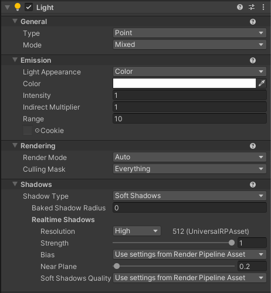

# Light component reference

Lights determine the shading of an object and the shadows it casts.

This page contains information on Light components in the Universal Render Pipeline (URP). For a general introduction to lighting in Unity and examples of common lighting workflows, see [the Lighting section of the Unity Manual](https://docs.unity3d.com/Manual/LightingOverview.html).

## Properties
The Light Inspector includes the following groups of properties:

* [General](#General)
* [Shape](#Shape)
* [Emission](#Emission)
* [Rendering](#Rendering)
* [Shadows](#Shadows)

### General

| Property:| Function: |
|:---|:---|
| __Type__| The current type of light. Possible values are __Directional__, __Point__, __Spot__ and __Area__.|
| __Mode__| Specify the [Light Mode](https://docs.unity3d.com/Manual/LightModes.html) used to determine if and how a light is "baked". Possible modes are __Realtime__, __Mixed__ and __Baked__.|

### Shape

| Property:| Function: |
|:---|:---|
| __Spot Angle__| Define the angle (in degrees) at the base of a spot light’s cone (__Spot__ light only). |

### Emission

| Property:| Function: |
|:---|:---|
| __Color__| Use the color picker to set the color of the emitted light. |
| __Intensity__| Set the brightness of the light. The default value for a __Directional__ light is 0.5. The default value for a __Point__, __Spot__ or __Area__ light is 1.  |
| __Indirect Multiplier__| Use this value to vary the intensity of indirect light. Indirect light is light that has bounced from one object to another. The __Indirect Multiplier__ defines the brightness of bounced light calculated by the global illumination (GI) system. If you set __Indirect Multiplier__ to a value lower than __1,__ the bounced light becomes dimmer with every bounce. A value higher than __1__ makes light brighter with each bounce. This is useful, for example, when a dark surface in shadow (such as the interior of a cave) needs to be brighter in order to make detail visible. |
| __Range__| Define how far the light emitted from the center of the object travels (__Point__ and __Spot__ lights only). |
| **Cookie** | The RGB texture this Light projects into the scene. Use cookies to create silhouettes or patterned illumination. The texture format to use depends on the type of Light:  &#8226; Directional: 2D texture  &#8226; Spot: 2D texture  &#8226; Point: [cubemap texture](https://docs.unity3d.com/Manual/class-Cubemap.html)  If you enable cookies, URP uses more memory.  **Note**: URP doesn't support light cookies for Area lights.  For more information about light cookies, see [Cookies](https://docs.unity3d.com/Manual/Cookies.html). |
| &nbsp;&nbsp;**Cookie Size** | The per-axis scale Unity applies to the cookie texture. Use this property to set the size of the cookie.  This property is available only if you set **Type** to **Directional** and assign a texture to **Cookie**. |
| &nbsp;&nbsp;**Cookie Offset** | The per-axis offset Unity applies to the cookie texture. Use this property to move the cookie without moving the light itself. You can also animate this property to scroll the cookie.   This property is available only if you set **Type** to **Directional** and assign a texture to **Cookie**. |

## Rendering

| Property:| Function: |
|:---|:---|
| __Render Mode__| Use this drop-down to set the rendering priority of the selected Light. This can affect lighting fidelity and performance (see *Performance Considerations,* below). |
|&nbsp;&nbsp;&nbsp;&nbsp;Auto| The rendering method is determined at run time, depending on the brightness of nearby lights and the current [Quality](https://docs.unity3d.com/Manual/class-QualitySettings.html) settings. |
|&nbsp;&nbsp;&nbsp;&nbsp;Important| The light is always rendered at per-pixel quality. Use __Important__ mode only for the most noticeable visual effects (for example, the headlights of a player’s car). |
|&nbsp;&nbsp;&nbsp;&nbsp;Not Important| The light is always rendered in a faster, vertex/object light mode.  |
| __Culling Mask__| Use this to selectively exclude groups of objects from being affected by the Light. For more information, see [Layers](https://docs.unity3d.com/Manual/Layers.html).|

## Shadows

| Property:| Function: |
|:---|:---|
| __Shadow Type__| Determine whether this Light casts Hard Shadows, Soft Shadows, or no shadows at all. See the page [Lights](https://docs.unity3d.com/Manual/class-Light.html) for information on hard and soft shadows. |
|&nbsp;&nbsp;&nbsp;&nbsp;Baked Shadow Angle| If __Type__ is set to __Directional__ and __Shadow Type__ is set to __Soft Shadows__, this property adds some artificial softening to the edges of shadows and gives them a more natural look. |
|&nbsp;&nbsp;&nbsp;&nbsp;Baked Shadow Radius| If __Type__ is set to __Point__ or __Spot__ and __Shadow Type__ is set to __Soft Shadows__, this property adds some artificial softening to the edges of shadows and gives them a more natural look. |
|&nbsp;&nbsp;&nbsp;&nbsp;Realtime Shadows| These properties are available when __Shadow Type__ is set to __Hard Shadows__ or __Soft Shadows__. Use these properties to control real-time shadow rendering settings. |
|&nbsp;&nbsp;&nbsp;&nbsp;&nbsp;&nbsp;&nbsp;&nbsp;Strength| Use the slider to control how dark the shadows cast by this Light are, represented by a value between 0 and 1. This is set to 1 by default. |
|&nbsp;&nbsp;&nbsp;&nbsp;&nbsp;&nbsp;&nbsp;&nbsp;Bias| Controls whether to use shadow bias settings from the URP Asset, or whether to define custom shadow bias settings for this Light. Possible values are **Use Pipeline Settings** or **Custom**.|
|&nbsp;&nbsp;&nbsp;&nbsp;&nbsp;&nbsp;&nbsp;&nbsp;Depth| Controls the distance at which the shadows will be pushed away from the light. Useful for avoiding false self-shadowing artifacts. This property is visible only when **Bias** is set to **Custom**.|
|&nbsp;&nbsp;&nbsp;&nbsp;&nbsp;&nbsp;&nbsp;&nbsp;Normal| Controls the distance at which the shadow casting surfaces will be shrunk along the surface normal. Useful for avoiding false self-shadowing artifacts. This property is visible only when **Bias** is set to **Custom**.|
|&nbsp;&nbsp;&nbsp;&nbsp;&nbsp;&nbsp;&nbsp;&nbsp;Near Plane| Use the slider to control the value for the near clip plane when rendering shadows, defined as a value between 0.1 and 10. This value is clamped to 0.1 units or 1% of the light’s __Range__ property, whichever is lower. This is set to 0.2 by default. |
|&nbsp;&nbsp;&nbsp;&nbsp;&nbsp;&nbsp;&nbsp;&nbsp;Soft&nbsp;Shadows&nbsp;Quality | Select the soft shadows quality. With the **Use Pipeline Settings** option selected Unity uses the value from the URP Asset. Options **Low**, **Medium**, and **High** let you specify the soft shadow quality value for this Light. For more information on the values, see the [Soft Shadows](universalrp-asset.md#soft-shadows) section. |

## Preset
When using Preset of Light Component, only a subset of properties are supported. Unsupported properties are hidden.
