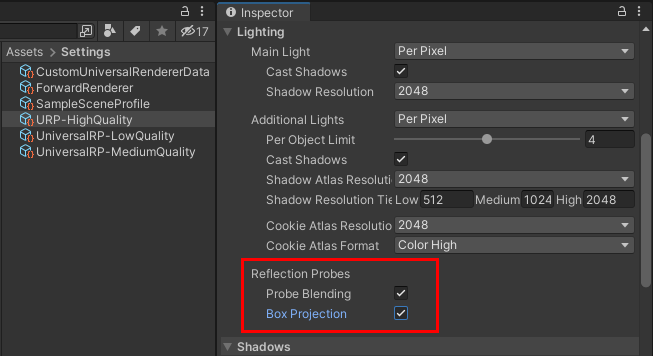

# Reflection probes

This page describes URP-specific behavior of reflection probes.

For general information on reflection probes, see the page [Reflection Probes](https://docs.unity3d.com/Manual/ReflectionProbes.html).

For examples of how to use reflection probes, see the [Lighting samples in URP Package Samples](../package-sample-urp-package-samples.md#lighting).

## Configuring reflection probe settings

To configure settings related to reflection probes, in a URP Asset, select **Lighting** > **Reflection Probes**.

 *Reflection probe settings.*

The Reflection Probes section contains the following properties:

| __Property__ | __Description__ |
| --- | --- |
| **Probe Blending** | Select this property to enable [reflection probe blending](#reflection-probe-blending). On lower-end mobile platforms, disable this property to decrease processing time on the CPU. |
| **Box Projection** | Select this property to enable reflection probe box projection. On lower-end mobile platforms, disable this property to decrease processing time on the CPU. |

## Reflection probe blending

Reflection probe blending lets you avoid a situation where a reflection suddenly appears on an object when it enters the probe box volume. When reflection probe blending is enabled, Unity gradually fades probe cubemaps in and out as the reflective object passes from one volume to the other.

URP supports reflection probe blending in all Rendering Paths.
### Reflection probe volume

Each reflection probe has a box volume. A reflection probe only affects parts of a GameObject that are inside the box volume. When a pixel of an object is outside of any reflection probe volume, Unity uses the skybox reflection.

In URP, Unity evaluates the contribution of each probe for each individual pixel, depending on the position of the pixel relative to the boundary of the probe volume. This behavior is different from the Built-in Render Pipeline, where Unity evaluates the contribution of a probe for the whole object.

### Blend Distance

Each reflection probe has the **Blend Distance** property. This property is the distance from the face of a reflection box volume towards the center of the box volume.

Unity uses the Blend Distance property to determine the contribution of a reflection probe. When a pixel of an object is on the face of a reflection probe volume, that pixel gets 0% of reflections from the probe. When a pixel is inside the reflection probe volume and its distance from each face exceeds the Blend Distance value, the pixel gets 100% of reflections.

If the Blend Distance value is more than half of the distance between faces of the reflection probe volume, the reflection probe cannot provide 100% contribution to any pixel within the volume.

### Which probes affect a GameObject

When a GameObject is within multiple reflection probe volumes, maximum two of the probes can affect the GameObject. Unity selects which probes affect the GameObject using the following criteria:

* The **Importance** property of a reflection probe. Unity selects two probes with higher Importance values and ignores the others.

* If the Importance values are the same, Unity selects probes which have the smallest box volumes.

* If the Importance values and the box volumes are the same, Unity determines which two reflection probe volumes contain larger surface areas of a GameObject, and picks the probes of those volumes.

When two reflection probes affect a GameObject, for each pixel, Unity calculates the weight of each probe depending on the distance of this pixel from the faces of the probe box volumes and the values of the **Blend Distance** properties. If the pixel is relatively close to faces of both box volumes and the sum of weights of both probes is less than 1, Unity assigns the remaining weight to the skybox reflection.

If the pixel is within both box volumes and farther than the Blend Distance values from faces of both volumes:

* If the **Importance** properties of the reflection probes are the same, Unity blends reflections from the probes with equal weights.

* If the **Importance** property of one of the probes is higher, Unity applies the reflections only from that probe.

## Box projection

For the box projection to work:

* Select the **Box Projection** check box on the [URP asset](#configuring-reflection-probe-settings).

* Select the **Box Projection** property on the reflection probe.
