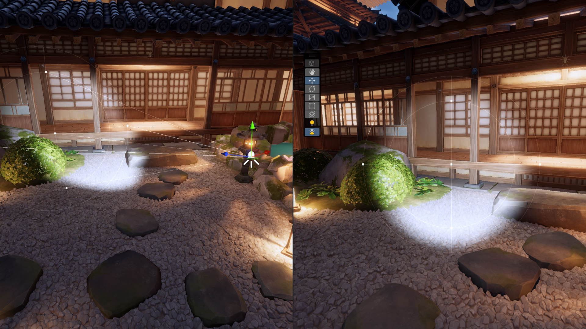

# View and manipulate Lights from their perspective

The Universal Render Pipeline (URP) includes the Light Placement Tool which you can use to view a Scene from a light source’s perspective. You can use this tool to move and modify any type of light source.

This tool does not affect any Cameras in your Scene. The Scene View Camera returns to its original position when you disable the Light Placement Tool.

## Use the Light Placement Tool

To use the Light Placement Tool :
1. Select a Light GameObject in the inspector window.
2. In the Scene View Toolbar, select the Light Placement Tool icon. . The Scene View Camera automatically changes position to look through the selected Light.
4. Use the Camera controls (pan, orbit, zoom) to adjust the Light’s position.
5. Use the Light’s gizmos to adjust its properties.

To exit the Light Placement Tool use one of the following methods: 
* Press "**Escape**".
* Select the Light Placement Tool icon.
* Select another GameObject.

The Scene View Camera automatically returns to its previous position.
