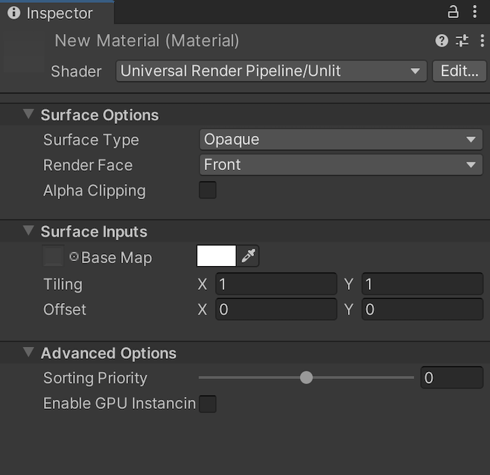

# Particles Unlit Shader

Use this Shader for Particles that don’t need lighting. Because there are no time-consuming lighting calculations or lookups, this Shader is optimal for lower-end hardware. The Unlit Shader uses the most simple [shading model](shading-model.md) in the Universal Render Pipeline (URP).

## Using the Particles Unlit Shader in the Editor

To select and use this Shader:

1. In your Project, create or find the Material you want to use the Shader on.  Select the **Material**. A Material Inspector window opens.
2. Click **Shader**, and select **Universal Render Pipeline** > **Particles** > **Unlit**.

## UI overview

The Inspector window for this Shader contains these elements:

* **[Surface Options](#surface-options)**
* **[Surface Inputs](#surface-inputs)**
* **[Advanced](#advanced)**

### Surface Options

The **Surface Options** control how URP renders the Material on a screen.

| Property           | Description                                                  |
| ------------------ | ------------------------------------------------------------ |
| **Surface Type**   | Use this drop-down to apply an **Opaque** or **Transparent** surface type to the Material. This determines which render pass URP renders the Material in. **Opaque** surface types are always fully visible, regardless of what’s behind them. URP renders opaque Materials first. **Transparent** surface types are affected by their background, and they can vary according to which type of transparent surface type you choose. URP renders transparent Materials in a separate pass after opaque Materials.  If you select **Transparent**, the **Blending Mode** drop-down appears. |
| **Blending Mode**  | Use this drop-down to determine how URP calculates the color of each pixel of the transparent Material by blending the Material with the background pixels. **Alpha** uses the Material’s alpha value to change how transparent a surface is. 0 is fully transparent. 1 appears fully opaque, but the Material is still rendered during the Transparent render pass. This is useful for visuals that you want to be fully visible but to also fade over time, like clouds. **Premultiply** applies a similar effect to the Material as **Alpha**, but preserves reflections and highlights, even when your surface is transparent. This means that only the reflected light is visible. For example, imagine transparent glass. **Additive** adds an extra layer to the Material, on top of another surface. This is good for holograms.  **Multiply** multiplies the color of the Material with the color behind the surface. This creates a darker effect, like when you view an through tinted glass. |
| **Render Face**    | Use this drop-down to determine which sides of your geometry to render. **Front Face** renders the front face of your geometry and [culls](https://docs.unity3d.com/Manual/SL-CullAndDepth.html) the back face. This is the default setting.  **Back Face** renders the front face of your geometry and culls the front face.  **Both** makes URP render both faces of the geometry. This is good for small, flat objects, like leaves, where you might want both sides visible. |
| **Alpha Clipping** | Makes your Material act like a [Cutout](https://docs.unity3d.com/Manual/StandardShaderMaterialParameterRenderingMode.html) Shader. Use this to create a transparent effect with hard edges between the opaque and transparent areas. For example, to create blades of grass. To achieve this effect, URP does not render alpha values below the specified **Threshold**, which appears when you enable **Alpha Clipping**.  You can set the **Threshold** by moving the slider, which accepts values from 0 to 1. All values above your threshold are fully opaque, and all values below your threshold are invisible. For example, a threshold of 0.1 means that URP doesn't render alpha values below 0.1. The default value is 0.5. |
| **Color Mode**     | Use this drop-down to determine how the particle color and the Material color blend together.  **Multiply** produces a darker final color by multiplying the two colors. **Additive** produces a brighter final colour by adding the two colours together. **Subtractive** subtracts the particle color from the base color of the Material. This creates an overall dark effect in the pixel itself, with less brightness. **Overlay** blends the particle color over the base color of the Material. This creates a brighter color at values over 0.5 and darker colors at values under 0.5. **Color** uses the particle color to colorize the Material color, while keeping the value and saturation of the base color of the Material. This is good for adding splashes of color to monochrome scenes. **Difference** returns the difference between both color values. This is good for blending particle and Material colors that are similar to each other. |

### Surface Inputs

The **Surface Inputs** describe the surface itself. For example, you can use these properties to make your surface look wet, dry, rough, or smooth.

| Property       | Description                                                  |
| -------------- | ------------------------------------------------------------ |
| **Base Map**   | Adds color to the surface. To assign a Texture to the **Base Map** setting, click the object picker next to it. This opens the Asset Browser, where you can select from the Textures in your Project. Alternatively, you can use the [color picker](https://docs.unity3d.com/Manual/EditingValueProperties.html). The color next to the setting shows the tint on top of your assigned Texture. To assign another tint, you can click this color swatch. If you select **Transparent** or **Alpha Clipping** under **Surface Options**, your Material uses the Texture’s alpha channel or color. The Base Map is also known as a diffuse map. |
| **Normal Map** | Adds a normal map to the surface. With a [normal map](https://docs.unity3d.com/Manual/StandardShaderMaterialParameterNormalMap.html), you can add surface details like bumps, scratches and grooves. To add the map, click the object picker next to it. The normal map picks up ambient lighting in the environment. |
| **Emission**   | Makes the surface look like it emits lights. When enabled, the  **Emission Map** and **Emission Color** settings appear. To assign an **Emission Map**, click the object picture next to it. This opens the Asset Browser, where you can select from the textures in your Project.  For **Emission Color**, you can use the [color picker](https://docs.unity3d.com/Manual/EditingValueProperties.html) to assign a tint on top of the color. This can be more than 100% white, which is useful for effects like lava, that shines brighter than white while still being another color. If you have not assigned an **Emission Map**, the **Emission** setting only uses the tint you’ve assigned in **Emission Color**.  If you do not enable **Emission**, URP sets the emission to black and does not calculate emission. |

### Advanced

The **Advanced** settings affect behind-the-scenes rendering. They do not have a visible effect on your surface, but on underlying calculations that impact performance.

| Property               | Description                                                  |
| ---------------------- | ------------------------------------------------------------ |
| **Flip-Book Blending** | Tick this box to blend flip-book frames together. This is useful in texture sheet animations with limited frames, because it makes animations smoother. If you have performance issues, try turning this off. |
| **Vertex Streams**     | This list shows the vertex streams that this Material requires in order to work properly. If the vertex streams aren’t correctly assigned, the **Fix Now** button appears. Click this button to apply the correct setup of vertex streams to the Particle System that this Material is assigned to. |
| **Sorting Priority**      | Use this slider to determine the chronological rendering order for a Material. URP renders Materials with lower values first. You can use this to reduce overdraw on devices by making the pipeline render Materials in front of other Materials first, so it doesn't have to render overlapping areas twice. This works similarly to the [render queue](https://docs.unity3d.com/ScriptReference/Material-renderQueue.html) in the built-in Unity render pipeline. |

#### Transparent surface type

If you’ve chosen a Transparent surface type under [Surface Options](#surface-options), these options appear:

| Property           | Description                                                  |
| ------------------ | ------------------------------------------------------------ |
| **Soft Particles** | Tick this box to make particles fade out when they get close to intersecting with the surface of other geometry written into the [depth buffer](https://docs.unity3d.com/Manual/class-RenderTexture.html). When you enable this feature, the **Surface Fade** settings appear: **Near** sets the distance from the other surface where the particle is completely transparent. This is where the particle appears to fade out completely. **Far** sets the distance from the other surface where the particle is completely opaque. The particle appears solid here. Distances are measured in world units. Only usable for transparent surface types.  **Note**: This setting uses the `CameraDepthTexture` that is created by URP. To use this setting, enable **Depth Texture** in the [URP Asset](universalrp-asset.md) or for the [Camera](camera-component-reference.md) that is rendering the particles. |
| **Camera Fading**  | Tick this box to make particles fade out when they get close to the camera. When you enable this feature, the **Distance** settings appear: **Near** sets the distance from the camera where the particle is completely transparent. This is where the particle appears to fade out completely. **Far** sets the distance from the camera where the particle is completely opaque. The particle appears solid here. Distances are measured in world units.   **Note**: This uses the `CameraDepthTexture` that is created by Universal RP. To use this setting, enable **Depth Texture** in the [URP Asset](universalrp-asset.md) or for the [Camera](camera-component-reference.md) that is rendering the particles. |
| **Distortion**     | Creates a distortion effect by making particles perform refraction with the objects drawn before them. This is useful for creating a heat wave effect or for warping objects behind the particles.  When you enable this feature, these settings appear: **Strength** controls how much the Particle distorts the background. Negative values have the opposite effect of positive values. So if something was offset to the right with a positive value, the equal negative value offsets it to the left. **Blend** controls how visible the distortion is. At 0, there is no visible distortion. At 1, only the distortion effect is visible.  **Note**: This uses the `CameraOpaqueTexture` that is created by URP. To use this setting, enable **Opaque Texture** in the [URP Asset](universalrp-asset.md) or for the [Camera](camera-component-reference.md) that is rendering the particles. |
