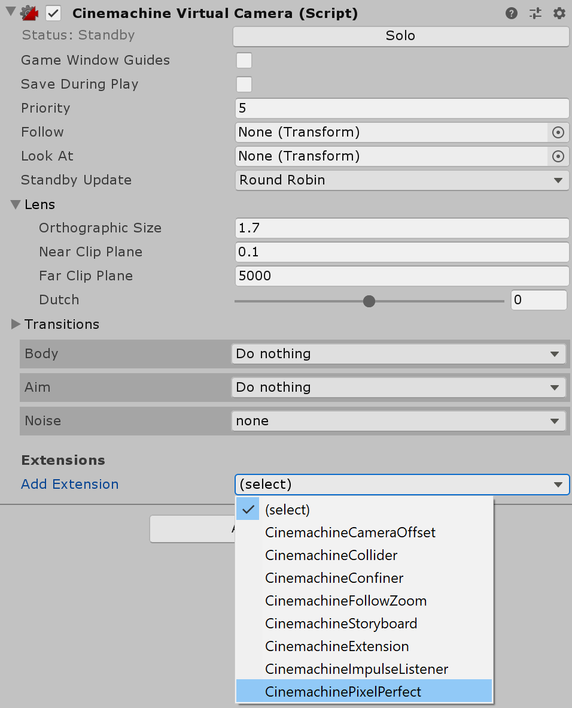

# Using the Cinemachine Pixel Perfect extension

Both the **Pixel Perfect Camera** and [Cinemachine](https://unity.com/unity/features/editor/art-and-design/cinemachine) modify the Camera’s orthographic size. Using these two systems together in a single Scene would cause them to fight for control over the Camera and produce unwanted results. The **Cinemachine Pixel Perfect** extension solves this incompatibility.

**Cinemachine Pixel Perfect** is an [extension](https://docs.unity3d.com/Packages/com.unity.cinemachine@2.2/manual/CinemachineVirtualCameraExtensions.html) for the **Cinemachine Virtual Camera** that alters the orthographic size of the virtual camera. The extension detects the presence of the Pixel Perfect Camera component, and uses the component settings to calculate for the correct orthographic size of the virtual camera that best retains the Sprites in a pixel-perfect resolution.

To add this extension to your virtual cameras, use the **Add Extension** dropdown menu on the Cinemachine Virtual Camera Inspector window. Add this extension to each virtual camera in your Project.

For each virtual camera attached with this extension, the Pixel Perfect Camera component then calculates a pixel-perfect orthographic size that best matches the original size of the virtual camera during **Play Mode ** or when **Run In Edit Mode** is enabled. This is done to match the original framing of each virtual camera as close as possible when the pixel-perfect calculations are implemented.

When the [Cinemachine Brain](https://docs.unity3d.com/Packages/com.unity.cinemachine@2.3/manual/CinemachineBrainProperties.html) component [blends](https://docs.unity3d.com/Packages/com.unity.cinemachine@2.3/manual/CinemachineBlending.html) between multiple virtual cameras, the rendered image is temporarily not pixel-perfect during the transition between cameras. The image becomes pixel-perfect once the view fully transitions to a single virtual camera.

The following are the current limitations of the extension:

- When a virtual camera with the Pixel Perfect extension is set to follow a [Target Group](https://docs.unity3d.com/Packages/com.unity.cinemachine@2.3/manual/CinemachineTargetGroup.html), there may be visible choppiness when the virtual camera is positioned with the [Framing Transposer](https://docs.unity3d.com/Packages/com.unity.cinemachine@2.9/manual/CinemachineBodyFramingTransposer.html) component.
- If the **Upscale Render Texture** option is enabled on the Pixel Perfect Camera, there are less possible pixel-perfect resolutions that match the original orthographic size of the virtual cameras. This may cause  the framing of the virtual cameras to be off by quite a large margin after the pixel-perfect calculations.
