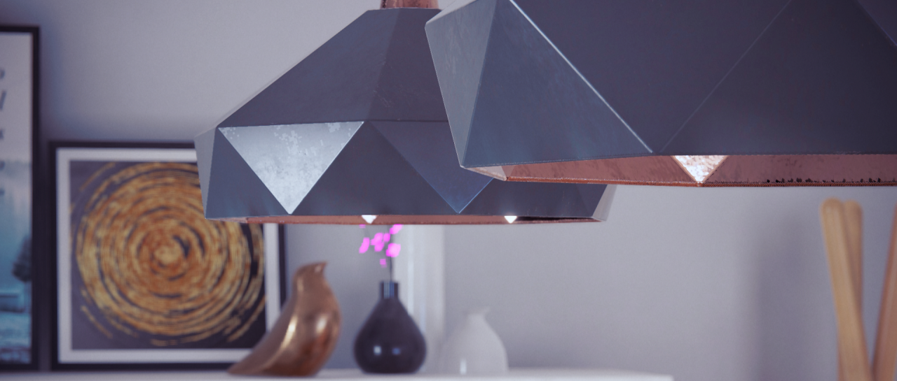
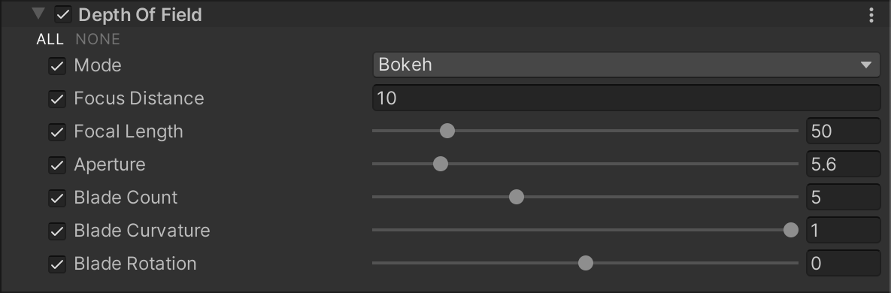

# Depth Of Field

The Depth Of Field component applies a depth of field effect, which simulates the focus properties of a camera lens. In real life, a camera can only focus sharply on an object at a specific distance. Objects nearer or farther from the camera are out of focus. The blurring gives a visual cue about an object’s distance, and introduces “bokeh”, which refers to visual artifacts that appear around bright areas of the image as they fall out of focus. To read more about bokeh, refer to the [Wikipedia article on Bokeh](https://en.wikipedia.org/wiki/Bokeh).

The Universal Render Pipeline (URP) has two depth of field modes:

- **Gaussian**: this mode approximates camera-like effects, but doesn’t imitate them completely. It has a limited blur radius and only does far-field blurring. This mode is the fastest, and is the best mode for lower-end platforms. 

- **Bokeh**: a slower but higher quality mode that closely imitates the effects of a real-life camera. It can do both near & far-field blurring, and generates bokeh on areas with high luminosity intensity, also known as hot spots. 

## Using Depth Of Field

**Depth Of Field** uses the [Volume](Volumes.md) system, so to enable and modify **Depth Of Field** properties, you must add a **Depth Of Field** override to a [Volume](Volumes.md) in your Scene. To add **Depth Of Field** to a Volume:

1. In the Scene or Hierarchy view, select a GameObject that contains a Volume component to view it in the Inspector.
2. In the Inspector, navigate to **Add Override** &gt; **Post-processing**, and click on **Depth Of Field**. Universal Render Pipeline applies **Depth Of Field** to any Camera this Volume affects.

## Properties

| **Property** | **Description**                                              |
| ------------ | ------------------------------------------------------------ |
| **Mode**     | Use this drop-down to select the mode that URP uses to set the focus for the depth of field effect.<ul><li>**Off**: Select this option to disable depth of field.</li><li>**Gaussian**: Select this option to use the faster but more limited depth of field mode.</li><li>**Bokeh**: Select this option to use the Bokeh-based depth of field mode.</li></ul> |

### Gaussian Depth of Field

| **Property**              | **Description**                                              |
| ------------------------- | ------------------------------------------------------------ |
| **Start**                 | Set the distance from the Camera at which the far field starts blurring. |
| **End**                   | Set the distance from the Camera at which the far field blur reaches its maximum blur radius. |
| **Max Radius**            | Set the maximum radius the far blur can reach. The default value is 1.  **Note:** Values above 1 can cause visual under-sampling artifacts to appear in your Scene. If your blur effects are not smooth or appear to have static noise in them, try decreasing the value back to 1 or lower. |
| **High Quality Sampling** | Use higher quality sampling to reduce flickering and improve the overall blur smoothness. This can cause some performance cost. |

### Bokeh Depth of Field

The **Bokeh** Depth of Field mode closely imitates the effect of a real-life camera. For this reason, the settings are based on real-life camera settings, and offer a number of properties to adjust the diaphragm blades on the Camera. For an introduction to diaphragm blades and how they affect the visual quality of your Camera output, refer to Improve Photography’s guide [Aperture Blades: How many is best?](https://improvephotography.com/29529/aperture-blades-many-best/).

| **Property**        | **Description**                                              |
| ------------------- | ------------------------------------------------------------ |
| **Focus&#160;Distance**  | Set the distance from the Camera to the focus point.         |
| **Focal Length**    | Set the distance, in millimeters, between the Camera sensor and the Camera lens. The larger the value is, the shallower the depth of field. |
| **Aperture**        | Set the ratio of aperture (known as f-stop or f-number). The smaller the value is, the shallower the depth of field is. |
| **Blade Count**     | Use the slider to set the number of diaphragm blades the Camera uses to form the aperture. The more blades you use, the rounder the bokeh appears.  _Blade Count from left to right: 3, 4, 5, and 6._ |
| **Blade&#160;Curvature** | Use the slider to set the curvature of diaphragm blades the Camera uses to form the aperture. The smaller the value is, the more visible aperture blades are. A value of 1 makes the bokeh perfectly circular.  _Blade Curvature value of 1 (left), and 0 (right)._ |
| **Blade Rotation**  | Use the slider to set the rotation of diaphragm blades in degrees. |
