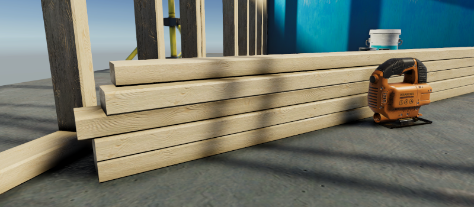
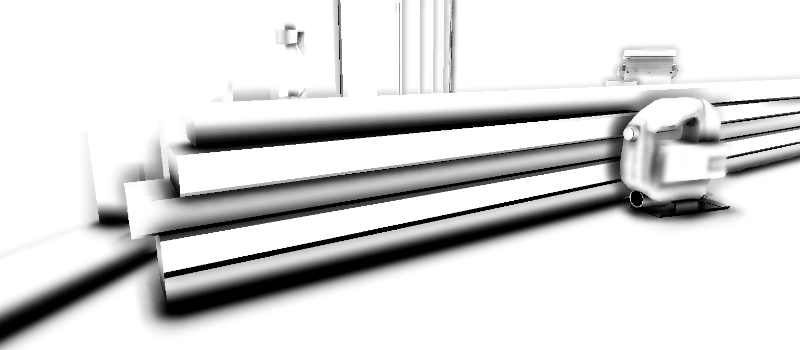

# Ambient Occlusion

The Ambient Occlusion effect darkens creases, holes, intersections and surfaces that are close to each other in real-time. In the real world, such areas tend to block out or occlude ambient light, so they appear darker.

URP implements the Screen Space Ambient Occlusion (SSAO) effect as a [Renderer Feature](urp-renderer-feature.md). It works with every shader that the Universal Render Pipeline (URP) provides as well as any custom opaque Shader Graphs you create.

> **Note**: The SSAO effect is a Renderer Feature and works independently from the post-processing effects in URP. This effect does not depend on or interact with Volumes.

The following images show a scene with the Ambient Occlusion effect turned off, on, and only the Ambient Occlusion texture.

 *Scene with Ambient Occlusion effect turned off.*

 *Scene with Ambient Occlusion effect turned on.*

 *Scene with only the Ambient Occlusion texture.*

## Add the SSAO Renderer Feature to a Renderer

URP implements the Ambient Occlusion effect as a Renderer Feature.

To use the SSAO effect in your project follow the instructions on [How to add a Renderer Feature to a Renderer](urp-renderer-feature-how-to-add.md) and add the Screen Space Ambient Occlusion Renderer Feature.

This causes any Cameras that use the Renderer with the SSAO Renderer Feature to have the SSAO effect.

## Properties

This section describes the properties of the SSAO Renderer Feature.

### Method

This property defines the type of noise the SSAO effect uses.

Available Options:

* **Interleaved Gradient Noise**: Uses interleaved gradient noise to generate static SSAO.
* **Blue Noise**: Uses a selection of blue noise textures to generate dynamic SSAO. This creates an animated effect as the texture changes with every frame, as a result the SSAO effect is more subtle when the camera is in motion.

**Performance impact**: Insignificant.

### Intensity

This property defines the intensity of the darkening effect.

**Performance impact**: Insignificant.

### Radius

When Unity calculates the Ambient Occlusion value, the SSAO effect takes samples of the normal texture within this radius from the current pixel.

**Performance impact**: High.

A lower **Radius** value improves performance, because the SSAO Renderer Feature samples pixels closer to the source pixel. This makes caching more efficient.

Calculating the Ambient Occlusion Pass on objects closer to the Camera takes longer than on objects further from the Camera. This is because the **Radius** property scales with the object.

### Falloff Distance

SSAO does not apply to objects farther than this distance from the Camera.

A lower value increases performance in scenes that contain many distant objects. The performance improvement is smaller in smaller scenes with fewer objects.

**Performance impact**: Depends on the application.

### Direct Lighting Strength

This property defines how visible the effect is in areas exposed to direct lighting.

These images show how the **Direct Lighting Strength** value changes the SSAO effect depending on whether they are in the shadow or not.

 *Direct Lighting Strength: 0.2.*

 *Direct Lighting Strength: 0.9.*

**A**. Shows the effect of **Direct Lighting Strength** on the SSAO effect in lit areas.

**B**. Shows the effect of **Direct Lighting Strength** on the SSAO effect in areas one or more shadows cover.

**Performance impact**: Insignificant.

## Quality

### Source

Select the source of the normal vector values. The SSAO Renderer Feature uses normal vectors for calculating how exposed each point on a surface is to ambient lighting.

Available options:

* **Depth Normals**: SSAO uses the normal texture generated by the `DepthNormals` Pass. This option lets Unity make use of a more accurate normal texture.
* **Depth**: SSAO does not use the `DepthNormals` Pass to generate the normal texture. SSAO reconstructs the normal vectors using the depth texture instead. Use this option only if you want to avoid using the `DepthNormals` Pass block in your custom shaders. Selecting this option enables the **Normal Quality** property.

**Performance impact**: Depends on the application.

When you switch between the options **Depth Normals** and **Depth**, there might be a variation in performance, which depends on the target platform and the application. In a wide range of applications the difference in performance is small. In most cases, **Depth Normals** produce a better visual look.

For more information on the Source property, refer to the [Implementation details](#implementation-details).

### Normal Quality

This property becomes active when you select the option Depth in the **Source** property.

Higher quality of the normal vectors produces smoother SSAO effect.

Available options:

* **Low**
* **Medium**
* **High**

**Performance impact**: Medium.

In some scenarios, the **Depth** option produces results comparable with the **Depth Normals** option. But in certain cases, the **Depth Normals** option provides a significant increase in quality. The following images show an example of such case.

 *Source: Depth. Normal Quality: Low.*

 *Source: Depth. Normal Quality: Medium.*

 *Source: Depth. Normal Quality: High.*

 *Source: Depth Normals.*

For more information, refer to the [Implementation details](#implementation-details).

### Downsample

Selecting this check box reduces the resolution of the Pass that calculates the Ambient Occlusion effect by a factor of two.

The reduction in resolution of the Ambient Occlusion Pass by a factor of two reduces the pixel count to process by a factor of four. This reduces the load on the GPU significantly, but makes the effect less detailed.

**Performance impact**: Very high.

### After Opaque

When you enable **After Opaque**, Unity calculates and applies the SSAO effect after the opaque render pass. This can increase performance when used with **Depth** as the **Source** for normal vector values as Unity does not perform the skips depth prepass to calculate SSAO and instead uses the existing depth values.

**After Opaque** can also increase performance on mobile devices that use tile-based rendering.

**Performance impact**: Medium.

### Blur Quality

This property defines the quality of blur that Unity applies to the SSAO effect. Higher quality blur creates a smoother, higher fidelity effect but requires more processing power.

Available options:

* **High** (Bilateral): Bilateral blur, takes three passes to process.
* **Medium** (Gaussian): Gaussian blur, takes two passes to process.
* **Low** (Kawase): Kawase blur, takes a single pass to process.

**Performance impact**: Very high.

### Samples

For each pixel, the SSAO Render Feature takes the selected number of samples within the specified radius to calculate the Ambient Occlusion value. A higher value makes the effect smoother and more detailed, but also reduces performance.

Available options:

* **High**: 12 Samples
* **Medium**: 8 Samples
* **Low**: 4 Samples

**Performance impact**: High.

An increase in the **Sample Count** value from 4 to 8 doubles the computational load on the GPU.

## Implementation details

The SSAO Renderer Feature uses normal vectors for calculating how exposed each point on a surface is to ambient lighting.

URP 10.0 implements the `DepthNormals` Pass block that generates the the normal texture `_CameraNormalsTexture` for the current frame. By default, the SSAO Renderer Feature uses this texture to calculate Ambient Occlusion values.

If you implement your custom SRP and if you do not want to implement the `DepthNormals` Pass block in your shaders, you can use the SSAO Renderer Feature and set its **Source** property to **Depth**. In this case, Unity does not use the `DepthNormals` Pass to generate the normal vectors, it reconstructs the normal vectors using the depth texture instead.

Selecting the option **Depth** in the **Source** property enables the **Normal Quality** property. The options in this property (Low, Medium, and High) determine the number of samples of the depth texture that Unity takes when reconstructing the normal vector from the depth texture. The number of samples per quality level: Low: 1, Medium: 5, High: 9.
