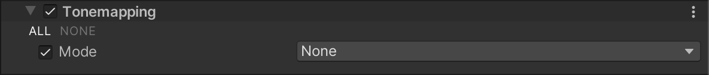

# Tonemapping

Tonemapping is the process of remapping the HDR values of an image to a new range of values. Its most common purpose is to make an image with a low dynamic range appear to have a higher range. For more information, refer to the [Wikipedia article on Tone mapping](https://en.wikipedia.org/wiki/Tone_mapping).

## Using Tonemapping

**Tonemapping**  uses the [Volume](Volumes.md) system, so to enable and modify **Tonemapping** properties, you must add a **Tonemapping** override to a [Volume](Volumes.md) in your scene.

To add **Tonemapping** to a Volume:

1. In the Scene or Hierarchy view, select a GameObject that contains a Volume component to view it in the Inspector.
2. In the Inspector, navigate to **Add Override** &gt; **Post-processing**, and click on **Tonemapping**. The Universal Render Pipeline applies **Tonemapping** to any Camera this Volume affects.

## Properties

| **Property** | **Description**                                              |
| ------------ | ------------------------------------------------------------ |
| **Mode**     | Select a tonemapping algorithm to use for color grading. The options are:<ul><li>**None**: Use this option if you do not want to apply tonemapping.</li><li>**Neutral**: Use this option if you only want range-remapping with minimal impact on color hue & saturation. It is generally a good starting point for extensive color grading.</li><li>**ACES**: Use this option to apply a close approximation of the reference ACES tonemapper, for a more cinematic look. It is more contrasted than Neutral, and has an effect on actual color hue & saturation. If you use this tonemapper, Unity does all the grading operations in the ACES color spaces, for optimal precision and results. **Note**: ACES HDR tonemapping is not supported on Android devices with Adreno 300 series GPU.</li></ul> |
