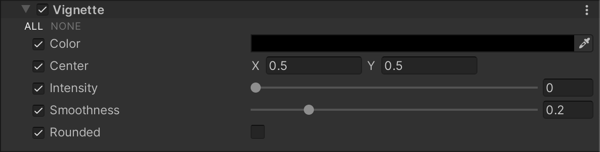

# Vignette

In photography, vignetting is the term for the darkening and/or desaturating towards the edges of an image compared to the center. In real life, thick or stacked filters, secondary lenses, and improper lens hoods are usually the cause of this effect. You can use vignetting to draw focus to the center of an image.

## Using Vignette

**Vignette** uses the [Volume](Volumes.md) system, so to enable and modify **Vignette** properties, you must add a **Vignette** override to a [Volume](Volumes.md) in your scene.

To add **Vignette** to a Volume:

1. In the Scene or Hierarchy view, select a GameObject that contains a Volume component to view it in the Inspector.
2. In the Inspector, navigate to **Add Override** &gt; **Post-processing** and click on **Vignette**. Universal Render Pipeline applies **Vignette** to any Camera this Volume affects.

## Properties

| **Property**   | **Description**                                              |
| -------------- | ------------------------------------------------------------ |
| **Color**      | Use the color picker to set the color of the vignette.       |
| **Center**     | Set the vignette center point. For reference, the screen center is [0.5, 0.5]. |
| **Intensity**  | Set the strength of the vignette effect.   |
| **Smoothness** | Use the slider to set the smoothness of the vignette borders. Values range between 0.01 and 1. The higher the value, the smoother the vignette border. The default value is 0.2.
| **Rounded**    | When enabled, the vignette is perfectly round. When disabled, the vignette matches the shape on the current aspect ratio. |
