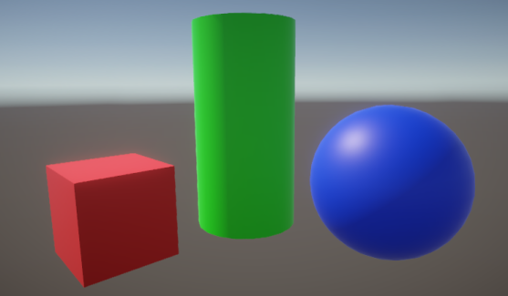

# Custom post-processing

The Universal Render Pipeline (URP) provides a variety of pre-built [post-processing effects](https://docs.unity3d.com/Packages/com.unity.render-pipelines.universal@15.0/manual/integration-with-post-processing.html) that you can adjust to create a particular visual effect or style. URP also lets you create custom post-processing effects using the [Full Screen Pass Renderer Feature](../renderer-features/renderer-feature-full-screen-pass.md). For example, you can implement a grayscale effect to indicate when a player has run out of health.

 *Scene with no post-processing effects.*

 *Scene with grayscale custom post-processing effect.*

The following page describes how to create a custom post-processing effect using the [Full Screen Pass Renderer Feature](../renderer-features/renderer-feature-full-screen-pass.md).

* [How to create a custom post-processing effect](post-processing-custom-effect-low-code.md).