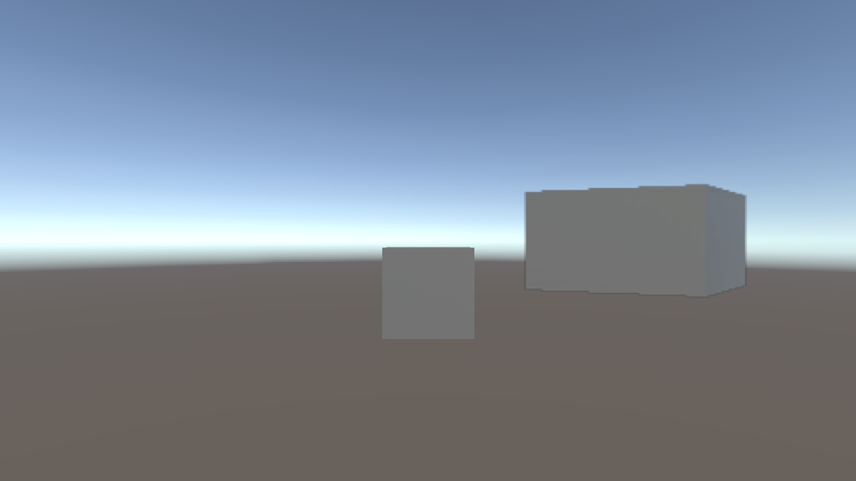

# Implement an HDR Output compatible custom overlay

This page demonstrates how to create a Scriptable Renderer Feature that does the following:

* Composites the output of one camera onto another camera.
* Applies tonemapping to make the custom overlay consistent with the effects of HDR output.

This includes the shader that applies tonemapping to the overlay, depending on frame order.

Refer to [Introduction to Scriptable Renderer Features](../renderer-features/scriptable-renderer-features/intro-to-scriptable-renderer-features.md) and [Introduction to Scriptable Render Passes](../renderer-features/intro-to-scriptable-render-passes.md) for more information.

This example is split into the following sections:

* [Prerequisites](#prerequisites)
* [Set up the scene](#set-up-the-scene)
* [Create the custom overlay Render Pass](#create-the-custom-overlay-render-pass)
  * [Implement the RecordRenderGraph method](#implement-the-recordrendergraph-method)
* [Create the custom overlay Renderer Feature](#create-the-custom-overlay-scriptable-renderer-feature)
* [Create the custom overlay shader](#create-the-custom-overlay-shader)
* [Finish the custom overlay](#finish-the-custom-overlay)
* [Complete code samples](#complete-code-samples)
  * [Custom overlay Render Pass code](#custom-overlay-render-pass-code)
  * [Custom overlay Renderer Feature code](#custom-overlay-scriptable-renderer-feature-code)
  * [Custom overlay shader code](#custom-overlay-shader-code)

## Prerequisites

This example assumes the following:

* The Unity project uses URP as the active render pipeline.
* The project is set up for HDR rendering with the following settings:
  * The active URP Asset has **Grading Mode** set to **High Dynamic Range**.
  * The active URP Asset has **HDR** enabled.
  * The Project Settings have **HDR Output** enabled.

## Set up the scene

For the example to work correctly, you must first set up a sample scene as shown in the following instructions.

1. Create a Cube GameObject and set its position to the origin point in the scene (X: 0, Y: 0, Z: 0).
2. Align the `Main Camera` so that the cube is clearly visible.
3. Create a new camera and call it **Overlay Camera**.
4. Position the overlay camera to the right of the `Main Camera` and align it so the cube is clearly visible.
5. Set the overlay camera **Background Type** property to **Solid Color** in the Inspector window.
6. Set the color of the overlay camera background to a clear black with the RGBA values of `0, 0, 0, 0`.
7. Create a render texture and call it **OverlayRenderTexture**. To create a render texture, go to **Assets** > **Create** > **Rendering** > **Render Texture**.

    > **Note**: For better HDR precision, use a signed float format for the render texture format. To do this, select the render texture, then in the Inspector window change **Color Format** to a format with the `_SFLOAT` suffix.

8. Assign the overlay render texture to the overlay camera's **Output Texture** property. To do this, open the `Overlay Camera` in the Inspector and go to **Output** > **Output Texture** and select **OverlayRenderTexture** from the asset list.
9. Create a new Universal Renderer asset for the overlay camera and call it **OverlayRenderer**. To do this, go to **Assets** > **Create** > **Rendering** > **URP Universal Renderer**.
10. Select the active URP Asset, then in the Inspector window go to **Rendering** > **Renderer List** > **+**. Select **OverlayRenderer**. This adds the overlay renderer to the renderer list.
11. Select the overlay camera, then in the Inspector window go to **Rendering** > **Renderer**. Select **OverlayRenderer**. This sets the overlay camera to use the overlay renderer.

The scene is now ready for you to create a custom overlay with Scriptable Renderer Features.

## Create the custom overlay Render Pass

To create a custom overlay that's compatible with HDR Output, you must use a Scriptable Render Pass to create the overlay. HDR Output applies tonemapping to the output of the main camera during post-processing. As a result of this, the output of the main camera and the overlay camera have different tonemapping. This render pass then occurs after post-processing to apply tonemapping to the output of the overlay camera.

To create the render pass for this example, use the following steps:

1. Create a C# script and call it `CustomOverlayRenderPass`.
2. In the script, remove the code that Unity inserted in the `CustomOverlayRenderPass` class.
3. Add the following `using` directives.

    ```c#
    using UnityEngine;
    using UnityEngine.Rendering;
    using UnityEngine.Rendering.Universal;
    using UnityEngine.Rendering.RenderGraphModule;
    ```

4. Create a new `CustomOverlayRenderPass` class that inherits from the `ScriptableRenderPass` class and has the attribute `[SupportedOnRenderer(typeof(UniversalRendererData))]`.

    ```c#
    [SupportedOnRenderer(typeof(UniversalRendererData))]
    public class CustomOverlayRenderPass : ScriptableRenderPass
    {
  
    }
    ```

5. Add the properties `Material passMaterial` and `RTHandle passOverlayTexture` to the render pass, as shown below.

    ```c#
    [SupportedOnRenderer(typeof(UniversalRendererData))]
    public class CustomOverlayRenderPass : ScriptableRenderPass
    {
        Material passMaterial;
        RTHandle overlayTextureHandle;
    }
    ```

6. Create a constructor method that takes a material as a parameter and assigns it to `passMaterial`. This method also creates the profiling sampler for the render pass and sets it to run at the `AfterRenderingPostProcessing` event.

    ```c#
    public CustomOverlayRenderPass(Material material)
    {
        passMaterial = material;
        profilingSampler = new ProfilingSampler(nameof(CustomOverlayRenderPass));

        renderPassEvent = RenderPassEvent.AfterRenderingPostProcessing;
    }
    ```

7. Add a `Setup` method for the render pass. Use this method and parameter to create an `RTHandle` from the overlay texture as shown below. The use of an `RTHandle` allows the `RenderPass` API to interact with the overlay render texture.

    ```c#
    public void Setup(Texture overlayTex)
    {
        if (overlayTextureHandle != overlayTex)
        {
            overlayTextureHandle?.Release();
            overlayTextureHandle = RTHandles.Alloc(overlayTex);
        }
    }
    ```

8. Implement the `Dispose` method to release the overlay texture when the render pass is destroyed.

    ```c#
    public void Dispose()
    {
        overlayTextureHandle?.Release();
    }
    ```

9. Create two structs, one named `CopyData`, and another named `PassData`, which contain the properties shown below. These structs hold key properties URP needs to implement the render pass.

    ```c#
    struct CopyData
    {
        public TextureHandle source;
    }

    struct PassData
    {
        public TextureHandle source;
        public TextureHandle overlayTexture;
        public TextureHandle internalLut;
        public Vector4 lutParams;
        public Material material;
    }
    ```

10. Add the `RecordRenderGraph` method as shown below.

    ```c#
    public override void RecordRenderGraph(RenderGraph renderGraph, ContextContainer frameData)
    {

    }
    ```

### Implement the RecordRenderGraph method

Add the code from the following steps within the `RecordRenderGraph` method of the `CustomOverlayRenderPass` class.

1. Get the post-processing, resource, and camera data from the frame data.

    ```c#
    UniversalPostProcessingData postProcessingData = frameData.Get<UniversalPostProcessingData>();
    UniversalResourceData resourceData = frameData.Get<UniversalResourceData>();
    UniversalCameraData cameraData = frameData.Get<UniversalCameraData>();
    ```

2. Get the active color texture from the resource data.

    ```c#
    TextureHandle activeCameraColor = resourceData.activeColorTexture;
    ```

3. Create a texture to store the active camera color target.

    ```c#
    RenderTextureDescriptor colorCopyDescriptor = cameraData.cameraTargetDescriptor;
    colorCopyDescriptor.depthBufferBits = (int) DepthBits.None;
    TextureHandle copiedColor = UniversalRenderer.CreateRenderGraphTexture(renderGraph, colorCopyDescriptor, "_CustomCameraColorCopy", false);
    ```

4. Create a `RasterRenderPass` to copy the active camera color target into the texture. The copy will be used to handle blending.

    ```c#
    using (var builder = renderGraph.AddRasterRenderPass<CopyData>("Custom Overlay Render Pass - Copy Camera", out var passData))
    {
        passData.source = activeCameraColor;
        builder.UseTexture(passData.source, AccessFlags.Read);
        builder.SetRenderAttachment(copiedColor, 0, AccessFlags.WriteAll);

        builder.SetRenderFunc((CopyData data, RasterGraphContext context) =>
        {
            Blitter.BlitTexture(context.cmd, data.source, new Vector4(1, 1, 0, 0), 0.0f, false);
        });
    }
    ```

5. Create another `RasterRenderPass` to copy the overlay texture to the active camera color target with a custom material. This is the container for the rest of the code you add in this section of the guide.

    ```c#
    using (var builder = renderGraph.AddRasterRenderPass<PassData>("Custom Overlay Render Pass - Blit Overlay", out var passData))
    {
    
    }
    ```

6. Set up the properties the render pass needs to blit the overlay texture, as shown below.

    ```c#
    using (var builder = renderGraph.AddRasterRenderPass<PassData>("Custom Overlay Render Pass - Blit Overlay", out var passData))
    {
        passData.material = passMaterial;

        builder.SetRenderAttachment(activeCameraColor, 0, AccessFlags.Write);

        passData.source = copiedColor;
        builder.UseTexture(passData.source, AccessFlags.Read);
    }
    ```

7. Import the texture into the render graph system, then set the texture as an input.

    ```c#
    passData.overlayTexture = renderGraph.ImportTexture(passOverlayTexture);
    builder.UseTexture(passData.overlayTexture, AccessFlags.Read);
    ```

8. Check for post-processing and HDR color grading. If the configuration is correct for HDR Output, set the internal color LUT texture HDR uses as an input, and pass its parameters to the shader.

    ```c#
    if (postProcessingData.gradingMode == ColorGradingMode.HighDynamicRange && cameraData.postProcessEnabled)
    {
        passData.internalLut = resourceData.internalColorLut;
        builder.UseTexture(passData.internalLut, AccessFlags.Read);

        int lutHeight = postProcessingData.lutSize;
        int lutWidth = lutHeight * lutHeight;

        float postExposure = 1.0f;
        ColorAdjustments colorAdjustments = VolumeManager.instance.stack.GetComponent<ColorAdjustments>();
        if (colorAdjustments != null)
        {
            postExposure = Mathf.Pow(2.0f, colorAdjustments.postExposure.value);
        }

        passData.lutParams = new Vector4(1f / lutWidth, 1f / lutHeight, lutHeight - 1f, postExposure);
    }
    ```

    > **Note**: If post processing is disabled, the HDR color conversion will be applied after this render pass and the expected colorspace for the cameras output is the default Rec709. The code in this example uses an `if` statement here to prevent this render pass from altering the output of the overlay camera before HDR is applied.

9. Set a keyword on the shader to enable tonemapping, and add a command to blit the overlay texture to the active camera color target.

    ```c#
    builder.SetRenderFunc((PassData data, RasterGraphContext context) =>
    {
        data.material.SetTexture("_OverlayTexture", data.overlayTexture);

        bool tonemappingActive = data.internalLut.IsValid();
        CoreUtils.SetKeyword(data.material, "TONEMAPPING", tonemappingActive);
        if (tonemappingActive)
        {
            data.material.SetTexture("_InternalLut", data.internalLut);
            data.material.SetVector("_InternalLut_Params", data.lutParams);
        }
        
        Blitter.BlitTexture(context.cmd, data.source, new Vector4(1, 1, 0, 0), data.material, 0);
    });
    ```

This completes the `CustomOverlayRenderPass` script, ready for a Scriptable Renderer Feature to add it to a renderer.

For the complete code for this section, refer to [Custom overlay Render Pass code](#custom-overlay-render-pass-code).

## Create the custom overlay Scriptable Renderer Feature

To add the `CustomOverlayRenderPass` to a renderer, you must create a Scriptable Renderer Feature with the following steps.

1. Create a C# script and call it `CustomOverlayRendererFeature`.
2. In the script, remove the code that Unity inserted in the `CustomOverlayRendererFeature` class.
3. Add the following `using` directives.

    ```c#
    using UnityEngine;
    using UnityEngine.Rendering;
    using UnityEngine.Rendering.Universal;
    ```

4. Set up a new `CustomOverlayRendererFeature` class that inherits from the `ScriptableRendererFeature` class.

    ```c#
    public class CustomOverlayRendererFeature : ScriptableRendererFeature
    {
  
    }
    ```

5. Add the following properties to contain the assets and data the render pass needs.

    ```c#
    public class CustomOverlayRendererFeature : ScriptableRendererFeature
    {
        public Shader hdrShader;
        public RenderTexture passOverlayTexture;

        Material passMaterial;

        CustomOverlayRenderPass overlayRenderPass = null;
    }
    ```

6. Create the `AddRenderPasses` method, and use it to apply the overlay only in Game view and to the last camera in the camera stack.

    ```c#
    public override void AddRenderPasses(ScriptableRenderer renderer, ref RenderingData renderingData)
    {
        if (renderingData.cameraData.cameraType != CameraType.Game || !renderingData.cameraData.resolveFinalTarget)
            return;
    }
    ```

7. After the `if` statement, pass the overlay texture to the overlay render pass and enqueue the render pass.

    ```c#
    public override void AddRenderPasses(ScriptableRenderer renderer, ref RenderingData renderingData)
    {
        if (renderingData.cameraData.cameraType != CameraType.Game || !renderingData.cameraData.resolveFinalTarget)
            return;

        overlayRenderPass.Setup(passOverlayTexture);

        renderer.EnqueuePass(overlayRenderPass);
    }
    ```

8. Add the `Create` method and create an instance of the `CustomOverlayRenderPass` with a new material that uses `hdrShader`.

    ```c#
    public override void Create()
    {
        passMaterial = CoreUtils.CreateEngineMaterial(hdrShader);

        overlayRenderPass = new CustomOverlayRenderPass(passMaterial);
    }
    ```

9. Implement the `Dispose` method to release the resources the renderer feature creates once it has applied the render pass.

    ```c#
    protected override void Dispose(bool disposing)
    {
        CoreUtils.Destroy(passMaterial);
        overlayRenderPass.Dispose();
    }
    ```

For the complete code for this section, refer to [Custom overlay Scriptable Renderer Feature code](#custom-overlay-scriptable-renderer-feature-code).

## Create the custom overlay shader

The material the `CustomOverlayRendererFeature` creates requires a custom shader to handle the overlay and HDR Output changes. The following steps demonstrate how to create a shader capable of this.

1. Create a new shader and name it `CustomOverlayBlit`.
2. Delete the shader code Unity generates automatically and set up the outline of the shader as shown below.

    ```c++
    Shader "Custom/CustomOverlayBlit"
    {
        SubShader
        {
            Tags{ "RenderPipeline" = "UniversalPipeline" }

            Pass
            {
                ZWrite Off ZTest Always Blend Off Cull Off

                HLSLPROGRAM
                    #pragma target 2.0
                    #pragma editor_sync_compilation
                    #pragma vertex Vert
                    #pragma fragment Frag
                    #pragma multi_compile_local_fragment _ TONEMAPPING

                    #include "Packages/com.unity.render-pipelines.universal/ShaderLibrary/Core.hlsl"
                    #include "Packages/com.unity.render-pipelines.core/Runtime/Utilities/Blit.hlsl"
                    #include "Packages/com.unity.render-pipelines.core/ShaderLibrary/Color.hlsl"
                
                    TEXTURE2D(_InternalLut);
                    TEXTURE2D_X(_OverlayTexture);

                    float4 _InternalLut_Params;

                    #define LutParams _InternalLut_Params.xyz
                    #define PostExposure _InternalLut_Params.w

                ENDHLSL
            }
        }
    }
    ```

3. Create a method with the name `ApplyTonemapping` and the return type `half3`. This method should have the following parameters: `half3 input`, `TEXTURE2D_PARAM(lutTex, lutSampler)`, `float3 lutParams`, `float exposure`.
4. In the `ApplyTonemapping` method, multiply `input` by the `exposure` value, then `saturate` the modified `input`.

    ```c++
    half3 ApplyTonemapping(half3 input, TEXTURE2D_PARAM(lutTex, lutSampler), float3 lutParams, float exposure)
    {
        input *= exposure;
        float3 inputLutSpace = saturate(LinearToLogC(input));
    }
    ```

5. Apply the tonemapping changes with `ApplyLut2D` and return the result.

    ```c++
    half3 ApplyTonemapping(half3 input, TEXTURE2D_PARAM(lutTex, lutSampler), float3 lutParams, float exposure)
    {
        input *= exposure;
        float3 inputLutSpace = saturate(LinearToLogC(input));
        return ApplyLut2D(TEXTURE2D_ARGS(lutTex, lutSampler), inputLutSpace, lutParams);
    }
    ```

6. Create a standard `Frag` method as shown below. Place this method inside the `HLSLPROGRAM` but after the `ApplyTonemapping` method.

    ```c++
    half4 Frag(Varyings input) : SV_Target
    {

    }
    ```

7. In the `Frag` method, retrieve the original camera color and the overlay color.

    ```c++
    half4 Frag(Varyings input) : SV_Target
    {
        half4 color = FragBlit(input, sampler_LinearClamp);

        half4 overlay = SAMPLE_TEXTURE2D_X(_OverlayTexture, sampler_LinearClamp, input.texcoord);
    }
    ```

8. Create an `if` statement to check if the shader should apply tonemapping. If the shader should apply tonemapping. use the `ApplyTonemapping` method to apply it to the overlay.

    ```c++
    half4 Frag(Varyings input) : SV_Target
    {
        half4 color = FragBlit(input, sampler_LinearClamp);

        half4 overlay = SAMPLE_TEXTURE2D_X(_OverlayTexture, sampler_LinearClamp, input.texcoord);

        #if TONEMAPPING
        overlay.rgb = ApplyTonemapping(overlay.rgb, TEXTURE2D_ARGS(_InternalLut, sampler_LinearClamp), LutParams, PostExposure);
        #endif
    }
    ```

9. Blend the overlay with the original camera color and return the outcome.

    ```c++
    half4 Frag(Varyings input) : SV_Target
    {
        half4 color = FragBlit(input, sampler_LinearClamp);

        half4 overlay = SAMPLE_TEXTURE2D_X(_OverlayTexture, sampler_LinearClamp, input.texcoord);

        #if TONEMAPPING
        overlay.rgb = ApplyTonemapping(overlay.rgb, TEXTURE2D_ARGS(_InternalLut, sampler_LinearClamp), LutParams, PostExposure);
        #endif

        color.rgb = color.rgb * (1.0 - overlay.a) + overlay.rgb * overlay.a;
        return color;
    }
    ```

The shader is now complete and ready for use in the `CustomOverlayRenderPass` and `CustomOverlayRendererFeature` scripts.

To see the complete code for this section, refer to [Custom overlay shader code](#custom-overlay-shader-code).

## Finish the custom overlay

To finish the custom overlay, you must set up the scripts you've created, to apply their effects to the renderers in the scene. The following steps demonstrate how to do this.

1. Find and select the main renderer the active URP Asset uses.
2. In the Inspector window, select **Add Renderer Feature** > **Custom Overlay Renderer Feature** to add the `CustomOverlayRendererFeature` script.
3. Assign the `CustomOverlayBlit` shader to the **Shader** property of the custom overlay Scriptable Renderer Feature.
4. Assign the `OverlayRenderTexture` to the **Overlay Texture** property of the custom overlay Scriptable Renderer Feature.

The custom overlay is now complete and should appear on top of the main camera output in Play Mode. The overlay should be tonemapped in the same way as the main camera output, with no visible difference. This should be similar to the screenshot below.

<br/>*Cube in the middle of the Game view with the cube from another angle as an overlay, tonemapped to match HDR Output.*

> **Note**: The end result might vary depending on the placement of the overlay camera.

## Complete code samples

### Custom overlay render pass code

The following is the complete code sample for the Scriptable Render Pass from the example.

```c#
using UnityEngine;
using UnityEngine.Rendering;
using UnityEngine.Rendering.Universal;
using UnityEngine.Rendering.RenderGraphModule;

[SupportedOnRenderer(typeof(UniversalRendererData))]
public class CustomOverlayRenderPass : ScriptableRenderPass
{
    Material passMaterial;
    RTHandle overlayTextureHandle;

    public CustomOverlayRenderPass(Material material)
    {
        passMaterial = material;
        profilingSampler = new ProfilingSampler(nameof(CustomOverlayRenderPass));

        // The render pass is executed after post processing, so the main camera target has been tonemapped but not the overlay texture
        renderPassEvent = RenderPassEvent.AfterRenderingPostProcessing;
    }

    public void Setup(Texture overlayTex)
    {
        //Create an RTHandle from the overlay texture, to import it into the render graph system
        if (overlayTextureHandle != overlayTex)
        {
            overlayTextureHandle?.Release();
            overlayTextureHandle = RTHandles.Alloc(overlayTex);
        }
    }

    public void Dispose()
    {
        overlayTextureHandle?.Release();
    }

    class CopyData
    {
        public TextureHandle source;
    }

    class PassData
    {
        public TextureHandle source;
        public TextureHandle overlayTexture;
        public TextureHandle internalLut;
        public Vector4 lutParams;
        public Material material;
    }
    
    public override void RecordRenderGraph(RenderGraph renderGraph, ContextContainer frameData)
    {
        UniversalPostProcessingData postProcessingData = frameData.Get<UniversalPostProcessingData>();
        UniversalResourceData resourceData = frameData.Get<UniversalResourceData>();
        UniversalCameraData cameraData = frameData.Get<UniversalCameraData>();

        TextureHandle activeCameraColor = resourceData.activeColorTexture;

        // Create a texture to copy the active camera color target into
        RenderTextureDescriptor colorCopyDescriptor = cameraData.cameraTargetDescriptor;
        colorCopyDescriptor.depthBufferBits = (int) DepthBits.None;
        TextureHandle copiedColor = UniversalRenderer.CreateRenderGraphTexture(renderGraph, colorCopyDescriptor, "_CustomCameraColorCopy", false);

        // Copy the active camera color target into the texture
        using (var builder = renderGraph.AddRasterRenderPass<CopyData>("Custom Overlay Render Pass - Copy Camera", out var passData))
        {
            passData.source = activeCameraColor;
            builder.UseTexture(passData.source, AccessFlags.Read);
            builder.SetRenderAttachment(copiedColor, 0, AccessFlags.WriteAll);

            builder.SetRenderFunc((CopyData data, RasterGraphContext context) =>
            {
                Blitter.BlitTexture(context.cmd, data.source, new Vector4(1, 1, 0, 0), 0.0f, false);
            });
        }

        using (var builder = renderGraph.AddRasterRenderPass<PassData>("Custom Overlay Render Pass - Blit Overlay", out var passData))
        {
            passData.material = passMaterial;

            builder.SetRenderAttachment(activeCameraColor, 0, AccessFlags.Write);

            passData.source = copiedColor;
            builder.UseTexture(passData.source, AccessFlags.Read);

            // Import the overlay texture that will be copied onto the camera color, and set it as an input
            passData.overlayTexture = renderGraph.ImportTexture(overlayTextureHandle);
            builder.UseTexture(passData.overlayTexture, AccessFlags.Read);

            // If post-processing is enabled on the main camera, apply the tonemapping to the overlay texture as well
            // If post processing is disabled, the HDR color conversion will be applied after this render pass and the expected colorspace for the cameras output is the default Rec709
            if (postProcessingData.gradingMode == ColorGradingMode.HighDynamicRange && cameraData.postProcessEnabled)
            {
                // Import the internal color LUT texture used for HDR color grading and tonemapping
                // This includes any HDR color conversion URP needs for the display, so the output of the camera is in the display's color gamut
                passData.internalLut = resourceData.internalColorLut;
                builder.UseTexture(passData.internalLut, AccessFlags.Read);

                // Pass LUT parameters to the shader
                int lutHeight = postProcessingData.lutSize;
                int lutWidth = lutHeight * lutHeight;

                float postExposure = 1.0f;
                ColorAdjustments colorAdjustments = VolumeManager.instance.stack.GetComponent<ColorAdjustments>();
                if (colorAdjustments != null)
                {
                    postExposure = Mathf.Pow(2.0f, colorAdjustments.postExposure.value);
                }

                passData.lutParams = new Vector4(1f / lutWidth, 1f / lutHeight, lutHeight - 1f, postExposure);
            }

            builder.SetRenderFunc((PassData data, RasterGraphContext context) =>
            {
                // Pass parameters to the shader
                data.material.SetTexture("_OverlayTexture", data.overlayTexture);

                // Set a keyword on the shader to enable tonemapping
                bool tonemappingActive = data.internalLut.IsValid();
                CoreUtils.SetKeyword(data.material, "TONEMAPPING", tonemappingActive);
                if (tonemappingActive)
                {
                    data.material.SetTexture("_InternalLut", data.internalLut);
                    data.material.SetVector("_InternalLut_Params", data.lutParams);
                }
                
                // Blit the overlay texture onto the camera color
                Blitter.BlitTexture(context.cmd, data.source, new Vector4(1, 1, 0, 0), data.material, 0);
            });
        }
    }
}
```

### Custom overlay Scriptable Renderer Feature code

The following is the complete code sample for the Scriptable Renderer Feature from the example.

```c#
using UnityEngine;
using UnityEngine.Rendering;
using UnityEngine.Rendering.Universal;

public class CustomOverlayRendererFeature : ScriptableRendererFeature
{
    public Shader hdrShader;
    public RenderTexture passOverlayTexture;

    Material passMaterial;

    CustomOverlayRenderPass overlayRenderPass = null;

    public override void AddRenderPasses(ScriptableRenderer renderer, ref RenderingData renderingData)
    {
        // Render the overlay onto the main camera during Game view rendering only, for the last camera in the camera stack
        if (renderingData.cameraData.cameraType != CameraType.Game || !renderingData.cameraData.resolveFinalTarget)
            return;

        // Pass the overlay texture at runtime in case it changes
        overlayRenderPass.Setup(passOverlayTexture);

        // Enqueue the render pass to be executed
        renderer.EnqueuePass(overlayRenderPass);
    }

    public override void Create()
    {
        // Create a blit material from the given shader
        passMaterial = CoreUtils.CreateEngineMaterial(hdrShader);

        // Create the render pass
        overlayRenderPass = new CustomOverlayRenderPass(passMaterial);
    }

    protected override void Dispose(bool disposing)
    {
        // Destroy the render pass resources
        CoreUtils.Destroy(passMaterial);
        overlayRenderPass.Dispose();
    }
}
```

### Custom overlay shader code

The following is the complete code sample for the shader from the example.

```c++
Shader "Custom/CustomOverlayBlit"
{
    SubShader
    {
        Tags{ "RenderPipeline" = "UniversalPipeline" }

        Pass
        {
            ZWrite Off ZTest Always Blend Off Cull Off

            HLSLPROGRAM
                #pragma target 2.0
                #pragma editor_sync_compilation
                #pragma vertex Vert
                #pragma fragment Frag
                #pragma multi_compile_local_fragment _ TONEMAPPING

                #include "Packages/com.unity.render-pipelines.universal/ShaderLibrary/Core.hlsl"
                #include "Packages/com.unity.render-pipelines.core/Runtime/Utilities/Blit.hlsl"
                #include "Packages/com.unity.render-pipelines.core/ShaderLibrary/Color.hlsl"
                
                TEXTURE2D(_InternalLut);
                TEXTURE2D_X(_OverlayTexture);

                float4 _InternalLut_Params;

                #define LutParams _InternalLut_Params.xyz
                #define PostExposure _InternalLut_Params.w

                half3 ApplyTonemapping(half3 input, TEXTURE2D_PARAM(lutTex, lutSampler), float3 lutParams, float exposure)
                {
                    input *= exposure;
                    float3 inputLutSpace = saturate(LinearToLogC(input)); // LUT space is in LogC
                    return ApplyLut2D(TEXTURE2D_ARGS(lutTex, lutSampler), inputLutSpace, lutParams);
                }

                half4 Frag(Varyings input) : SV_Target
                {
                    // Get the original camera color
                    half4 color = FragBlit(input, sampler_LinearClamp);

                    // Get the overlay color
                    half4 overlay = SAMPLE_TEXTURE2D_X(_OverlayTexture, sampler_LinearClamp, input.texcoord);

                    // Tonemap the overlay
                    #if TONEMAPPING
                    overlay.rgb = ApplyTonemapping(overlay.rgb, TEXTURE2D_ARGS(_InternalLut, sampler_LinearClamp), LutParams, PostExposure);
                    #endif

                    // Blend overlay and color
                    color.rgb = color.rgb * (1.0 - overlay.a) + overlay.rgb * overlay.a;
                    return color;
                }

            ENDHLSL
        }
    }
}
```
