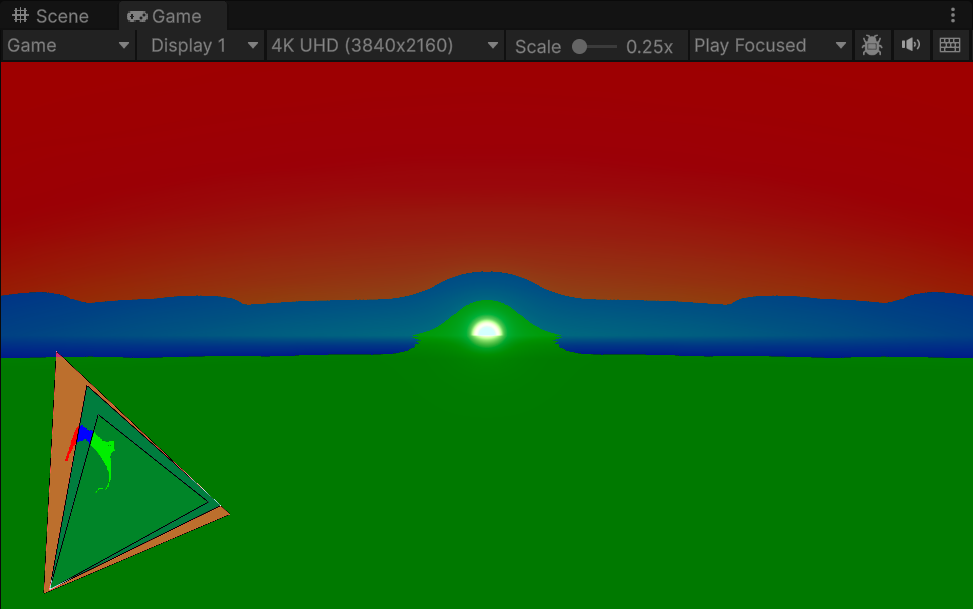
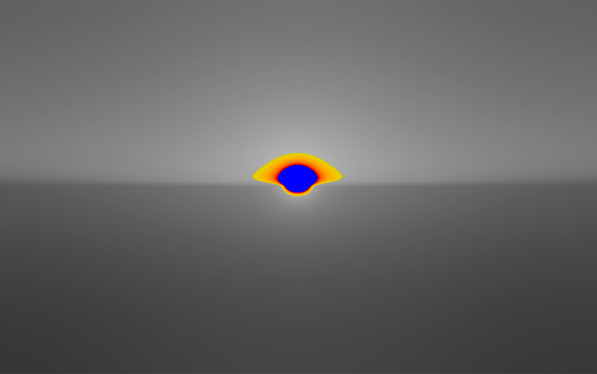

# High Dynamic Range (HDR) Output

[High Dynamic Range](https://docs.unity3d.com/Manual/HDR.html) content has a wider color gamut and greater luminosity range than standard definition content.

URP can output HDR content for displays which support that functionality.

> **Note**: You can only use HDR Output with a linear color space. For more information on color spaces in Unity, refer to [Color space](xref:LinearLighting).

## How to enable HDR Output

To activate HDR output, follow these steps.

1. Locate the [URP Asset](./../universalrp-asset.md) in the Project window under **Assets** > **Settings**.
2. Navigate to **Quality** > **HDR** and enable the checkbox to enable **HDR**.
3. Navigate to **Edit** > **Project Settings** > **Player** > **Other Settings** and enable the following settings:

    * **Allow HDR Display Output**
    * **Use HDR Display Output**

  > **Note**: Only enable **Use HDR Display Output** if you need the main display to use HDR Output.

If you switch to a URP Asset that does not have HDR enabled, URP disables HDR Output until you change to a URP Asset with HDR enabled.

> **Note**: When HDR Output is active the color grading mode is HDR by default, even if a different Color Grading Mode is active in the URP Asset.

## Understand HDR Output implementation

Unity's HDR Output is split into the following steps which always occur in this order:

1. [Tone mapping](#tone-mapping)
2. [Transfer Function](#transfer-function)

### Tone mapping

Tone mapping is the first step in the HDR Output process. In this step, Unity balances the exposure and hue of the scene according to the target display's dynamic range. Dynamic range is determined by the following properties:

* **Minimum brightness**
* **Maximum brightness**
* **Paper white brightness**
 
For more information on these properties, refer to [Important tone mapping values](#important-tone-mapping-values).

At the same time, Unity performs the color space conversion. Unity converts the colors from the default Rec. 709 color space to the target display's color space. This maps the colors in the scene to the wider gamut of colors of the target display and ensures Unity utilizes the full color gamut available on the display.

For more information, refer to [HDR tone mapping in URP](#hdr-tone-mapping-in-urp) and [configure HDR tone mapping settings](#configure-hdr-tone-mapping-settings).

### Transfer function

The second step of HDR Output is the transfer function. The transfer function converts the output of the rendering process to levels of brightness of a given display. Unity determines the correct transfer function for the display and uses it to encode the output according to the standard the display expects. This enables Unity to use the correct level of precision for the gamma and create accurate exposure levels on the target display.

## HDR tone mapping in URP

After you enable **Allow HDR Display Output**, you must configure [tone mapping](./../post-processing-tonemapping.md) settings for your HDR input.

In order to configure these settings effectively, you need to understand how certain values related to tone mapping determine the visual characteristics of your HDR output.

### Important tone mapping values

To properly make use of the capabilities of HDR displays, your **Tonemapping** configuration must take into account the capabilities of the target display, specifically these three values (in nits):

* **Minimum supported brightness**.
* **Maximum supported brightness**.
* **Paper White value**: This value represents the brightness of a paper-white surface represented on the display, which determines the display's brightness overall.

> **Note**: Low Dynamic Range (LDR) and High Dynamic Range (HDR) content do not appear equally bright on displays with the same Paper White value. This is because displays apply extra processing to low dynamic range content that bumps its brightness levels up. For this reason, it is best practice to implement a calibration menu for your application.

### Usable user interfaces depend on accurate Paper White values

[Unlit](./../unlit-shader.md) materials do not respond to lighting changes, so it is standard practice to use an Unlit material for user interfaces. Calculations for Unlit material rendering define brightness with values between 0 and 1 when you are not specifically targeting HDR displays. In this context, a value of 1 corresponds to white, and a value of 0 corresponds to black.

However, in HDR mode, URP uses Paper White values to determine the brightness of Unlit materials. This is because HDR values can exceed the 0 to 1 range.

As a result, Paper White values determine the brightness of UI elements in HDR mode, especially white elements, whose brightness matches Paper White values.

## Configure HDR tone mapping settings

You can select and adjust tone mapping modes in the [Volume](./../Volumes.md) component settings. You can also adjust some aspects of your HDR tone mapping configuration with a script. For more information on this, refer to the [HDROutputSettings API](#the-hdroutputsettings-api).

After you enable **Allow HDR Display Output**, HDR tone mapping options become visible in the Volume component.

### Tone mapping modes

URP provides two **Tonemapping** modes: **Neutral** and **ACES**. Each tone mapping mode has some unique properties.

* **Neutral** mode is especially suitable for situations where you do not want the tone mapper to color grade your content.
* **ACES** mode uses the ACES reference color space for feature films. It produces a cinematic, contrasty result.

### Neutral

| Property | Description |
| -------- | ----------- |
| **Neutral HDR Range Reduction Mode** | The curve that the Player uses for tone mapping. The options are:<ul><li>**BT2390**: The default. Defined by the [BT.2390](https://www.itu.int/pub/R-REP-BT.2390) broadcasting recommendations.</li><li>**Reinhard**: A simple Tone Mapping operator.</li></ul>This option is only available when you enable **Show Additional Properties**. |
| **Hue Shift Amount** | The value determines the extent to which your content retains its original hue after you apply HDR settings. When this value is 0, the tonemapper attempts to preserve the hue of your content as much as possible by only tonemapping luminance. |
| **Detect Paper White** | Enable this property if you want URP to use the Paper White value that the display communicates to the Unity Engine. In some cases, the value the display communicates may not be accurate. Implement a calibration menu for your application so that users can display your content correctly on displays that communicate inaccurate values. |
| **Paper White** | The Paper White value of the display. If you do not enable **Detect Paper White**, you must specify a value here. |
| **Detect Brightness Limits** | Enable this property if you want URP to use the minimum and maximum nit values that the display communicates. In some cases, the value the display communicates may not be accurate. It is best practice to implement a calibration menu for your application to allow for these situations. |
| **Min Nits** | The minimum brightness value of the display. If you do not enable **Detect Brightness Limits**, you must specify a value here and in **Max Nits**. |
| **Max Nits** | The maximum brightness value of the display. If you do not enable **Detect Brightness Limits**, you must specify a value here and in **Min Nits**. |

### Misuse of Hue Shift Amount

Creators might author some content with the intention to use **Hue Shift Amount** to produce special effects. In the illustration below, the **Hue Shift Amount** is 0 for Image A and 1 for Image B. The flames image B appear more intense because of the hue shift effect. It is preferable not to author content in this way, because settings optimized for special effects can have undesirable effects on other content in the scene.

 *Image A: Output when Hue Shift Amount is 0.* *Image B: Output when Hue Shift Amount is 1.*

### ACES

This mode has fixed presets to target 1000, 2000, and 4000 nit displays. It is best practice to implement a calibration menu for your application to ensure that the user can select the right preset.

| Property | Description |
| -------- | ----------- |
| **ACES Preset** | The tone mapper preset to use. The options are:<ul><li>**ACES 1000 Nits**: The default. This curve targets 1000 nits displays.</li><li>**ACES 2000 Nits**: Curve that targets 2000 nits displays.</li><li>**ACES 4000 Nits**: Curve that targets 4000 nits displays.</li></ul> |
| **Detect Paper White** | Enable this property if you want URP to use the Paper White value that the display communicates to the Unity Engine. In some cases, the value the display communicates may not be accurate. Implement a calibration menu for your application so that users can display your content correctly on displays that communicate inaccurate values. |
| **Paper White** | The Paper White value of the display. If you do not enable **Detect Paper White**, you must specify a value here. |

### The HDROutputSettings API

The [HDROutputSettings](https://docs.unity3d.com/ScriptReference/HDROutputSettings.html) API makes it possible to enable and disable HDR mode, as well as query certain values (such as Paper White).

These values are also listed on the HDR output display table on the Rendering Debugger. To access the table, navigate to **Window** > **Analysis** > **Render Pipeline Debugger** > **Rendering** > **HDR Output**.

## Use Offscreen Rendering with HDR Output

When you use offscreen rendering techniques, not all cameras in a scene output directly to the display, for example, when Unity renders the output to a Render Texture. In these situations, use the output of the camera before rendering post-processing.

Unity does not apply HDR Output processing to the output of cameras which use offscreen rendering techniques. This prevents HDR Output processing from being applied twice to the camera's output.

## Use Standard Dynamic Range (SDR) Rendering with HDR Output enabled

HDR Output relies on HDR Rendering to provide pixel values in the correct format for tone mapping and color encoding. The values after HDR tone mapping are in nits and exceed 1. This differs from SDR Rendering where the pixel values are between 0 and 1. As a result of this, the use of SDR Rendering with HDR Output can cause the rendered image to look underexposed or oversaturated.

You can use SDR Rendering on a per-camera basis when you have HDR Output enabled, this can be useful for cameras that only render unlit materials, for example, for mini-map rendering. However, the use of SDR Rendering with HDR Output imposes some limitations.

To ensure correct rendering when you use SDR Rendering with HDR Output, you must avoid any render passes that occur after post-processing. This includes URP's built-in effects which insert render passes after post-processing. As a result, SDR Rendering with HDR Output is incompatible with the following features:

* [Upscaling](../universalrp-asset.md#quality)
* [FXAA](../anti-aliasing.md#fxaa)
* [HDR Debug Views](#hdr-debug-views)
* Custom passes which occur after post-processing

### 2D Renderer

To use SDR Rendering with HDR Output on the 2D Renderer, you must ensure post-processing is turned off.

## HDR Debug Views

URP offers three debug views for HDR rendering. To access them, navigate to **Window** > **Analysis** > **Render Pipeline Debugger** > **Lighting** > **HDR Debug Mode**.

### Gamut View

The triangles in this debug view indicate which parts of three specific color gamuts this scene covers. The small triangle displays the [Rec709](https://en.wikipedia.org/wiki/Rec._709) gamut values, the medium triangle displays the [P3-D65](https://en.wikipedia.org/wiki/DCI-P3) gamut values, and the large triangle displays the [Rec2020](https://en.wikipedia.org/wiki/Rec._2020) gamut values. This enables you to check color plot changes while color grading. It can also help you ensure that you benefit from the wider color gamut available in HDR.

### Gamut Clip

This debug view indicates the relationship between scene values and specific color gamuts. Areas of the screen with values within the Rec709 gamut are green, areas outside of the Rec709 gamut but inside the P3-D65 gamut are blue, and areas outside of both are red.

### Values exceeding Paper White

This debug view uses a color coded gradient to indicate parts of the Scene that exceed the Paper White value and Max Nits. The gradient ranges from yellow to red and blue. Yellow corresponds to **Paper White** +1, red corresponds to **Max Nits**, and blue corresponds to **Max Nits**+1.

## Platform Compatibility

URP only supports HDR Output on the following platforms:

* Windows with DirectX 11, DirectX 12 or Vulkan
* MacOS devices that use Metal
* iOS 16+ devices
* Consoles
* XR devices with HDR support
* Android devices that use Vulkan and GLES

> **Note**: DirectX 11 only supports HDR Output in the Player, it does not support HDR Output in the Editor.
