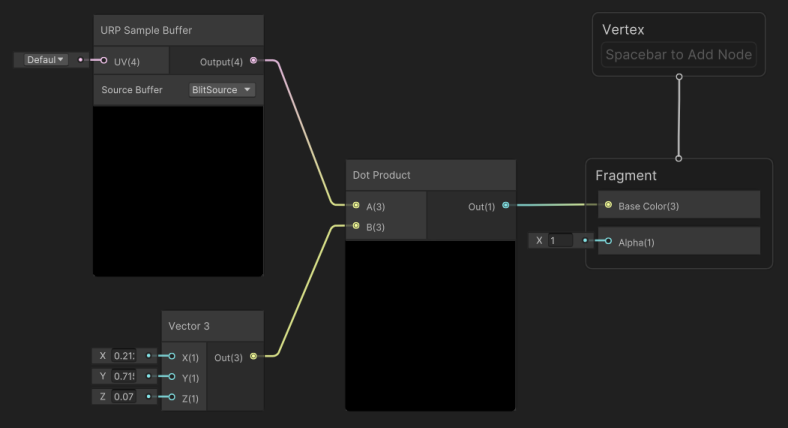
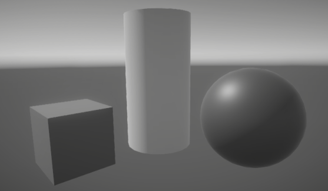

# How to create a custom post-processing effect

The example on this page shows how to use a Full Screen Render Pass to create a grayscale custom post-processing effect.

## Prerequisites

This example requires the following:

- A Unity project with the URP package installed.

- The **Scriptable Render Pipeline Settings** property refers to a URP asset (**Project Settings** > **Graphics** > **Scriptable Render Pipeline Settings**).

## Create a Fullscreen Shader Graph

You must create a Fullscreen Shader Graph to create a custom post-processing effect.

1. Create a new Shader Graph in your Project. To do this right-click in the Project window and select **Create** > **Shader Graph** > **URP** > **Fullscreen Shader Graph**.
2. Add a **URP Sample Buffer** node. To do this right-click in the Shader Graph window, and select **Create Node**. Then locate and select **URP Sample Buffer**.
3. In the **URP Sample Buffer** node's **Source Buffer** dropdown menu, select **BlitSource**.
4. Add a **Vector 3** node.
5. Assign the **Vector 3** node the following values:
    - **X** = 0.2126
    - **Y** = 0.7152
    - **Z** = 0.0722
6. Add a **Dot Product** node.
7. Connect the nodes as shown below.

    

    | Node                  | Connection                         |
    | --------------------- | ---------------------------------- |
    | **URP Sample Buffer** | **Output** to **Dot Product A**    |
    | **Vector 3**          | **Out** to **Dot Product B**       |
    | **Dot Product**       | **Out** to **Fragment Base Color** |

8. Save your Shader Graph.
9. Create a new Material in your Project. To do this right-click in the Project window and select **Create** > **Material**.
10. Apply the Shader Graph shader to the Material. To do this, open the Material in the Inspector and select **Shader** > **Shader Graphs**, then select the Shader Graph you created in the previous steps.

## Use the Material in a Full Screen Pass Renderer Feature

Once you've created a compatible Shader Graph and Material, you can use the Material with a Full Screen Pass Renderer Feature to create a custom post-processing effect.

1. In the Project window, select a URP Renderer.
2. In the Inspector, click **Add Renderer Feature** and select **Full Screen Pass Renderer Feature**. For more information on adding Renderer Features see [How to add a Renderer Feature to a Renderer](./../urp-renderer-feature-how-to-add.md).
3. Set the **Post Process Material** to the Material you created with the Fullscreen Shader Graph.
4. Set **Injection Point** to **After Rendering Post Processing**.
5. Set **Requirements** to **Color**.

You should now see the effect in both Scene view and Game view.

 *Example scene with a grayscale custom post-processing effect.*
