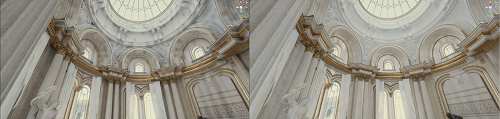

# Fix issues with Probe Volumes

Adjust settings or use Volume overrides to fix artefacts from Probe Volumes.

## How Light Probe validity works

Light Probes inside geometry are called invalid probes. The Universal Render Pipeline (URP) marks a Light Probe as invalid when the probe fires sampling rays to capture surrounding light data, but the rays hit the unlit backfaces inside geometry.

URP uses the following techniques to minimise incorrect lighting data from Light Probes:

- [Virtual Offset](#virtualoffset) tries to make invalid Light Probes valid, by moving their capture points so they're outside any [colliders](https://docs.unity3d.com/Documentation/Manual/CollidersOverview.html).
- [Dilation](#dilation) detects Light Probes that remain invalid after Virtual Offset, and gives them data from valid Light Probes nearby.

You can check which Light Probes are invalid using the [Rendering Debugger](features/rendering-debugger.md)

 
In the Scene on the left, Virtual Offset isn't active and dark bands are visible. In the Scene on the right, Virtual Offset is active. 

 
In the Scene on the left, Dilation isn't active and some areas are too dark. In the Scene on the right, Dilation is active. 

## Fix dark blotches or streaks

### Adjust Virtual Offset

You can configure **Virtual Offset Settings** in the [Probe Volumes panel](probevolumes-lighting-panel-reference.md) in the Lighting window. This changes how URP calculates the validity of Light Probes.

You can adjust the following:

- The length of the sampling ray Unity uses to find a valid capture point.
- How far Unity moves a Light Probe's capture position to avoid geometry. 
- How far Unity moves the start point of rays.
- How many times a probe's sampling ray hits colliders before Unity considers the probe invalid.

You can also disable Virtual Offset for a Baking Set. Virtual Offset only affects baking time, so disabling Virtual Offset doesn't affect runtime performance.

### Adjust Dilation

You can configure **Probe Dilation Settings** in the [Probe Volumes panel](probevolumes-lighting-panel-reference.md) in the Lighting window). This changes how URP calculates the validity of Light Probes, and how invalid Light Probes use lighting data from nearby valid Light Probes.

You can adjust the following:

- The percentage of backfaces a Light Probe can sample before URP considers that probe invalid.
- How far away from the invalid probe Unity searches for valid probes to contribute lighting data.
- How many iterations of Dilation URP does during the bake.
- How to weight the data from valid probes based on their spatial relationship with the invalid probe.

[How you adjust Light Probe density](probevolumes-changedensity.md) affects the final results, because URP uses the settings as a multiplier to calculate the distance between probes.

You can also disable Dilation for a Baking Set. Dilation only affects baking time, so disabling Dilation doesn't affect runtime performance.

## Fix light leaks

Light leaks are areas that are too light or dark, often in the corners of a wall or ceiling.

 
A light leak.
 

Light leaks often occur when geometry receives light from a Light Probe that isn't visible to the geometry, for example because the Light Probe is on the other side of a wall. Probe Volumes use regular grids of Light Probes, so Light Probes might not follow walls or be at the boundary between different lighting areas.

To fix light leaks, you can do the following:

- [Create thicker walls](#thickerwalls).
- [Add a Volume to your scene](#volume).
- [Adjust Baking Set properties](#probevolumesettings).
- [Use a Probe Adjustment Volume](#probevolumeadjustment).

### Create thicker walls

Adjust walls so their width is closer to the distance between probes in the local [brick](probevolumes-concept.md#how-probe-volumes-work)

### Add a Volume to your scene

You can add a [Volume](volumes-landing-page.md), then add a **Probe Volumes Options** override to the Volume. This adjusts the position that GameObjects use to sample the Light Probes.

1. Add a [Volume](set-up-a-volume.md) to your scene and make sure its area overlaps the camera position.
2. Select **Add Override**, then select **Lighting** > **Probe Volumes Options**.
3. Enable **Normal Bias**, then adjust the value to move the position that GameObject pixels use to sample the Light Probes, along the pixel's surface normal.
4. Enable **View Bias**, then adjust the value to move the position that GameObject pixels use to sample the Light Probes, towards the camera.
4. Disable and enable **Leak Reduction Mode** to check if it improves light leaks.

Volumes only affect the scene if the camera is near or inside the volume. Refer to [Understand volumes](volumes.md) for more information.

Refer to [Probe Volumes Options Override reference](probevolumes-options-override-reference.md) for more information on **Probe Volumes Options** settings.

### Adjust Baking Set properties

If adding a Volume doesn't work, use the [Probe Volumes panel](probevolumes-lighting-panel-reference.md) in the Lighting window to adjust Virtual Offset and Dilation settings.

1. In **Probe Dilation Settings**, reduce **Search Radius**. This can help in situations where invalid Light Probes are receiving lighting data from more distant Light Probes. However, a lower **Search Radius** might cause light leaks.
2. In **Virtual Offset Settings**, reduce **Search Distance Multiplier** and **Ray Origin Bias**. 
3. If there are light leaks in multiple locations, adjust **Min Probe Spacing** and **Max Probe Spacing** to increase the density of Light Probes.
4. Select **Generate Lighting** to rebake the scene using the new settings.

Note: Don't use very low values for the settings, or Dilation and Virtual Offset might not work.

### Add a Probe Adjustment Volume component

Use a Probe Adjustment Volume component to make Light Probes invalid in a small area. This triggers Dilation during baking, and improves the results of **Leak Reduction Mode** at runtime.

1. In the Probe Volume Inspector, select **Add Component**, then select **Light** > **Probe Adjustment Volume**.
2. Set the **Size** so the **Probe Adjustment Volume** area overlaps the Light Probes causing light leaks.
3. Set **Probe Volume Overrides** > **Mode** to **Invalidate Probes**, to invalidate the Light Probes in the Volume.
4. If you have a [Volume with a Probe Volumes Options override](#volume), enable **Leak Reduction Mode**.
6. In **Probe Volume Settings**, select **Generate Lighting** to rebake the scene using the new settings.

Using a Probe Adjustment Volume component solves most light leak issues, but often not all.

If you use many Probe Adjustment Volumes in a scene, your bake will be slower, and your scene might be harder to understand and maintain.

Refer to [Probe Adjustment Volume component reference](probevolumes-adjustment-volume-component-reference.md) for more information.

## Fix seams

Seams are artefacts that appear when one lighting condition transitions immediately into another. Seams are caused when two adjacent bricks have different Light Probe densities. Refer to [bricks](probevolumes-concept.md#how-probe-volumes-work) for more information.

 
Two seams.
 

To fix seams, do the following:

1. Add a [Volume](set-up-a-volume.md) to your scene and make sure its area overlaps the position of the camera.
2. Select **Add Override**, then select **Lighting** > **Probe Volumes Options**.
3. Enable **Sampling Noise**, then try adjusting the value to add noise and make the transition more diffuse. Noise can help break up noticeable edges in indirect lighting at brick boundaries.

## Additional resources

* [Configure the size and density of Probe Volumes](probevolumes-changedensity.md)
* [Probe Volumes panel reference](probevolumes-lighting-panel-reference.md)
* [Probe Volumes Options Override reference](probevolumes-options-override-reference.md)
* [Probe Adjustment Volume component reference](probevolumes-adjustment-volume-component-reference.md)
