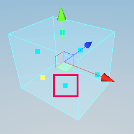

# Probe Volume Inspector reference

Select a Probe Volume and open the Inspector to view its properties.

<table>
<thead>
    <tr>
    <th><strong>Property</strong></th>
    <th colspan="2"><strong>Description</strong></th>
    </tr>
</thead>
<tbody>
    <tr>
    <tr>
        <td rowspan="4"><strong>Mode</strong></td>
    </tr>
    <tr>
        <td><strong>Global</strong></td>
        <td>URP sizes this Probe Volume to include all renderers in the scene or Baking Set that have <strong>Contribute Global Illumination</strong> enabled in their <a href="https://docs.unity3d.com/Manual/class-MeshRenderer.html">Mesh Renderer component</a>. URP recalculates the volume size every time you save or generate lighting.</td>
    </tr>
    <tr>
        <td><strong>Scene</strong></td>
        <td>URP sizes this Probe Volume to include all renderers in the same scene as this Probe Volume. URP recalculates the volume size every time you save or generate lighting.</td>
    </tr>
    <tr>
        <td><strong>Local</strong></td>
        <td>Set the size of this Probe Volume manually.</td>
    </tr>
    <tr>
        <td colspan="2"><strong>Size</strong></td>
        <td colspan="">Set the size of this Probe Volume. This setting only appears when you set <strong>Mode</strong> to <strong>Local</strong>.</td>
    </tr>
    <tr>
        <td rowspan="2"><strong>Subdivision Override</strong></td>
    </tr>
    <tr>
        <td><strong>Override Probe Spacing</strong></td>
        <td>Override the Probe Spacing set in the <strong>Baking Set</strong> for this Probe Volume. This cannot exceed the <strong>Min Probe Spacing</strong> and <strong>Max Probe Spacing</strong> values in the <a href="probevolumes-lighting-panel-reference.md">Probe Volumes panel in the Lighting window</a>.</td>
    </tr>
    <tr>
        <td rowspan="5"><strong>Geometry Settings</strong></td>
    </tr>
    <tr>
        <td><strong>Override Renderer Filters</strong></td>
        <td>Enable filtering by Layer which GameObjects URP considers when it generates probe positions. Use this to exclude certain GameObjects from contributing to Probe Volume lighting.</td>
    </tr>
    <tr>
        <td><strong>Layer Mask</strong></td>
        <td>Filter by Layer which GameObjects URP considers when it generates probe positions.</td>
    </tr>
    <tr>
        <td><strong>Min Renderer Size</strong></td>
        <td>The smallest <a href="https://docs.unity3d.com/ScriptReference/Renderer.html">Renderer</a> size URP considers when it generates probe positions.</td>
    </tr>
    <tr>
        <td><strong>Fill Empty Spaces</strong></td>
        <td>Enable URP filling the empty space between and around Renderers with bricks. Bricks in empty spaces always use the **Max Probe Spacing** value.</td>
    </tr>
</tbody>
</table>

## Size gizmo

To resize the Probe Volume, use one of the handles of the box gizmo in the Scene view. You can't resize a Probe Volume by changing the Transform component of the GameObject, or using the scale gizmo.

In this screenshot, a red box indicates the box gizmo handles.

 
The resize handles for Probe Volumes.
