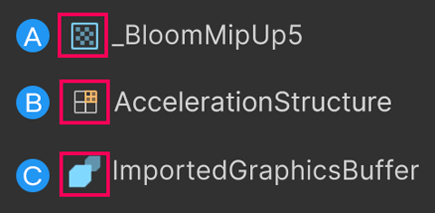

# Render Graph Viewer window reference

The **Render Graph Viewer** window displays the [render graph](render-graph.md) for the current scene in the Universal Render Pipeline (URP). 

Refer to [Analyze a render graph](render-graph-view.md) for more information.

## Toolbar

|**Control**|**Child control**|**Description**|
|-|-|-|
|**Capture**||Display the render graph for the current frame.|
|**Render graph**||Select the render graph from your project to display.|
|**Camera**||Select the camera to display the rendering loop for.|
|**Pass Filter**||Select which render passes to display.|
|| **Nothing** | Display no render passes. |
|| **Everything** | Display all render passes. |
|| **Culled** | Display render passes that URP hasn't included in the render graph because they have no effect on the final image. |
|| **Raster** | Display only raster render passes created using `renderGraph.AddRasterRenderPass`. |
|| **Unsafe** | Display only render passes that use Compatibility Mode APIs. Refer to [Use Compatibility Mode APIs in render graph render passes](render-graph-unsafe-pass.md) for more information. |
|| **Compute** | Display only compute render passes created using `renderGraph.AddComputePass`. |
|**Resource Filter**|| Select which resources to display.|
|| **Nothing** | Display no resources. |
|| **Everything** | Display all resources. |
|| **Imported** | Display only resources imported into the render graph using `ImportTexure`. |
|| **Textures** | Display only textures. |
|| **Buffers** | Display only buffers. |
|| **Acceleration Structures** | Display only acceleration structures used in compute render passes. |

## Main window

The main window is a timeline graph that displays the render passes in the render graph. It displays the following:

- On the left, the list of resources the render passes use, in the order URP creates them.
- At the top, the list of render passes, in the order URP executes them.

At the point where a render pass and a texture meet on the graph, a resource access block displays how the render pass uses the resource. The access block uses the following icons and colors:

|**Access block icon or color**|**Description**|
|-|-|
|Dotted lines|The resource hasn't been created yet.|
|Green|The render pass has read-only access to the resource. The render pass can read the resource.|
|Red|The render pass has write-only access to the resource. The render pass can write to the resource.|
|Green and red|The render pass has read-write access to the resource. The render pass can read from or write to the resource.|
|Grey|The render pass can't access the resource.|
|Globe icon|The render pass sets the texture as a global resource. If the globe icon has a gray background, the resource was imported into the render graph as a `TextureHandle` object, and the pass uses the `SetGlobalTextureAfterPass` API. Refer to [Create a render graph texture](render-graph-create-a-texture.md) and [Transfer a texture between render passes](render-graph-pass-textures-between-passes.md) for more information.|
|Blank|The resource has been deallocated in memory, so it no longer exists.|

Select an access block to display the resource in the Resource List and the render pass in the Pass Inspector List.

### Render passes

|**Control**|**Description**|
|-|-|
|Render pass name|The name of the render pass. This name is set in the `AddRasterRenderPass` or `AddComputePass` method.|
|Merge bar|If URP merged this pass with other passes, the Render Graph Viewer displays a blue bar below the merged passes.|
|Resource access overview bar|When you select a render pass name, the resource access overview bar displays information about the pass you selected and related passes. Hover your cursor over an overview block for more information. Select an overview block to open the C# file for the render pass.  Access blocks use the following colors:<ul><li>White: The selected pass.</li><li>Grey: The pass isn't related to the selected pass.</li><li>Blue: The pass reads from or writes to a resource the selected pass uses.</li><li>Flashing blue: The pass reads from or writes to a resource the selected pass uses, and can be merged with other flashing blue passes.</li></ul>|

### Resources

|**Property**|**Description**|
|-|-|
|Resource type|The type of the resource. Refer to the following screenshot.|
|Resource name|The resource name.|
|Imported resource|Displays a left-facing arrow if the resource is imported. Refer to [Import a texture into the render graph system](render-graph-import-a-texture.md) for more information.|

The icons used as the resource type. 
A: A texture. 
B: An acceleration structure. 
C: A buffer.

## Resource List

Select a resource in the Resource List to expand or collapse information about the resource.

You can also use the Search bar to find a resource by name.

|**Property**|**Description**|
|-|-|
|Resource name|The resource name.|
|Imported resource|Displays a left-facing arrow if the resource is imported.|
|**Size**|The resource size in pixels.|
|**Format**|The texture format. Refer to [GraphicsFormat](https://docs.unity3d.com/2023.3/Documentation/ScriptReference/Experimental.Rendering.GraphicsFormat.html) for more information.|
|**Clear**|Displays **True** if URP clears the texture.|
|**BindMS**|Whether the texture is bound as a multisampled texture. Refer to [RenderTextureDescriptor.BindMS](https://docs.unity3d.com/ScriptReference/RenderTextureDescriptor-bindMS.html) for more information.|
|**Samples**|How many times Multisample Anti-aliasing (MSAA) samples the texture. Refer to [Anti-aliasing](anti-aliasing.md#multisample-anti-aliasing-msaa) for more information.|
|**Memoryless**|Displays **True** if the resource is stored in tile memory on mobile platforms that use tile-based deferred rendering. Refer to [Render graph system introduction](render-graph-introduction.md) for more information.|

## Pass List

Select a render pass in the main window to display information about the render pass in the Pass List.

You can also use the Search bar to find a render pass by name.

|**Property**|**Description**|
|-|-|
|Pass name|The render pass name. If URP merged multiple passes, this property displays the names of all the merged passes.|
|**Native Render Pass Info**|Displays information about whether URP created a native render pass for this render pass by merging multiple render passes. Refer to [Introduction to the render graph system](render-graph-introduction.md) for more information.|
|**Pass break reasoning**|Displays the reasons why URP could not merge this render pass with the next render pass. |

### Render Graph Pass Info

The **Render Graph Pass Info** section displays information about the render pass, and each of the resources it uses.

If URP merged multiple passes into this pass, the section displays information for each merged pass.

|**Property**|**Description**|
|-|-|
|**Name**|The render pass name.|
|**Attachment dimensions**|The size of a resource the render pass uses, in pixels. Displays **0x0x0** if the render pass doesn't use a resource.|
|**Has depth attachment**|Whether the resource has a depth texture.|
|**MSAA samples**|How many times Multisample Anti-aliasing (MSAA) samples the texture. Refer to [Anti-aliasing](anti-aliasing.md#multisample-anti-aliasing-msaa) for more information. |
|**Async compute**|Whether the render pass accesses the resource using a compute shader.|

### Attachments Load/Store Actions

The **Attachments Load/Store Actions** section displays the resources the render pass uses. The section displays **No attachments** if the render pass doesn't use any resources.

|**Property**|**Description**|
|-|-|
|**Name**|The resource name.|
|**Load Action**|The load action for the resource. Refer to [`RenderBufferLoadAction`](https://docs.unity3d.com/ScriptReference/Rendering.RenderBufferLoadAction.html) for more information.|
|**Store Action**|The store action for the resource, and how URP uses the resource later in another render pass or outside the graph. Refer to [`RenderBufferStoreAction`](https://docs.unity3d.com/ScriptReference/Rendering.RenderBufferStoreAction.html) for more information.|

## Additional resources

- [Frame Debugger](https://docs.unity3d.com/2023.3/Documentation/Manual/frame-debugger-window.html)
- [Understand performance](understand-performance.md)
