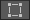

# Decal Renderer Feature

With the Decal Renderer Feature, Unity can project specific Materials (decals) onto other objects in the Scene. The decals interact with the Scene’s lighting and wrap around Meshes.

 *Decal Projector in a sample Scene.*

For examples of how to use Decals, see the [Decals samples in URP Package Samples](package-sample-urp-package-samples.md#decals).

## How to use the feature

To add decals to your Scene:

1. [Add the Decal Renderer Feature](urp-renderer-feature-how-to-add.md) to the URP Renderer.

2. Create a Material, and assign it the `Shader Graphs/Decal` shader. In the Material, select the Base Map and the Normal Map.

    

3. Create a new Decal Projector GameObject, or add a [Decal Projector component](#decal-projector-component) to an existing GameObject.

The following illustration shows a Decal Projector in the Scene.

For more information, see also [Decal Projector component](#decal-projector-component).

An alternative way to add decals to a Scene:

1. Create a Quad GameObject.

2. Assign a Decal Material to the GameObject.

3. Position the Quad on the surface where you want the decal to be. If necessary, adjust the [mesh bias](decal-shader.md#mesh-bias-type) value to prevent z-fighting.

## Limitations

This feature has the following limitations:

* The decal projection does not work on transparent surfaces.

## Decal Renderer Feature properties

This section describes the properties of the Decal Renderer Feature.

 *Decal Renderer Feature, Inspector view.*

### Technique

Select the rendering technique for the Renderer Feature.

This section describes the options in this property.

#### Automatic

Unity selects the rendering technique automatically based on the build platform.

#### DBuffer

Unity renders decals into the Decal buffer (DBuffer). Unity overlays the content of the DBuffer on top of the opaque objects during the opaque rendering.

Selecting this technique reveals the **Surface Data** property. The Surface Data property lets you specify which surface properties of decals Unity blends with the underlying meshes. The Surface Data property has the following options:

* **Albedo**: decals affect the base color and the emission color.
* **Albedo Normal**: decals affect the base color, the emission color, and the normals.
* **Albedo Normal MAOS**: decals affect the base color, the emission color, the normals, the metallic values, the smoothness values, and the ambient occlusion values.

**Limitations:**

* This technique requires the DepthNormal prepass, which makes the technique less efficient on GPUs that implement tile-based rendering.

* This technique does not work on particles and terrain details.

#### Screen Space

Unity renders decals after the opaque objects using normals that Unity reconstructs from the depth texture. Unity renders decals as meshes on top of the opaque meshes. This technique supports only the normal blending.

Selecting this technique reveals the following properties.

| __Property__    | __Description__ |
| --------------- |---------------- |
| __Normal Blend__| The options in this property (Low, Medium, and High) determine the number of samples of the depth texture that Unity takes when reconstructing the normal vector from the depth texture. The higher the quality, the more accurate the reconstructed normals are, and the higher the performance impact is. |
| &#160;&#160;&#160;&#160;**Low**    | Unity takes one depth sample when reconstructing normals. |
| &#160;&#160;&#160;&#160;**Medium** | Unity takes three depth samples when reconstructing normals. |
| &#160;&#160;&#160;&#160;**High**   | Unity takes five depth samples when reconstructing normals. |
| __Use GBuffer__ | Unity uses this option in the Deferred Rendering Path. In the Deferred Rendering Path, decals affect the base color, the emission color, and the normals. |

### Max Draw Distance

The maximum distance from the Camera at which Unity renders decals.

## Decal Projector component

The Decal Projector component lets Unity project decals onto other objects in the Scene. A Decal Projector component must use a Material with the [Decal Shader Graph](decal-shader.md) assigned (`Shader Graphs/Decal`).

For more information on how to use the Decal Projector, see section [How to use the feature](#how-to-use-the-feature).

The Decal Projector component contains the Scene view editing tools and the Decal Projector properties.

 *Decal Projector component in the Inspector.*

> **NOTE**: If you assign a Decal Material to a GameObject directly (not via a Decal Projector component), then Decal Projectors do not project decals on such GameObject.

### Decal Scene view editing tools

When you select a Decal Projector, Unity shows its bounds and the projection direction.

The Decal Projector draws the decal Material on every Mesh inside the bounding box.

The white arrow shows the projection direction. The base of the arrow is the pivot point.

The Decal Projector component provides the following Scene view editing tools.

| __Icon__                                     | __Action__    | __Description__ |
| -------------------------------------------- |-------------- | --------------- |
|   | __Scale__     | Select to scale the projector box and the decal. This tool changes the UVs of the Material to match the size of the projector box. The tool does not affect the pivot point. |
|    | __Crop__      | Select to crop or tile the decal with the projector box. This tool changes the size of the projector box but not the UVs of the Material. The tool does not affect the pivot point. |
| | __Pivot / UV__| Select to move the pivot point of the decal without moving the projection box. This tool changes the transform position. This tool also affects the UV coordinates of the projected texture. |

### Decal Projector component properties

This section describes the Decal Projector component properties.

| __Property__            | __Description__                                              |
| ----------------------- | ------------------------------------------------------------ |
| __Scale Mode__          | Select whether this Decal Projector inherits the Scale values from the Transform component of the root GameObject. Options: &#8226; __Scale Invariant__: Unity uses the scaling values (Width, Height, etc.) only in this component, and ignores the values in the root GameObject. &#8226; __Inherit from Hierarchy__: Unity evaluates the scaling values for the decal by multiplying the [lossy Scale](https://docs.unity3d.com/ScriptReference/Transform-lossyScale.html) values of the Transform of the root GameObject by the Decal Projector's scale values. **Note**: since the Decal Projector uses the orthogonal projection, if the root GameObject is [skewed](https://docs.unity3d.com/Manual/class-Transform.html), the decal does not scale correctly. |
| __Width__               | The width of the projector bounding box. The projector scales the decal to match this value along the local X axis. |
| __Height__              | The height of the projector bounding box. The projector scales the decal to match this value along the local Y axis. |
| __Projection Depth__    | The depth of the projector bounding box. The projector projects decals along the local Z axis. |
| __Pivot__               | The offset position of the center of the projector bounding box relative to the origin of the root GameObject. |
| __Material__            | The Material to project. The Material must use a Shader Graph that has the Decal Material type. For more information, see the page [Decal Shader Graph](decal-shader.md). |
| __Tiling__              | The tiling values for the decal Material along its UV axes. |
| __Offset__              | The offset values for the decal Material along its UV axes. |
| __Opacity__             | This property lets you specify the opacity value. A value of 0 makes the decal fully transparent, a value of 1 makes the decal as opaque as defined by the __Material__. |
| __Draw Distance__       | The distance from the Camera to the Decal at which this projector stops projecting the decal and URP no longer renders the decal. |
| __Start Fade__          | Use the slider to set the distance from the Camera at which the projector begins to fade out the decal. Values from 0 to 1 represent a fraction of the __Draw Distance__. With a value of 0.9, Unity starts fading the decal out at 90% of the __Draw Distance__ and finishes fading it out at the __Draw Distance__. |
| __Angle Fade__          | Use the slider to set the fade out range of the decal based on the angle between the decal's backward direction and the vertex normal of the receiving surface. |

### Performance

URP supports the GPU instancing of Materials. If the decals in your Scene use the same Material, and if the Material has the **Enable GPU Instancing** property turned on, URP instances the Materials and reduces the performance impact.
