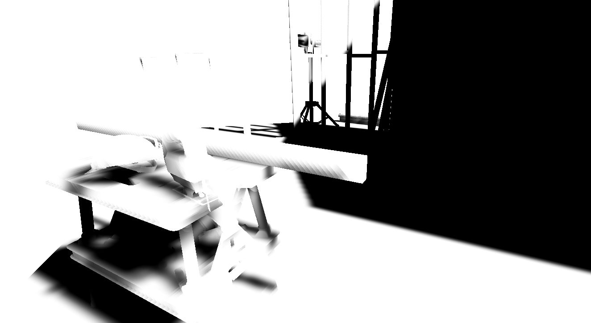

# Screen Space Shadows Renderer Feature

 *Screen-space shadows in a sample scene.*

You can add a [Screen Space Shadows Renderer Feature](renderer-feature-screen-space-shadows.md) to a Universal Render Pipeline (URP) renderer. This makes URP use a single render texture to calculate and draw shadows from the main Directional Light, instead of multiple [shadow cascade](https://docs.unity3d.com/Manual/shadow-cascades.html) textures.

The Screen Space Shadows Renderer Feature doesn't affect how shadows look. 

If your project uses the [Forward Renderer](urp-universal-renderer.md), screen-space shadows might make rendering faster, because the Universal Render Pipeline (URP) doesn't need to access multiple shadow cascade textures.

Screen-space shadows have the following limitations:

- URP adds a depth prepass so it can sample the depth texture. This might reduce performance on mobile platforms that use tile-based rendering. Refer to [Depth Priming Mode](urp-universal-renderer.md#rendering) for more information about the depth prepass.
- URP creates a screen-space shadows texture, which uses more memory.

 *The screen-space shadows texture for the previous image.*

## Enable screen-space shadows

To add screen-space shadows to your project, add the Screen Space Shadows Renderer Feature. Refer to [Add a renderer feature](urp-renderer-feature-how-to-add.md).

URP doesn't calculate or draw screen-space shadows for transparent objects. URP uses shadow maps for transparent objects instead.

## View screen-space shadows

Use the [Frame Debugger](https://docs.unity3d.com/Manual/FrameDebugger.html) to view the render passes that draw shadows. Check the following render passes:

- **ScreenSpaceShadows**, which creates the screen-space shadows texture. 
- **MainLightShadow**, which creates shadow map textures.

Check the **DrawOpaqueObjects** render pass to check which shadow texture URP uses to draw shadows on each object.

 *The Frame Debugger with screen-space shadows enabled. The objects in the **DrawOpaqueObjects** render pass use **_ScreenSpaceShadowmapTexture**.*

 *The Frame Debugger with screen-space shadows disabled. The objects in the **DrawOpaqueObjects** render pass use **TempBuffer 398 2048x1024** and **TempBuffer 399 2048x2048**, which are shadow map textures from the **MainLightShadow** render pass.*
