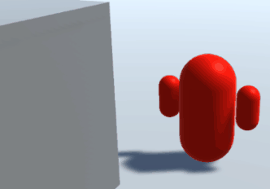
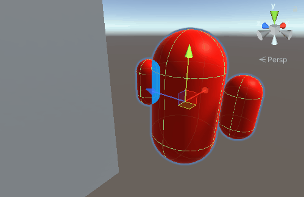
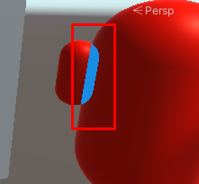
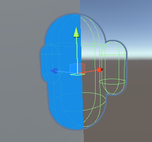

# Example of creating a custom rendering effect using a Render Objects Renderer Feature in URP

The [Render Objects Renderer Feature](renderer-feature-render-objects) lets you draw objects at a specific point in the frame rendering loop. You can interpret and write rendering data such as depth and stencil in different ways, or draw a set of GameObjects at a certain time.

The following example uses a Render Objects Renderer Feature to draw a GameObject in a different color if it's behind other GameObjects.

First, create a GameObject and attach it to a new [layer](https://docs.unity3d.com/Manual/Layers.html).

1. Create a GameObject in your scene.
1. In the **Inspector** window, open the **Layer** dropdown and add a new layer. You can call the layer **DrawBehind**.
1. Set the GameObject to the new layer.

Next, create a Render Objects Renderer Feature that renders only the new layer, on top of the scene.

1. In the **Project** window, select the [URP Renderer asset](../universalrp-asset) your project uses, for example **Settings** > **PC_Renderer**.
1. To create a Render Objects Renderer Feature, select **Add Renderer Feature** in the **Inspector** window, then select **Render Objects**.
1. To make the Renderer Feature draw only the layer with the GameObject, open the **Render Objects (Render Objects)** dropdown, then set **Layer Mask** to the layer.
1. Set **Event** to the **AfterRenderingOpaques** injection point. For more information about custom pass injection points, refer to [Custom Pass injection points](../customize/custom-pass-injection-points).

Next, adjust the Renderer Feature so it renders only the parts hidden behind other GameObjects, and in a different color.

1. Open the **Overrides** dropdown, then select **Depth** and set **Depth Test** to **Greater**.

    The Renderer Feature now only renders a pixel if its depth is greater than the current pixel in the depth buffer, which means the new pixel is behind another GameObject.

1. [Create a new material](../shaders-in-universalrp) that uses the **Universal Render Pipeline/Unlit** shader.
1. Set the **Base Map** color to a color of your choice.
1. In the Renderer Feature, in the **Overrides** section, set **Material** to the material you created.

When you move the GameObject behind other GameObjects, Unity now renders the hidden parts in the color you selected.

## Fix overlapping areas of a GameObject

If you use a complex GameObject, the Renderer Feature might draw overlapping parts as though they're hidden. This is because the depth of one part is greater than the overlapping part.

To fix this issue, disable rendering the whole GameObject, and create a new Renderer Feature that renders the non-hidden parts. Follow these steps:

1. In the URP Renderer asset, open the **Opaque Layer Mask** dropdown and disable the layer you added. 

    Unity now doesn't draw the layer in the opaque render pass. The Renderer Feature still draws the hidden parts, because it's in a different render pass.

    

1. Add a new Render Objects Renderer Feature.
1. Set **Layer Mask** to the new layer, so this Renderer Feature draws the GameObject.
1. Set **Event** to the **AfterRenderingOpaques** injection point.
1. To avoid the first Renderer Feature affecting the depth calculations in the new Renderer Feature, disable **Write Depth** in the **Overrides** section of the first Renderer Feature.

The first Renderer Feature draws the hidden parts, and the second Renderer Feature draws the rest of the GameObject.

## Additional resources

- [Renderer Objects Renderer Feature reference](renderer-feature-render-objects)
