# Example: How to create a custom rendering effect using the Render Objects Renderer Feature

The example on this page describes how to create a custom rendering effect with the Render Objects Renderer Feature.

## Example overview

The example on this page demonstrates how to implement the following effect:

* There is a character in the Scene.

    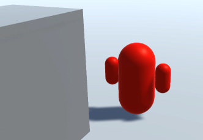

* When the character goes behind GameObjects, Unity draws the character silhouette with a different Material.

    

## Prerequisites

This example requires the following:

* A Unity project with the URP package installed.

* The **Scriptable Render Pipeline Settings** property refers to a URP asset (**Project Settings** > **Graphics** > **Scriptable Render Pipeline Settings**).

## Create example Scene and GameObjects

To follow the steps in this example, create a new Scene with the following GameObjects:

1. Create a Cube. Set its **Scale** values so that it looks like a wall.

    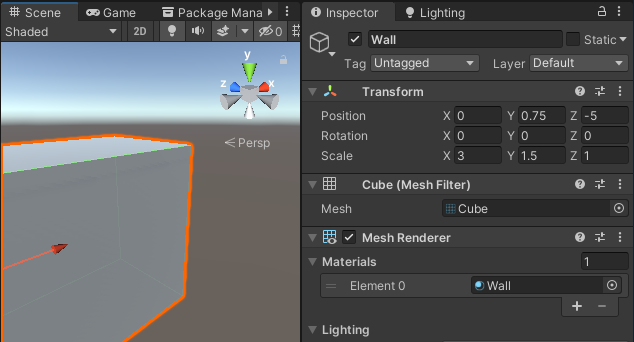

2. Create a Material and assign it the `Universal Render Pipeline/Lit` shader. Select the base color (for example, red). Call the Material `Character`.

3. Create a basic character and assign it the Character Material. In this example, the character consists of three capsules: the big capsule in the center represents the body, and the two smaller capsules represent the hands.

    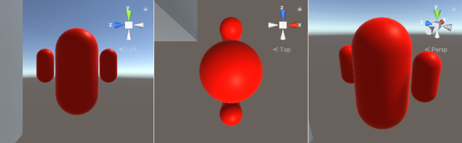

    To make it easier to manipulate the character in the Scene, add the three Capsules as child GameObjects under the Character GameObject.

    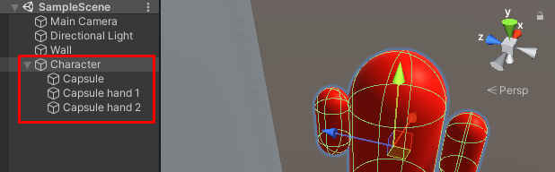

4. Create a Material and assign it the `Universal Render Pipeline/Unlit` shader. Select the base color that you would like the character to have when it's behind GameObjects (for example, blue). Call the Material `CharacterBehindObjects`.

Now you have the setup necessary to follow the steps in this example.

## Example implementation

This section assumes that you created a Scene as described in section [Example Scene and GameObjects](#example-objects).

The example implementation uses two Render Objects Renderer Features: one to draw parts of the character that are behind other GameObjects, and another one to draw the parts of the character that are in front of other GameObjects.

### Create a Renderer Feature to draw the character behind GameObjects

Follow these steps to create a Renderer Feature to draw the character behind GameObjects.

1. Select a URP Renderer.

    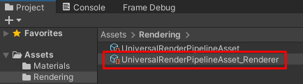

2. In the Inspector, click **Add Renderer Feature** and select **Render Objects**.

    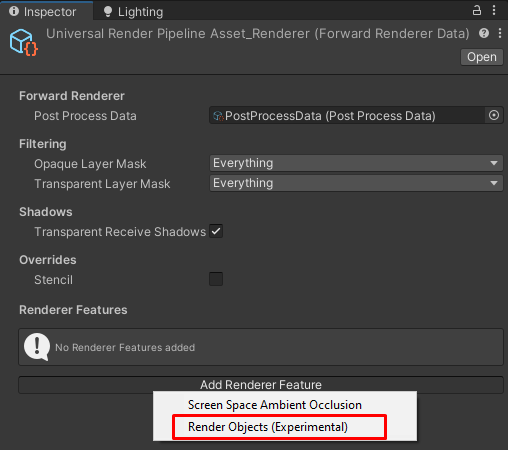

    Select the **Name** field and enter the name of the new Renderer Feature, for example, **DrawCharacterBehind**.

3. This example uses Layers to filter the GameObjects to render. Create a new Layer and call it **Character**.

    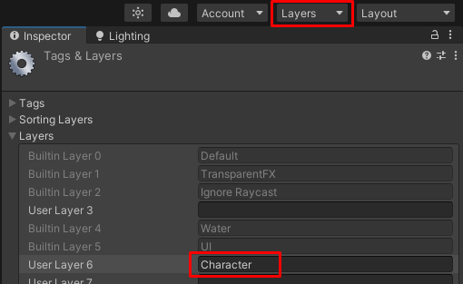

4. Select the **Character** GameObject and assign it to the `Character` Layer. To do this, open the Layer drop down and select `Character`.
    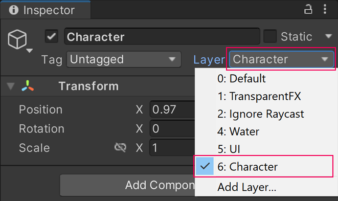

5. In the `DrawCharacterBehind` Renderer Feature, in **Filters** > **Layer Mask**, select `Character`. With this setting, this Renderer Feature renders GameObjects only in the Layer `Character`.

6. In **Overrides** > **Material**, select the `CharacterBehindObjects` Material.

    The Renderer Feature overrides the Material of a GameObject with the selected Material.

    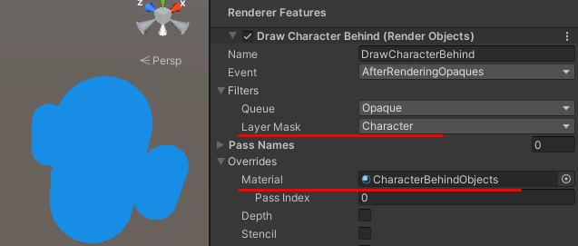

7. The intended behavior is that the Renderer Feature renders the character with the `CharacterBehindObjects` Material only when the character is behind other GameObjects.

    To achieve this, select the **Depth** check box, and set the **Depth Test** property to **Greater**.

    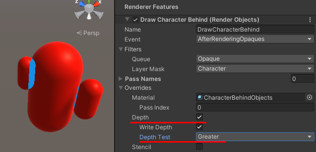

With these settings, Unity renders the character with the `CharacterBehindObjects` Material only when the character is behind another GameObject. However, Unity also renders parts of the character using the `CharacterBehindObjects` Material, because some parts of the character occlude the character itself.

### Create an extra Renderer Feature to avoid the self see-through effect

The settings in the previous section result in the self see-through effect for the following reason:

* When performing the Opaque rendering pass of the URP Renderer, Unity renders all GameObjects belonging to the character with the `Character` Material and writes depth values to the Depth buffer. This happens before Unity starts executing the `DrawCharacterBehind` Renderer Feature, because, by default, new Render Objects Renderer Features have the value **AfterRenderingOpaques** in the **Event** property.

    The **Event** property defines the injection point where Unity injects Render Passes from the Render Objects Renderer Feature. The event when URP Renderer draws GameObjects in the **Opaque Layer Mask** is the **BeforeRenderingOpaques** event.

* When executing the `DrawCharacterBehind` Renderer Feature, Unity performs the depth test using the condition specified in the **Depth Test** property. In the following screenshot, a bigger capsule occludes part of the smaller capsule, and the depth test passes for that part of the smaller capsule. The Renderer Feature overrides the Material for that part.

    

The following steps describe how to avoid such behavior and ensure that Unity draws all parts of the character with proper Materials.

1. In the URP asset, in **Filtering** > **Opaque Layer Mask**, clear the check mark next to the `Character` Layer.

    

    Now Unity does not render the character unless it's behind a GameObject.

    

2. Add a new Render Objects Renderer Feature, and call it `Character`.

3. In the `Character` Renderer Feature, in **Filters** > **Layer Mask**, select the `Character` Layer.

    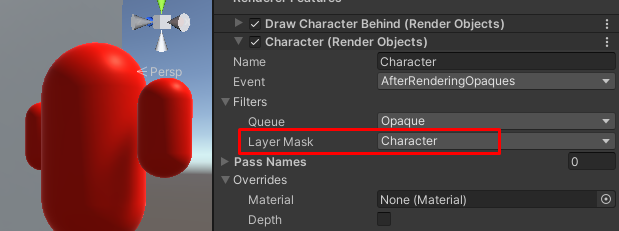

    Now Unity renders the character with the `Character` Material even when the character is behind GameObjects.

    This happens because the `DrawCharacterBehind` Renderer Feature writes values to the depth buffer. When Unity executes the `Character` Renderer Feature, the pixels on the character appear to be in front of the pixels that Unity has drawn previously, and Unity draws on top of those pixels.

4. In the `DrawCharacterBehind` Renderer Feature, In **Overrides** > **Depth**, clear the **Write Depth** check box. With this setting, the `DrawCharacterBehind` Renderer Feature does not make changes to the depth buffer and the `Character` Renderer Feature does not draw the character when it's behind GameObjects.

    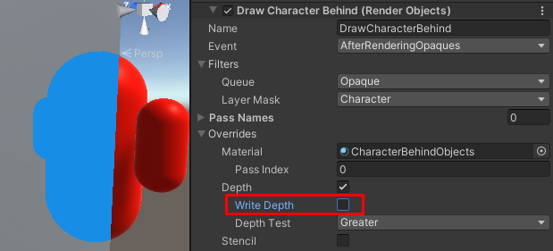

The example is complete. When the character goes behind GameObjects, Unity draws the character silhouette with the `CharacterBehindObjects` Material.

With the extra `Character` Renderer Feature, Unity renders GameObjects as follows:

1. URP Renderer does not render the `Character` GameObject in the **BeforeRenderingOpaques** event, because the `Character` Layer is excluded from the **Opaque Layer Mask** list.

2. The `DrawCharacterBehind` Renderer Feature draws parts of the character that are behind other GameObjects. This happens in the **AfterRenderingOpaques** event.

3. The `Character` Renderer Feature draws parts of the character that are in front of other GameObjects. This happens in the **AfterRenderingOpaques** event, and after executing the `DrawCharacterBehind` Renderer Feature.

To see another use case of the Render Objects Renderer Feature, refer to the **Object Occlusion** Scene in the [Universal Rendering Examples](https://github.com/Unity-Technologies/UniversalRenderingExamples) project.
