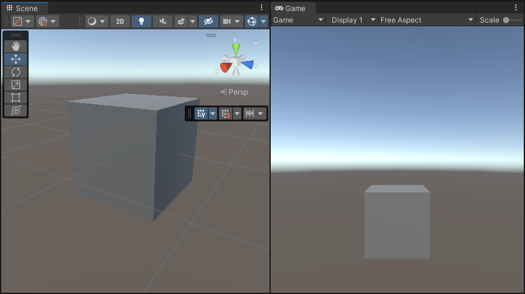
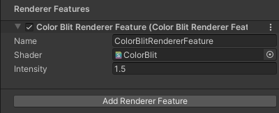
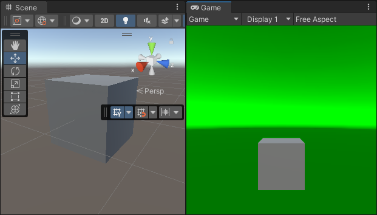

# Perform a full screen blit in URP in Compatibility Mode

The example on this page describes how to create a custom Renderer Feature that performs a full screen blit.

[!include[](../snippets/note-compatibility-mode.md)]

## Example overview

This example implements the following solution:

* A [custom Renderer Feature](https://docs.unity3d.com/Packages/com.unity.render-pipelines.universal@12.0/api/UnityEngine.Rendering.Universal.ScriptableRendererFeature.html) calls a custom [Render Pass](https://docs.unity3d.com/Packages/com.unity.render-pipelines.universal@12.0/api/UnityEngine.Rendering.Universal.ScriptableRenderPass.html).

* The [Render Pass](https://docs.unity3d.com/Packages/com.unity.render-pipelines.universal@12.0/api/UnityEngine.Rendering.Universal.ScriptableRenderPass.html) blits the Opaque Texture to the the [Camera color target](https://docs.unity3d.com/Packages/com.unity.render-pipelines.universal@7.0/api/UnityEngine.Rendering.Universal.ScriptableRenderer.html#UnityEngine_Rendering_Universal_ScriptableRenderer_cameraColorTarget) for the current renderer. The render pass uses the command buffer to draw a full screen mesh for both eyes.

The example includes [the shader](#shader) that performs the GPU side of the rendering. The shader samples the color buffer using XR sampler macros.

## Prerequisites

This example requires the following:

* The **Scriptable Render Pipeline Settings** property refers to a URP asset (**Project Settings** > **Graphics** > **Scriptable Render Pipeline Settings**).

## <a name="example-objects"></a>Create example scene and GameObjects

To follow the steps in this example, create a new scene with the following GameObjects:

1. Create a Cube. Ensure that the Cube is clearly visible from the main Camera.

    

Now you have the scene necessary to follow the steps in this example.

## Example implementation

This section assumes that you created a scene as described in section [Create example scene and GameObjects](#example-objects).

Follow these steps to create a [custom Renderer Feature](https://docs.unity3d.com/Packages/com.unity.render-pipelines.universal@12.0/api/UnityEngine.Rendering.Universal.ScriptableRendererFeature.html) with a custom [Render Pass](https://docs.unity3d.com/Packages/com.unity.render-pipelines.universal@12.0/api/UnityEngine.Rendering.Universal.ScriptableRenderPass.html).

1. Create a new C# script. Call it `ColorBlitRendererFeature.cs`. This script implements the custom Renderer Feature.

    ```C#
    using UnityEngine;
    using UnityEngine.Rendering;
    using UnityEngine.Rendering.Universal;

    internal class ColorBlitRendererFeature : ScriptableRendererFeature
    {
        public Shader m_Shader;
        public float m_Intensity;

        Material m_Material;

        ColorBlitPass m_RenderPass = null;

        public override void AddRenderPasses(ScriptableRenderer renderer,
                                        ref RenderingData renderingData)
        {
            if (renderingData.cameraData.cameraType == CameraType.Game)
                renderer.EnqueuePass(m_RenderPass);
        }

        public override void SetupRenderPasses(ScriptableRenderer renderer,
                                            in RenderingData renderingData)
        {
            if (renderingData.cameraData.cameraType == CameraType.Game)
            {
                // Calling ConfigureInput with the ScriptableRenderPassInput.Color argument
                // ensures that the opaque texture is available to the Render Pass.
                m_RenderPass.ConfigureInput(ScriptableRenderPassInput.Color);
                m_RenderPass.SetTarget(renderer.cameraColorTargetHandle, m_Intensity);
            }
        }

        public override void Create()
        {
            m_Material = CoreUtils.CreateEngineMaterial(m_Shader);
            m_RenderPass = new ColorBlitPass(m_Material);
        }

        protected override void Dispose(bool disposing)
        {
            CoreUtils.Destroy(m_Material);
        }
    }
    ```

2. Create a new C# script. Call it `ColorBlitPass.cs`. This script implements the custom Render Pass that performs the custom blit draw call.

    This Render Pass uses the `Blitter.BlitCameraTexture` method to draw a full-screen quad and perform the blit operation.

    > **Note**: Do not use the `cmd.Blit` method in URP XR projects because that method has compatibility issues with the URP XR integration. Using `cmd.Blit` might implicitly enable or disable XR shader keywords, which breaks XR SPI rendering.

    ```C#
    using UnityEngine;
    using UnityEngine.Rendering;
    using UnityEngine.Rendering.Universal;

    internal class ColorBlitPass : ScriptableRenderPass
    {
        ProfilingSampler m_ProfilingSampler = new ProfilingSampler("ColorBlit");
        Material m_Material;
        RTHandle m_CameraColorTarget;
        float m_Intensity;

        public ColorBlitPass(Material material)
        {
            m_Material = material;
            renderPassEvent = RenderPassEvent.BeforeRenderingPostProcessing;
        }

        public void SetTarget(RTHandle colorHandle, float intensity)
        {
            m_CameraColorTarget = colorHandle;
            m_Intensity = intensity;
        }

        public override void OnCameraSetup(CommandBuffer cmd, ref RenderingData renderingData)
        {
            ConfigureTarget(m_CameraColorTarget);
        }

        public override void Execute(ScriptableRenderContext context, ref RenderingData renderingData)
        {
            var cameraData = renderingData.cameraData;
            if (cameraData.camera.cameraType != CameraType.Game)
                return;

            if (m_Material == null)
                return;

            CommandBuffer cmd = CommandBufferPool.Get();
            using (new ProfilingScope(cmd, m_ProfilingSampler))
            {
                m_Material.SetFloat("_Intensity", m_Intensity);
                Blitter.BlitCameraTexture(cmd, m_CameraColorTarget, m_CameraColorTarget, m_Material, 0);
            }
            context.ExecuteCommandBuffer(cmd);
            cmd.Clear();

            CommandBufferPool.Release(cmd);
        }
    }
    ```

3. <a name="shader"></a>Create the shader that performs the blit operation. Call the shader file `ColorBlit.shader`. The vertex function outputs the full-screen quad position. The fragment function samples the color buffer and returns the `color * float4(0, _Intensity, 0, 1)` value to the render target.

    ```c++
    Shader "ColorBlit"
    {
            SubShader
        {
            Tags { "RenderType"="Opaque" "RenderPipeline" = "UniversalPipeline"}
            LOD 100
            ZWrite Off Cull Off
            Pass
            {
                Name "ColorBlitPass"

                HLSLPROGRAM
                #include "Packages/com.unity.render-pipelines.universal/ShaderLibrary/Core.hlsl"
                // The Blit.hlsl file provides the vertex shader (Vert),
                // input structure (Attributes) and output strucutre (Varyings)
                #include "Packages/com.unity.render-pipelines.core/Runtime/Utilities/Blit.hlsl"

                #pragma vertex Vert
                #pragma fragment frag

                TEXTURE2D_X(_CameraOpaqueTexture);
                SAMPLER(sampler_CameraOpaqueTexture);

                float _Intensity;

                half4 frag (Varyings input) : SV_Target
                {
                    UNITY_SETUP_STEREO_EYE_INDEX_POST_VERTEX(input);
                    float4 color = SAMPLE_TEXTURE2D_X(_CameraOpaqueTexture, sampler_CameraOpaqueTexture, input.texcoord);
                    return color * float4(0, _Intensity, 0, 1);
                }
                ENDHLSL
            }
        }
    }
    ```

4. Add the `ColorBlitRendererFeature` to the Universal Renderer asset.

    

    For information on how to add a Renderer Feature, refer to the page [How to add a Renderer Feature to a Renderer](../urp-renderer-feature-how-to-add.md).

    For this example, set the Intensity property to 1.5.

5. Unity shows the following views:

    

    > **Note**: To visualize the example in XR, configure the project to use XR SDK. [Add the MockHMD XR Plugin to the project](https://docs.unity3d.com/Packages/com.unity.xr.mock-hmd@latest/index.html). Set the **Render Mode** property to **Single Pass Instanced**.

The example is complete.

## Additional resources

For more information on performing the blit operation in Compatibility Mode, refer to the [Using textures section in the URP 14 (Unity 2022) documentation](https://docs.unity3d.com/Packages/com.unity.render-pipelines.universal@14.0/manual/working-with-textures.html).