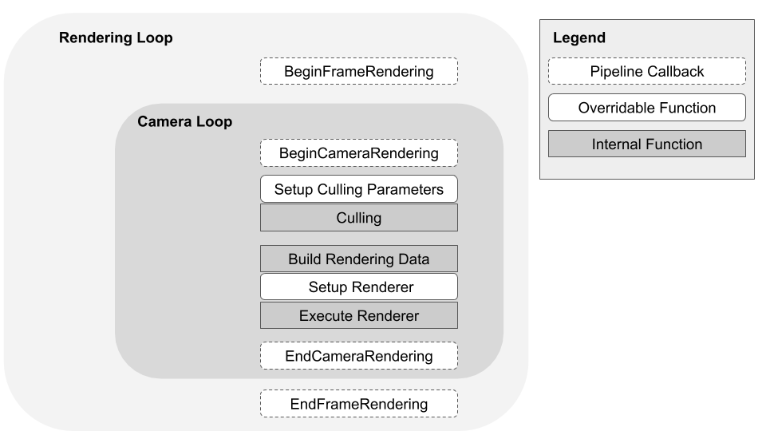

# Rendering in the Universal Render Pipeline

The Universal Render Pipeline (URP) renders Scenes using the following components:

- URP Renderer. URP contains the following Renderers:
    - [Universal Renderer](urp-universal-renderer.md).
    - [2D Renderer](Setup.md#2d-renderer-setup).
- [Shading models](shading-model.md) for shaders shipped with URP
- Camera
- [URP Asset](universalrp-asset.md)

The following illustration shows the frame rendering loop of the URP Universal Renderer.

When the [render pipeline is active in Graphics Settings](InstallURPIntoAProject.md), Unity uses URP to render all Cameras in your Project, including game and Scene view cameras, Reflection Probes, and the preview windows in your Inspectors.

The URP renderer executes a Camera loop for each Camera, which performs the following steps:

1. Culls rendered objects in your Scene
2. Builds data for the renderer
3. Executes a renderer that outputs an image to the framebuffer.

For more information about each step, refer to [Camera loop](#camera-loop).

In the [RenderPipelineManager](https://docs.unity3d.com/ScriptReference/Rendering.RenderPipelineManager.html) class, URP provides events that you can use to execute code before and after rendering a frame, and before and after rendering each Camera loop. The events are:

* [beginCameraRendering](https://docs.unity3d.com/ScriptReference/Rendering.RenderPipelineManager-beginCameraRendering.html)
* [beginFrameRendering](https://docs.unity3d.com/ScriptReference/Rendering.RenderPipelineManager-beginFrameRendering.html)
* [endCameraRendering](https://docs.unity3d.com/ScriptReference/Rendering.RenderPipelineManager-endCameraRendering.html)
* [endFrameRendering](https://docs.unity3d.com/ScriptReference/Rendering.RenderPipelineManager-endFrameRendering.html)

For the example of how to use the beginCameraRendering event, refer to [Inject a render pass via scripting](./customize/inject-render-pass-via-script.md).

## Camera loop

The Camera loop performs the following steps:

| Step                         | Description                                                  |
| ---------------------------- | ------------------------------------------------------------ |
| __Setup Culling Parameters__ | Configures parameters that determine how the culling system culls Lights and shadows. You can override this part of the render pipeline with a custom renderer. |
| __Culling__                  | Uses the culling parameters from the previous step to compute a list of visible renderers, shadow casters, and Lights that are visible to the Camera. Culling parameters and Camera [layer distances](https://docs.unity3d.com/ScriptReference/Camera-layerCullDistances.html) affect culling and rendering performance. |
| __Build Rendering Data__     | Catches information based on the culling output, quality settings from the [URP Asset](universalrp-asset.md), [Camera](cameras.md), and the current running platform to build the `RenderingData`. The rendering data tells the renderer the amount of rendering work and quality required for the Camera and the currently chosen platform. |
| __Setup Renderer__           | Builds a list of render passes, and queues them for execution according to the rendering data. You can override this part of the render pipeline with a custom renderer. |
| __Execute Renderer__         | Executes each render pass in the queue. The renderer outputs the Camera image to the framebuffer. |
