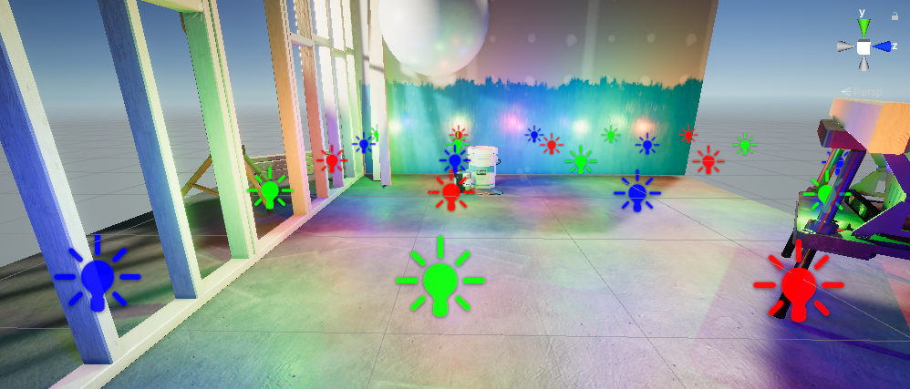
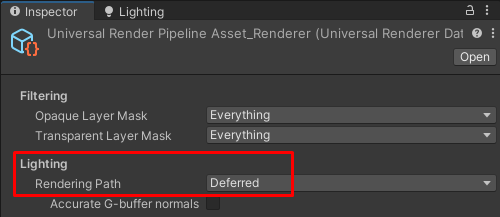
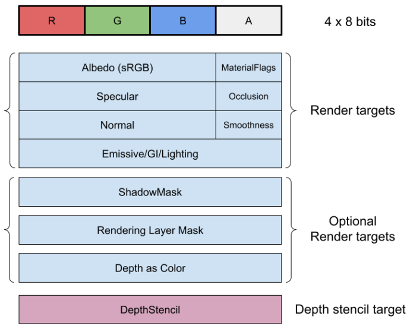
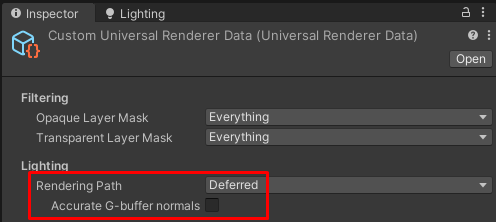
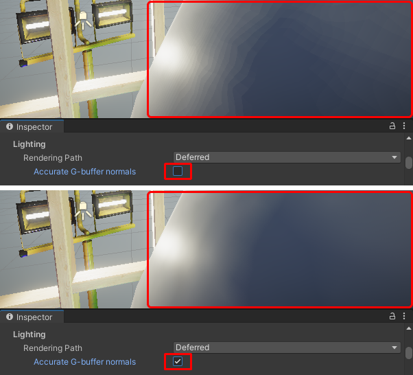
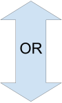
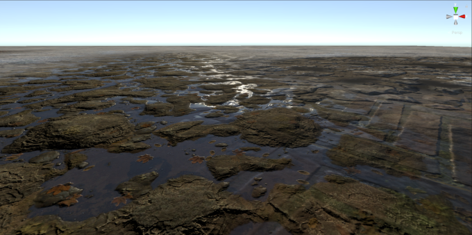
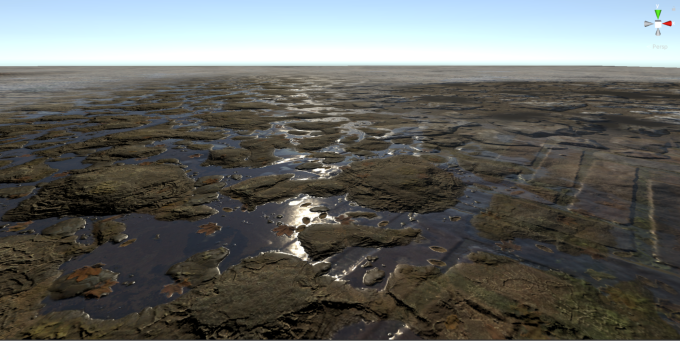

# Deferred Rendering Path in URP

URP Universal Renderer supports the following Rendering Paths:

* Forward
* Forward+
* Deferred

For information on differences between the rendering paths, see section [Rendering Path comparison](../urp-universal-renderer.md#rendering-path-comparison).

This section describes the Deferred Rendering Path.

<br/>*Sample Scene rendered with the Deferred Rendering Path.*

This section contains the following topics:

* [How to select the Deferred Rendering Path](#how-to-enable)

* [Unity Player system requirements](#requirements)

* [Implementation details](#implementation-details)

* [Relevant code files](#relevant-code-files)

* [ShaderLab Pass tags](#shaderlab-pass-tags)

* [Limitations and performance](#limitations-and-performance)

## <a name="how-to-enable"></a>How to select the Deferred Rendering Path

To select the Rendering Path, use the property **Lighting** > **Rendering Path** in the URP Universal Renderer asset.



When you select the Deferred Rendering Path, Unity shows the [Accurate G-buffer normals](#accurate-g-buffer-normals) property.

The **Accurate G-buffer normals** property lets you configure how Unity encodes the normals when storing them in the geometry buffer (G-buffer).

* **Accurate G-buffer normals** off: This option increases performance, especially on mobile GPUs, but might lead to color banding artifacts on smooth surfaces.

* **Accurate G-buffer normals** on: Unity uses the octahedron encoding to store values of normal vectors in the RGB channel of a normal texture. With this encoding, values of normal vectors are more accurate, but the encoding and decoding operations put extra load on the GPU.

For more information about this setting, see the section [Encoding of normals in G-buffer](#accurate-g-buffer-normals).

## <a name="requirements"></a>Unity Player system requirements

The Deferred Rendering Path has the following requirements and limitations on top of the general system requirements for the Unity Player.

* Minimum Shader Model: Shader Model 4.5.

* Deferred Rendering Path does not support the OpenGL and OpenGL ES API.<br/>If a project with the Deferred Rendering Path is built for platforms using those API, the application falls back to the Forward Rendering Path.

## Implementation details

This section describes the implementation details of this feature, and technical details about how this feature functions.

### G-buffer layout

This section describes how Unity stores material attributes in the G-buffer in the Deferred Rendering Path.

The following illustration shows the data structure for each pixel of the render targets that Unity uses in the Deferred Rendering Path.



The data structure consists of the following components.

**Albedo (sRGB)**

This field contains the albedo color in sRGB format, 24 bits.

**MaterialFlags**

This field is a bit field that contains Material flags:

* Bit 0, **ReceiveShadowsOff**: if set, the pixel does not receive dynamic shadows.

* Bit 1, **SpecularHighlightsOff**: if set, the pixel does not receive specular highlights.

* Bit 2, **SubtractiveMixedLighting**: if set, the pixel uses subtractive mixed lighting.

* Bit 3, **SpecularSetup**: if set, the Material uses the specular workflow.

Bits 4-7 are reserved for future use.

For more technical details, see the file `/ShaderLibrary/UnityGBuffer.hlsl`.

**Specular**

This field contains the following values:

* SimpleLit Material: RGB specular color stored in 24 bits.

* Lit Material with metallic workflow: reflectivity stored in 8 bits, 16 bits are not used.

* Lit Material with specular workflow: RGB specular color stored in 24 bits.

**Occlusion**

This field contains the baked occlusion value from the baked lighting. For real-time lighting, Unity calculates the ambient occlusion value by combining the baked occlusion value with the SSAO value.

**Normal**

This field contains the world space normals encoded in 24 bits. For information on the encoding of normals, see section [Encoding of normals in G-buffer](#accurate-g-buffer-normals).

**Smoothness**

This field stores the smoothness value for the SimpleLit and Lit materials.

**Emissive/GI/Lighting**

This render target contains the Material emissive output and baked lighting. Unity fills this field during the G-buffer Pass. During the deferred shading pass, Unity stores lighting results in this render target.

Render target format:

* **B10G11R11_UFloatPack32**, unless one of the following conditions is true:

    * In URP Asset, the setting **Quality** > **HDR** is turned on, and the target Player platform does not support HDR.

    * In Player Settings, the setting **PreserveFramebufferAlpha** is true.

* **R16G6B16A16_SFloat**, if Unity cannot use **B10G11R11_UFloatPack32** because of the project settings.

* If Unity cannot use one of the other formats in the list, it uses what the following method returns: `SystemInfo.GetGraphicsFormat(DefaultFormat.HDR)`.

**ShadowMask**

Unity adds this render target to the G-buffer layout when Lighting Mode is set to Subtractive or Shadow mask.

The Subtractive and the Shadow mask modes are optimized for the Forward Rendering Path, and are less efficient in the Deferred Rendering Path. In the Deferred Rendering Path,  avoid using these modes and use the Baked Indirect mode instead to improve GPU performance.

**Rendering Layer Mask**

Unity adds this render target to the G-buffer layout when the Use Rendering Layers option is enabled (URP Asset, **Lighting** > **Use Rendering Layers**). 

Using Rendering Layers might have an impact on the GPU performance. For more information, see the page [Rendering Layers](../features/rendering-layers.md#performance).

**Depth as Color**

Unity adds this render target to the G-buffer layout when Native Render Pass is enabled on platforms that support it. Unity renders depth as a color into this render target. This render target has the following purpose:

* Improves performance on Vulkan devices.

* Lets Unity get the depth buffer on Metal API, which does not allow fetching the depth from the DepthStencil buffer within the same render pass.

The format of the Depth as Color render target is `GraphicsFormat.R32_SFloat`.

**DepthStencil**

Unity reserves the four highest bits of this render target to mark the Material type. See also [URP Pass tags: UniversalMaterialType](../urp-shaders/urp-shaderlab-pass-tags.md#universalmaterialtype).

For this render target, Unity selects either the `D32F_S8` format, or the `D24S8` format depending on the platform.

### <a name="accurate-g-buffer-normals"></a>Encoding of normals in G-buffer

In the Deferred Rendering Path, Unity stores normals in the G-buffer. Unity encodes each normal as a 24 bit value.

When you select the **Deferred** option in the **Rendering Path** property in the URP Universal Renderer asset, Unity shows the **Accurate G-buffer normals** property.



The **Accurate G-buffer normals** property lets you configure how Unity encodes the normals.

* **Accurate G-buffer normals** off: Unity stores values of normal vectors in the G-buffer in the RGB channel of a normal texture, 8 bit per value (x, y, z). The values are quantized with the loss of accuracy. This option increases performance, especially on mobile GPUs, but might lead to color banding artifacts on smooth surfaces.

* **Accurate G-buffer normals** on: Unity uses the octahedron encoding to store values of normal vectors in the RGB channel of a normal texture. With this encoding, values of normal vectors are more accurate, but the encoding and decoding operations put extra load on the GPU.<br/>The precision of the encoded normal vectors is similar to the precision of the sampled values in the Forward Rendering Path.

The following illustration shows the visual difference between the two options when the Camera is very close to the GameObject:



**Performance considerations**

With **Accurate G-buffer normals** option turned on, there is extra load on the GPU because of the encoding and decoding operations. This load is insignificant for desktop platforms and consoles, but might be considerable for mobile GPUs.

Turning the option on does not increase the memory footprint. To store the normals, Unity uses the same RGB channel in the normal texture regardless of the encoding.

### <a name="render-passes"></a>Deferred Rendering Path render Passes

The following table shows the sequence of Render Pass events in the Deferred Rendering Path.

<table>
    <thead>
    <tr>
        <th>Render Pass events</th>
        <th>Deferred Rendering Path Passes</th>
        <th>SSAO Renderer Feature Passes</th>
    </tr>
    </thead>
    <tbody>
    <tr>
        <td>BeforeRendering</td>
        <td>&#160;</td>
        <td>&#160;</td>
    </tr>
    <tr>
        <td>BeforeRenderingShadows</td>
        <td>&#160;</td>
        <td>&#160;</td>
    </tr>
    <tr>
        <td>AfterRenderingShadows</td>
        <td>&#160;</td>
        <td>&#160;</td>
    </tr>
    <tr>
        <td>BeforeRenderingPrePasses</td>
        <td>Depth, or depth and normal prepass (Forward only materials)</td>
        <td>&#160;</td>
    </tr>
    <tr>
        <td>AfterRenderingPrePasses</td>
        <td>&#160;</td>
        <td>&#160;</td>
    </tr>
    <tr>
        <td>BeforeRenderingGbuffer</td>
        <td>G-buffer Pass (GBufferPass)</td>
        <td>&#160;</td>
    </tr>
    <tr>
        <td>&#160;</td>
        <td>Copy G-buffer depth texture</td>
        <td>&#160;</td>
    </tr>
    <tr>
        <td>AfterRenderingGbuffer</td>
        <td>&#160;</td>
        <td>SSAO (optional)</td>
    </tr>
    <tr>
        <td>BeforeRenderingDeferredLights</td>
        <td>&#160;</td>
        <td rowspan="4"></td>
    </tr>
    <tr>
        <td></td>
        <td>Deferred rendering (stencil)</td>
    </tr>
    <tr>
        <td>AfterRenderingDeferredLights</td>
        <td>&#160;</td>
    </tr>
    <tr>
        <td>BeforeRenderingOpaques</td>
        <td>Opaque Forward-only Materials</td>
    </tr>
    <tr>
        <td>AfterRenderingOpaques</td>
        <td>&#160;</td>
        <td>SSAO and blending (optional)</td>
    </tr>
    <tr>
        <td>BeforeRenderingSkybox</td>
        <td>&#160;</td>
        <td>&#160;</td>
    </tr>
    <tr>
        <td>AfterRenderingSkybox</td>
        <td>&#160;</td>
        <td>&#160;</td>
    </tr>
    <tr>
        <td>BeforeRenderingTransparents</td>
        <td>&#160;</td>
        <td>&#160;</td>
    </tr>
    <tr>
        <td>AfterRenderingTransparents</td>
        <td>&#160;</td>
        <td>&#160;</td>
    </tr>
    <tr>
        <td>BeforeRenderingPostProcessing</td>
        <td>&#160;</td>
        <td>&#160;</td>
    </tr>
    <tr>
        <td>AfterRenderingPostProcessing</td>
        <td>&#160;</td>
        <td>&#160;</td>
    </tr>
    <tr>
        <td>AfterRendering</td>
        <td>&#160;</td>
        <td>&#160;</td>
    </tr>
    <tbody>
</table>

The following sections describe the Deferred Rendering Path render Passes.

#### Depth, or depth and normal prepass

In the Deferred Rendering Path, in the depth prepass or depth and normal prepass, Unity renders only the Materials that do not support the deferred rendering model. For example, Materials using the Complex Lit shader are such Materials.

In the Deferred Rendering Path, Unity does not use the depth prepass to generate a copy of the depth buffer (this behavior is different in the Forward Rendering Path).

If the Universal Renderer has the SSAO Renderer Feature, Unity executes the depth and normal prepass. SSAO uses the screen-space depth and normal buffers to calculate ambient occlusion.

#### Optional passes: SSAO, SSAO with blending

If the Universal Renderer has the SSAO Renderer Feature, and the **After Opaque** option is disabled (the option is disabled by default), Unity executes the SSAO Pass at the AfterRenderingGbuffer event. The SSAO Renderer Feature calculates the SSAO texture. Unity samples this texture in the Deferred rendering Pass and in the Pass that renders Forward-only Materials.

Using this Pass order, Unity can combine the baked occlusion with the real-time occlusion from the SSAO Renderer Feature, and avoid double-darkening from the baked and the real-time ambient occlusion.

When the After Opaque option is enabled, Unity executes the SSAO and blending Pass at the AfterRenderingOpaques event, after rendering the Forward-only Materials. Unity then executes an extra full screen Pass to overlay the SSAO texture onto the Emissive/GI/Lighting buffer. This causes over-darkening of the areas that receive baked occlusion and real-time occlusion.

**Performance considerations**

On mobile platforms with TBDR architecture, with the **After Opaque** option is disabled, Unity requires an extra render target for load and store operations. This has a significant performance impact.

Enabling the **After Opaque** option on mobile platforms improves GPU performance. On mobile platforms with TBDR architecture, enabling this option avoids extra render target load and store operations.

#### Forward-only Pass

Certain Unity shaders use lighting models that Unity cannot render in the Deferred Rendering Path.

Examples of such shaders:

* **Complex Lit**: the Lighting model of this shader (for example, the Clear Coat effect) is too complex and extra Material properties cannot fit into the G-buffer.

* **Baked Lit** and **Unlit**: these shaders do not calculate real-time lighting, that's why Unity renders them into the Emissive/GI/Lighting buffer directly during the Forward-only pass. This is faster than evaluating the shaders in the Deferred rendering (stencil) pass.

* **Custom shaders**: Unity renders the shaders that do not declare the Pass tags required by the Deferred Rendering Path as Forward-only. The required Pass tags are: `LightMode`, and `UniversalMaterialType`. For more information, see [URP Pass tags](../urp-shaders/urp-shaderlab-pass-tags.md).

Unity renders Materials with such shaders in the Forward Rendering Path. For the SSAO Renderer Feature to be able to calculate ambient occlusion for the Materials using the **Complex Lit** shader, Unity must render such Materials in the depth and normal prepass first. This is because Unity does not render those Materials in the G-buffer pass (GBufferPass). For more information, see [URP Pass tags](../urp-shaders/urp-shaderlab-pass-tags.md).

#### General implementation notes

For maximum platform compatibility, the URP Deferred Rendering Path uses the light stencil volume technique to render light volumes and apply deferred shading.

## Relevant code files

This section contains the list of files that contain the code related to the Deferred Rendering Path.

* The main class that handles the Deferred Rendering Path:

    ```
    com.unity.render-pipelines.universal\Runtime\DeferredLights.cs
    ```

* ScriptableRenderPass for the G-Buffer pass:

    ```
    com.unity.render-pipelines.universal\Runtime\Passes\GBufferPass.cs
    ```

* ScriptableRenderPass for the deferred shading pass:

    ```
    com.unity.render-pipelines.universal\Runtime\Passes\DeferredPass.cs
    ```

* Shader asset for the deferred shading:

    ```
    com.unity.render-pipelines.universal\Shaders\Utils\StencilDeferred.shader
    ```

* Utility functions for the deferred shading:

    ```
    com.unity.render-pipelines.universal\Shaders\Utils\Deferred.hlsl
    ```

* Utility functions for storing and loading the Material properties from the G-buffer:

    ```
    com.unity.render-pipelines.universal\Shaders\Utils\UnityGBuffer.hlsl
    ```

## ShaderLab Pass tags

To enable Unity to render a shader in the Deferred Rendering Path, the shader must have a Pass with the following tag definition:

`"LightMode" = "UniversalGBuffer"`

Unity executes the shader with such `LightMode` tag during the G-buffer Pass.

To indicate that Unity must render a certain Material in the Forward-only Pass in the Deferred Rendering Path, add the following tags to a shader Pass:

`"LightMode" = "UniversalForwardOnly"`

`"LightMode" = "DepthNormalsOnly"`

To specify the shader lighting model (Lit, SimpleLit), use the `UniversalMaterialType` tag.

For more information, see the section [URP Pass tags: LightMode](../urp-shaders/urp-shaderlab-pass-tags.md#lightmode).

## Limitations and performance

This section describes the limitations of the Deferred Rendering Path.

### Terrain blending

When blending more than four Terrain layers, the Deferred Rendering Path generates slightly different results from the Forward Rendering Path. This happens because in the Forward Rendering Path, Unity processes the first four layers separately from the next four layers using multi-pass rendering.

In the Forward Rendering Path, Unity merges Material properties and calculates lighting for the combined properties of four layers at once. Unity then processes the next four layers in the same way and alpha-blends the lighting results.

In the Deferred Rendering Path, Unity combines Terrain layers in the G-buffer pass, four layers at a time, and then calculates lighting only once during the deferred rendering pass. This difference with the Forward Rendering Path leads to [visually different outcomes](#terrain-visual-diff).

Unity combines the Material properties in the G-buffer using hardware blending (four layers at a time), which limits how correct the combination of property values is. For example, pixel normals cannot be correctly combined using the alpha blend equation alone, because one Terrain layer might contain coarse Terrain detail while another layer might contain fine detail. Averaging or summing normals results in loss of accuracy.

> **NOTE:** Turning the setting [Accurate G-buffer normals](#accurate-g-buffer-normals) on breaks Terrain blending. With this setting turned on, Unity encodes normals using octahedron encoding. Normals in different layers encoded this way cannot be blended together because of the bitwise nature of the encoding (2 x 12 bits). If your application requires more than four Terrain layers, turn the **Accurate G-buffer normals** setting off.

<a name="terrain-visual-diff"></a>The following illustration shows the visual difference when rendering Terrain layers with different Rendering Paths.

<br/>*Terrain layers rendered with the Forward Rendering Path*

<br/>*Terrain layers rendered with the Deferred Rendering Path*

### Baked Global Illumination and Lighting Modes

When Baked Global Illumination is enabled, the Subtractive and the Shadowmask Lighting modes put extra load on the GPU in the Deferred Rendering Path.

The Deferred Rendering Path supports the Subtractive and the Shadowmask Lighting modes for compatibility reasons, but, unlike the case with the Forward Rendering Path, these modes do not provide any improvements in performance. In the Deferred Rendering Path, Unity processes all meshes using the same Lighting algorithm and stores the extra Lighting properties required by Subtractive and the Shadowmask modes in the [ShadowMask render target](#g-buffer-layout).

In the Deferred Rendering Path, the Baked Indirect Lighting mode provides better performance, since it does not require the ShadowMask render target.

### Rendering layers

URP implements the Rendering Layers feature that lets you configure which Lights in a Scene affect specific meshes. Lights assigned to a specific Rendering Layer only affect the meshes assigned to the same Rendering Layer.

For more information on Rendering Layers, see the page [Rendering Layers](../features/rendering-layers.md).

**Performance impact**

The Rendering Layers feature requires an extra G-buffer render target to store the rendering layer mask (32 bits). The extra render target is likely to have a negative impact on GPU performance.

**Implementation notes**

In the Forward Rendering Path, the [Layers](https://docs.unity3d.com/Manual/Layers.html) feature lets you tell Unity to render specific meshes with a specific set of Lights. The [Layers](https://docs.unity3d.com/Manual/Layers.html) feature uses the culling mask system.

The Deferred Rendering Path cannot use the layer system with light culling masks, because the shading is deferred to a later stage in the rendering loop (see the **Deferred rendering (stencil)** step in the [Deferred Rendering Path render Passes](#render-passes) table.)
