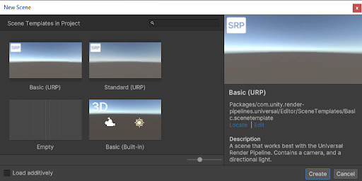

# Universal Render Pipeline Scene Templates

You can use [Scene Templates](https://docs.unity3d.com/Manual/scene-templates.html) to quickly create scenes that include pre-configured URP-specific settings and post-processing effects. For information on how to create a new scene from a Scene Template, refer to [Creating a new scene from the New Scene dialog](https://docs.unity3d.com/Manual/scenes-working-with.html#creating-a-new-scene-from-the-new-scene-dialog).

> *The New Scene dialog displaying Scene Templates.*

The following Scene Templates are available for URP:

* **Basic (URP)**: A scene that contains a [Camera](camera-component-reference.md) and a [Light](light-component.md). This is the URP equivalent of Unity's default scene.
* **Standard (URP)**: A scene that contains a Camera, a Light, and a global [Volume](Volumes.md) with various post-processing effects. **Note**: If you create a scene using the Standard (URP) Scene Template, Unity creates a new [Volume Profile](VolumeProfile.md) to store the post-processing effects.
