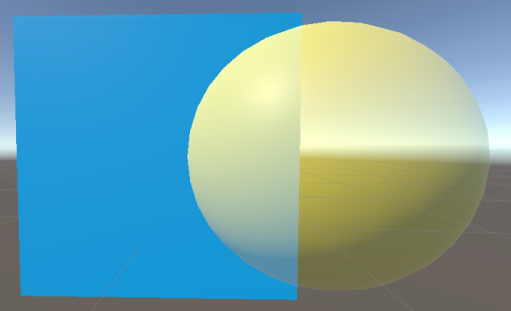
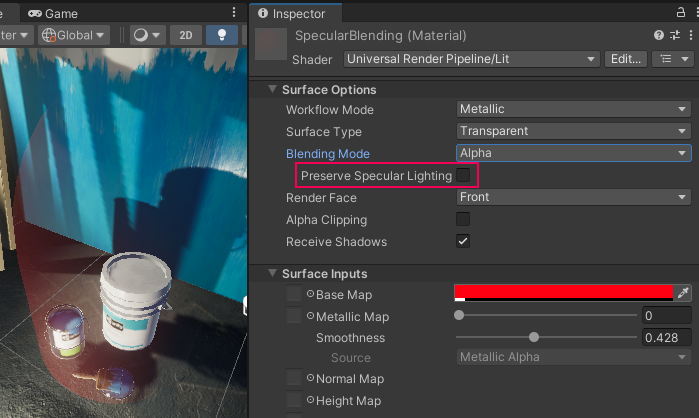
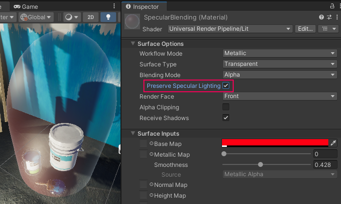

# Complex Lit Shader

The Complex Lit Shader contains all the functionality of the Lit shader and adds advanced material features. Some features in this shader might be considerably more resource-intensive and require [Unity Shader Model 4.5](https://docs.unity3d.com/Manual/SL-ShaderCompileTargets.html) hardware.

In the Deferred Rendering Path, URP renders objects that have the Complex Lit shader using the Forward Rendering Path. If the hardware of the target platform does not support features in the Complex Lit shader, URP uses the Lit shader instead.

## Using the Complex Lit Shader in the Editor

To select and use this Shader:

1. In your Project, create or find the Material you want to use the Shader on.  Select the **Material**. A Material Inspector window opens.
2. Click **Shader**, and select **Universal Render Pipeline** > **Complex Lit**.

## UI overview

The Inspector window for this Shader contains these elements:

* **[Surface Options](#surface-options)**
* **[Surface Inputs](#surface-inputs)**
* **[Advanced](#advanced)**

### Surface Options

The **Surface Options** control how URP renders the Material on a screen.

| Property            | Description                                                  |
| ------------------- | ------------------------------------------------------------ |
| **Workflow Mode**   | Use this drop-down menu to choose a workflow that fits your Textures, either  [**Metallic**](https://docs.unity3d.com/Manual/StandardShaderMaterialParameterMetallic.html) and [**Specular**](https://docs.unity3d.com/Manual/StandardShaderMaterialParameterSpecular.html). When you have made your choice, the main Texture options in the rest of the Inspector now follow your chosen workflow. For information on metallic or specular workflows, refer to the [Manual page for the Standard built-in Shader in Unity](https://docs.unity3d.com/Manual/StandardShaderMetallicVsSpecular.html). |
| **Surface Type**    | Use this drop-down to apply an **Opaque** or **Transparent** surface type to the Material. This determines which render pass URP renders the material in. **Opaque** surface types are always fully visible, regardless of what’s behind them. URP renders opaque Materials first. **Transparent** surface types are affected by their background, and they can vary according to which type of transparent surface type you choose. URP renders transparent Materials in a separate pass after opaque objects.  If you select **Transparent**, the **Blending Mode** drop-down appears. |
| **Blending Mode**   | Select how Unity calculates the color of each pixel of a transparent Material when it blends the Material with the background.  In the context of Blending Modes, Source refers to the transparent Material where the Blending Mode is set and Destination refers to anything that Material overlaps with. |
|&#160;&#160;&#160;&#160;Alpha |  *Alpha blending mode.*  **Alpha** uses the Material's alpha value to change how transparent an object is. 0 is fully transparent. 255 is fully opaque, this is translated to a value of 1 when used with the blending equations. The Material is always rendered in the Transparent render pass regardless of it's alpha value. This mode lets you use the [Preserve Specular Lighting](#preserve-specular) property.  Alpha equation: *OutputRGBA* = (*SourceRGB* &#215; *SourceAlpha*) + *DestinationRGB* &#215; (1 &#8722; *SourceAlpha*) |
|&#160;&#160;&#160;&#160;Premultiply |  *Premultiply blending mode.*  **Premultiply** first multiplies the RGB values of the transparent Material by its alpha value then applies a similar effect to the Material as **Alpha**. The equation for **Premultiply** also allows areas of the transparent Material with an alpha value of 0 to have an additive blend effect. This can help reduce artifacts that may appear at the edge of the overlap between opaque and transparent pixels.  Premultiply equation: *OutputRGBA* = *SourceRGB* + *DestinationRGB* &#215; (1 &#8722; *SourceAlpha*) |
|&#160;&#160;&#160;&#160;Additive |  *Additive blending mode.*  **Additive** adds the color values of the Materials together to create the blend effect. The alpha value determines the strength of the source Material's color before the blend is calculated. This mode lets you use the [Preserve Specular Lighting](#preserve-specular) property.  Additive equation: *OutputRGBA* = (*SourceRGB* &#215; *SourceAlpha*) + *DestinationRGB* |
|&#160;&#160;&#160;&#160;Multiply |  *Multiply blending mode.*  **Multiply** multiplies the color of the Material with the color behind the surface. This creates a darker effect, like when you look through colored glass. This mode uses the Material’s alpha value to adjust how much the colors blend. An alpha value of 1 results in unadjusted multiplication of the colors while lower values blend the colors towards white.  Multiply equation: *OutputRGBA* = *SourceRGB* &#215; *DestinationRGB*  |
| **Preserve Specular Lighting** | Indicates whether Unity preserves specular highlights on a GameObject or not. This applies even when your surface is transparent which means that only the reflected light is visible.  This property only appears when the **Surface Type** is set to Transparent and **Blending Mode** is set to either Alpha or Additive.   *Material with **Preserve Specular Lighting** disabled.*   *Material with **Preserve Specular Lighting** enabled.* |
| **Render Face**     | Use this drop-down to determine which sides of your geometry to render. **Front Face** renders the front face of your geometry and [culls](https://docs.unity3d.com/Manual/SL-CullAndDepth.html) the back face. This is the default setting.  **Back Face** renders the front face of your geometry and culls the front face.  **Both** makes URP render both faces of the geometry. This is good for small, flat objects, like leaves, where you might want both sides visible. |
| **Alpha Clipping**  | Makes your Material act like a [Cutout](https://docs.unity3d.com/Manual/StandardShaderMaterialParameterRenderingMode.html) Shader. Use this to create a transparent effect with hard edges between the opaque and transparent areas. For example, to create blades of grass. To achieve this effect, URP does not render alpha values below the specified **Threshold**, which appears when you enable **Alpha Clipping**.  You can set the **Threshold** by moving the slider, which accepts values from 0 to 1. All values above your threshold are fully opaque, and all values below your threshold are invisible. For example, a threshold of 0.1 means that URP doesn't render alpha values below 0.1. The default value is 0.5. |
| **Receive Shadows** | Tick this box to enable your GameObject to have shadows cast upon it by other objects. If you untick this box, the GameObject will not have shadows on it. |

### Surface Inputs

The **Surface Inputs** describe the surface itself. For example, you can use these properties to make your surface look wet, dry, rough, or smooth.

> **Note**: If you are used to the [Standard Shader](https://docs.unity3d.com/Manual/Shader-StandardShader.html) in the built-in Unity render pipeline, these options are similar to the Main Maps settings in the [Material Editor](https://docs.unity3d.com/Manual/StandardShaderContextAndContent.html).

| Property                    | Description                                                  |
| --------------------------- | ------------------------------------------------------------ |
| **Base Map**                | Adds color to the surface, also known as the diffuse map. To assign a Texture to the **Base Map** setting, click the object picker next to it. This opens the Asset Browser, where you can select from the Textures in your Project. Alternatively, you can use the [color picker](https://docs.unity3d.com/Manual/EditingValueProperties.html). The color next to the setting shows the tint on top of your assigned Texture. To assign another tint, you can click this color swatch. If you select **Transparent** or **Alpha Clipping** under **Surface Options**, your Material uses the Texture’s alpha channel or color. |
| **Metallic / Specular Map** | Shows a map input for your chosen **Workflow Mode** in the **Surface Options**. For the [**Metallic Map**](https://docs.unity3d.com/Manual/StandardShaderMaterialParameterMetallic.html) workflow, the map gets the color from the **Base Map** assigned above. Use the slider to control how metallic the surface appears. 1 is fully metallic, like silver or copper, and 0 is fully dielectric, like plastic or wood. You can generally use values in between 0 and 1 for dirty or corroded metals. For the [**Specular Map**](https://docs.unity3d.com/Manual/StandardShaderMaterialParameterSpecular.html) setting, you can assign a texture to it by clicking the object picker next to it. This opens the Asset Browser, where you can select from the Textures in your Project. Alternatively, you can use the [color picker](https://docs.unity3d.com/Manual/EditingValueProperties.html). For both workflows, you can use the **Smoothness** slider to control the spread of highlights on the surface. 0 gives a wide, rough highlight. 1 gives a small, sharp highlight like glass. Values in between produce semi-glossy looks. For example, 0.5 produces a plastic-like glossiness. Use the **Source** drop-down menu to select where the shader samples a smoothness map from. Options are: **Metallic Alpha** (alpha channel from the metallic map), and **Albedo Alpha** (alpha channel from the base map). The default value is **Metallic Alpha**. If the selected source has the alpha channel, the shader samples the channel and multiplies each sample by the **Smoothness** value. |
| **Normal Map**              | Adds a normal map to the surface. With a [normal map](https://docs.unity3d.com/Manual/StandardShaderMaterialParameterNormalMap.html?), you can add surface details like bumps, scratches and grooves. To add the map, click the object picker next to it. The normal map picks up ambient lighting in the environment.  The float value next to the setting is a multiplier for the effect of the  **Normal Map**. Low values decrease the effect of the normal map. High values create stronger effects. |
| **Height Map**              | URP implements the parallax mapping technique which uses the [height map](https://docs.unity3d.com/Manual/StandardShaderMaterialParameterHeightMap.html) to achieve surface-level occlusion effect by shifting the areas of the visible surface texture. To add the map, click the object picker next to it.  The float value next to the setting is a multiplier for the effect of the **Height Map**. Low values decrease the effect of the height map. High values create stronger effects. |
| **Occlusion Map**           | Select an [occlusion map](https://docs.unity3d.com/Manual/StandardShaderMaterialParameterOcclusionMap.html).  This simulates shadows from ambient light and reflection, which makes lighting look more realistic as less light reaches corners and crevices of objects. To select the occlusion map, click the object picker next to it. |
| **Clear Coat**          | Select this check box to enable the Clear Coat feature. The feature adds an extra Material layer which simulates a transparent and thin coating on top of the base Material. The feature affects the color and the Smoothness values of the underlying base material slightly. The index of refraction (IOR) of the Clear Coat is 1.5. **Performance impact**: Rendering Clear Coat has roughly twice the cost of rendering a base material, because the lighting is evaluated once per layer. **Mask**: This property defines the intensity of the effect: 0 - no effect, 1 - maximum effect. Setting the Mask value to 0 does not disable the feature. **Smoothness**: This property defines the spread of highlights on the surface. 0 gives wide, rough highlights. 1 gives sharp, glasslike highlights. There is the Clear Coat map property to the left of the Mask property. The channels have the following mapping: Red: the Mask property. Green: the Smoothness property. If a Clear Coat map is present, URP multiplies the map's pixel values by value of the Mask property. |
| **Emission**                | Makes the surface look like it emits lights. When enabled, the  **Emission Map** and **Emission Color** settings appear. To assign an **Emission Map**, click the object picture next to it. This opens the Asset Browser, where you can select from the textures in your Project. For **Emission Color**, you can use the [color picker](https://docs.unity3d.com/Manual/EditingValueProperties.html) to assign a tint on top of the color. This can be more than 100% white, which is useful for effects like lava, that shines brighter than white while still being another color. If you have not assigned an **Emission Map**, the **Emission** setting only uses the tint you’ve assigned in **Emission Color**. If you do not enable **Emission**, URP sets the emission to black and does not calculate emission. |
| **Tiling**                  | A 2D multiplier value that scales the Texture to fit across a mesh according to the U and V axes. This is good for surfaces like floors and walls. The default value is 1, which means no scaling. Set a higher value to make the Texture repeat across your mesh. Set a lower value to stretch the Texture. Try different values until you reach your desired effect. |
| **Offset**                  | The 2D offset that positions the Texture on the mesh.  To adjust the position on your mesh, move the Texture across the U or V axes. |

### Detail Inputs

Use the **Detail Inputs** settings to add extra details to the surface.

**Requirement**: GPU supporting shader model 2.5 or higher.

| Property                    | Description                                                  |
| --------------------------- | ------------------------------------------------------------ |
| **Mask**                    | Select a texture that defines areas where Unity overlays the Detail maps over the Surface Inputs maps. The mask uses the alpha channel of the selected texture. The **Tiling** and **Offset** settings have no effect on the mask. |
| **Base Map**                | Select the texture containing the surface details. Unity blends this map with the Surface Base Map using the overlay mode. |
| **Normal Map**              | Select the texture containing the normal vector data. Use a [normal map](https://docs.unity3d.com/Manual/StandardShaderMaterialParameterNormalMap.html?) to add surface details like bumps, scratches and grooves. Use the slider next to the setting to change the intensity of the effect of the map. The default value is 1. |
| **Tiling**                  | Use this setting to scale the **Base Map** and the **Normal Map** on the mesh along the U and V axes, so that the maps fit the mesh best. The default value is 1. Select a value higher than one to make the maps repeat themselves across the mesh. Set a value lower than 1 to stretch the maps. |
| **Offset**                  | The offset that moves the **Base Map** and the **Normal Map** on the mesh along the U and V axes. |

### Advanced

The **Advanced** settings affect the underlying calculations of your rendering. They do not have a visible effect on your surface.

| Property                    | Description                                                  |
| --------------------------- | ------------------------------------------------------------ |
| **Specular Highlights**     | Enable this to allow your Material to have specular highlights from direct lighting, for example [Directional, Point, and Spot lights](https://docs.unity3d.com/Manual/Lighting.html). This means that your Material reflects the shine from these light sources. Disable this to leave out these highlight calculations, so your Shader renders faster. By default, this feature is enabled. |
| **Environment Reflections** | Sample reflections using the nearest [Reflection Probe](https://docs.unity3d.com/Manual/class-ReflectionProbe.html), or, if you have set one in the [Lighting](https://docs.unity3d.com/Manual/GlobalIllumination.html) window, the [Lighting Probe](https://docs.unity3d.com/Manual/LightProbes.html). If you disable this, you will have fewer Shader calculations, but this also means that your surface has no reflections. |
| **Enable GPU Instancing**   | Makes URP render meshes with the same geometry and Material in one batch, when possible. This makes rendering faster. URP cannot render Meshes in one batch if they have different Materials or if the hardware does not support GPU instancing. |
| **Priority**                | Use this slider to determine the chronological rendering order for a Material. URP renders Materials with lower values first. You can use this to reduce overdraw on devices by making the pipeline render Materials in front of other Materials first, so it doesn't have to render overlapping areas twice. This works similarly to the [render queue](https://docs.unity3d.com/ScriptReference/Material-renderQueue.html) in the built-in Unity render pipeline. |

## Channel packing

This Shader uses [channel packing](http://wiki.polycount.com/wiki/ChannelPacking), so you can use a single RGBA texture for the metallic, smoothness and occlusion properties. When you use texture packing, you only have to load one texture into memory instead of three separate ones. When you write your texture maps in a program like Substance or Photoshop, you can pack the maps like this:

**Base Map**

| Channel   | Property   |
| :-------- | ---------- |
| **Red**   | Metallic   |
| **Green** | Occlusion  |
| **Blue**  | None       |
| **Alpha** | Smoothness |

**Clear Coat Map**

| Channel   | Property   |
| :-------- | ---------- |
| **Red**   | Mask       |
| **Green** | Smoothness |
| **Blue**  | None       |
| **Alpha** | None       |
