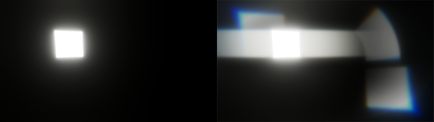

# Screen Space Lens Flare

The **Screen Space Lens Flare** override adds lens flares to your scene.

To calculate lens flares, the Universal Render Pipeline (URP) fetches bright areas of the current image, such as emissive lights and bright specular reflections. URP then draws the same areas back to the screen in different locations and using different effects such as stretch, blur, and chromatic aberration.

The **Screen Space Lens Flare** creates lens flares from the following:

- Emissive surfaces.
- Bright spots in your scene that appear depending on the camera view, for example a bright specular reflection on a shiny metal object, or a bright outside area viewed from a dark indoor area.
- All onscreen lights.

You can use the [Lens Flare (SRP)](lens-flare-component.md) component instead to create a flare for a light that has a specific position in the scene. You can also use both the **Lens Flare (SRP)** component and the **Screen Space Lens Flare** override in the same scene.

## How screen space lens flares work

The bright areas URP uses to calculate screen space lens flares are the same areas the [Bloom override](../../post-processing-bloom.md) brightens.

URP uses the same buffer as the Bloom override to fetch the bright areas and render the lens flares. The settings in the Bloom override affect the appearance of screen space lens flares. 

You can create the following types of lens flare:

- Regular flares, which are a brightened distorted version of the bright areas of the screen.
- Reversed flares, which are regular flares flipped upside-down and reversed.
- Warped flares, which are regular flares transformed using polar coordinates, to mimic a circular camera lens.
- Streaks, which are flares stretched in one direction, to mimic an anamorphic camera lens. 

You can control which types of flares appear and how many there are. You can also control the chromatic aberration effect URP adds to the flares.

 
The left image shows an emissive cube with bloom but no lens flares. The right image shows the same cube and a regular flare (top-left), a reversed flare (bottom-right), a warped flare (top-right) and streaks (to the left and right of the cube). 

## Enable screen space lens flares

**Screen Space Lens Flare** uses the [Volume](../../Volumes.md) system, so to enable and modify **Screen Space Lens Flare** properties, you must add a **Screen Space Lens Flare** override to a [Volume](../../VolumeOverrides.md) in your Scene.

## Use screen space lens flares

To add **Screen Space Lens Flare** to a Volume:

1. In the Scene or Hierarchy view, select a GameObject that contains a Volume component to view it in the Inspector.
2. In the Inspector, select **Add Override** > **Post-processing** > **Screen Space Lens Flare**.
3. Set **Intensity** to a value higher than 0.
4. If you have a [Bloom override](../../post-processing-bloom.md) in the volume, set **Intensity** in the Bloom override to a value higher than 0 or lens flares won't appear.

Some lens flares only appear, or only appear at full intensity, if you enable High Dynamic Range (HDR) rendering on your camera. To enable HDR, refer to [the **Output** section of the Camera component reference](../../camera-component-reference.md#output).

## Properties

| **Property** | **Description** |
| - | - |
| **Intensity** | Set the strength of all the types of lens flares. If the value is 0, URP doesn't calculate or render any lens flares. The default is 0. |
| **Tint Color** | Set the color URP uses to tint all the types of lens flares. The default is white. |
| **Bloom Mip Bias** | Set the mipmap level URP uses to sample the Bloom pyramid and create the lens flares. The higher the mipmap level, the smaller and more pixelated the sample source, and the blurrier the result. The range is 0 through 5. 0 is the full-resolution mipmap level. The default is 1. Refer to [Mipmaps introduction](https://docs.unity3d.com/2023.1/Documentation/Manual/texture-mipmaps-introduction.html) for more information. This property only appears if you open the **More** (⋮) menu and select **Show Additional Properties**. |

### Flares

Use the **Flares** settings to control regular flares, reversed flares and warped flares.

| **Property** || **Description** |
|-|-|-|
| **Regular Multiplier** || Set the strength of regular flares. If the value is 0, URP doesn't calculate or render regular flares. The default is 1. |
| **Reversed Multiplier** || Set the strength of reversed flares. If the value is 0, URP doesn't calculate or render reversed flares. The default is 1. |
| **Warped Multipler** || Set the strength of warped flares. If the value is 0, URP doesn't calculate or render warped flares. The default is 1. |
|| **Scale** | Scale the width (**x**) and height (**y**) of warped flares. The defaults are 1. This property only appears if you open the **More** (⋮) menu and select **Show Additional Properties**. |
| **Samples** || Set the number of times URP repeats the regular, reversed and warped flares. The range is 1 through 3. The default is 1. Increasing **Samples** has a big impact on performance. |
|| **Sample Dimmer** | Set the strength of the lens flares URP adds if you set **Samples** to 2 or 3. The higher the value, the less intense the flares. This property only appears if you open the **More** (⋮) menu and select **Show Additional Properties**. |
| **Vignette Effect** || Set the strength of the regular, reversed and warped flares in a circular area in the center of the screen. Use **Vignette Effect** to avoid lens flare obscuring the scene too much. The default value is 1, which means URP doesn't render flares at the center of the screen. |
| **Starting Position** || Control how far the position of the regular, reversed and warped flares differ from the bright area they're sampled from, in metres. If the value is 0, URP places the lens flares at the same position as the bright areas they're sampled from. The range is 1 through 3. The default is 1.25. |
| **Scale** || Set the size of regular, reversed and warped lens flares. The range is 1 through 4. The default is 1.5. |

### Streaks

Use the **Streaks** settings to control flares stretched in one direction.

| **Property** || **Description** |
|-|-|-|
| **Multiplier** || Set the strength of streaks. If the value is 0, URP doesn't calculate or render streaks. The default is 1. |
|| **Length** | Set the length of streaks. The range is 0 through 1. 1 is the approximate width of the screen. The default value is 0.5. |
|| **Orientation** | Set the angle of streaks, in degrees. The default value is 0, which creates horizontal streaks. |
|| **Threshold** | Control how localized the streak effect is. The higher the **Threshold**, the more localized the effect. The range is 0 through 1. The default value is 0.25. |
|| **Resolution** | Control the resolution detail of streaks. URP renders lower-resolution streaks faster. The options are **Half**, **Quarter** and **Eighth** full resolution. This property only appears if you open the **More** (⋮) menu and select **Show Additional Properties**. |

 
The effect of changing **Threshold** from 0 (a larger flare effect) to 1 (a smaller flare effect).

### Chromatic Aberration

Use the **Chromatic Aberration** settings to control chromatic aberration on all the lens flare types. Chromatic aberration splits light into its color components, which mimics the effect that a real-world camera produces when its lens fails to join all colors to the same point.

The chromatic aberration effect is strongest at the edges of the screen, and decreases in strength towards the center of the screen.

| **Property** | **Description** |
|-|-|
| **Intensity** | Set the strength of the chromatic aberration effect. If the value is 0, URP doesn't split the colors. |
