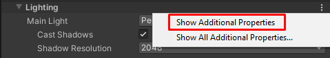
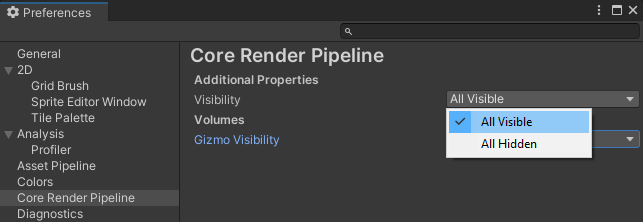
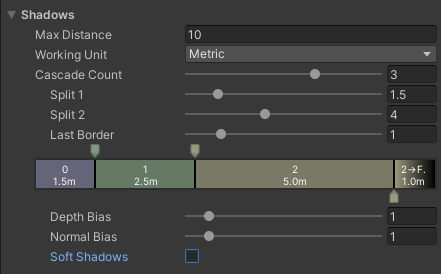

# Universal Render Pipeline Asset
To use the Universal Render Pipeline (URP), you have to [create a URP Asset and assign the asset in the Graphics settings](InstallURPIntoAProject.md).

The URP Asset controls several graphical features and quality settings for the Universal Render Pipeline. It is a scriptable object that inherits from ‘RenderPipelineAsset’. When you assign the asset in the Graphics settings, Unity switches from the built-in render pipeline to the URP. You can then adjust the corresponding settings directly in the URP, instead of looking for them elsewhere.

You can have multiple URP assets and switch between them. For example, you can have one with Shadows on and one with Shadows off. If you switch between the assets to see the effects, you don’t have to manually toggle the corresponding settings for shadows every time. You cannot, however, switch between HDRP/SRP and URP assets, as the
 render pipelines are incompatible.

## UI overview
In the URP, you can configure settings for:

- [__Rendering__](#rendering)
- [__Quality__](#quality)
- [__Lighting__](#lighting)
- [__Shadows__](#shadows)
- [__Post-processing__](#post-processing)
- [__Adaptive Performance__](#adaptive-performance)

**Note:** If you have the experimental 2D Renderer enabled (menu: **Graphics Settings** > add the 2D Renderer Asset under **Scriptable Render Pipeline Settings**), some of the options related to 3D rendering in the URP Asset don't have any impact on your final app or game.

### How to show Additional Properties

Unity does not show certain advanced properties in the URP Asset by default. To see all available properties:

* In the [URP Asset](../universalrp-asset.md), in any section, click the vertical ellipsis icon (&vellip;) and select **Show Additional Properties**

    

    Unity shows all available properties in the current section.

To show all additional properties in all sections:

1. Click the vertical ellipsis icon (&vellip;) and select **Show All Additional Properties**. Unity opens the **Core Render Pipeline** section in the **Preferences** window.

2. In the property **Additional Properties > Visibility**, select **All Visible**.

    

### Rendering
The __Rendering__ settings control the core part of the pipeline rendered frame.

| __Property__            | __Description__                                              |
| ----------------------- | ------------------------------------------------------------ |
| __Depth Texture__       | Enables URP to create a `_CameraDepthTexture`. URP then uses this [depth texture](https://docs.unity3d.com/Manual/SL-DepthTextures.html) by default for all Cameras in your Scene. You can override this for individual cameras in the [Camera Inspector](camera-component-reference.md). |
| __Opaque Texture__      | Enable this to create a `_CameraOpaqueTexture` as default for all cameras in your Scene. This works like the [GrabPass](https://docs.unity3d.com/Manual/SL-GrabPass.html) in the built-in render pipeline. The __Opaque Texture__ provides a snapshot of the scene right before URP renders any transparent meshes. You can use this in transparent Shaders to create effects like frosted glass, water refraction, or heat waves. You can override this for individual cameras in the [Camera Inspector](camera-component-reference.md). |
| __Opaque Downsampling__ | Set the sampling mode on the opaque texture to one of the following: __None__:  Produces a copy of the opaque pass in the same resolution as the camera. __2x Bilinear__: Produces a half-resolution image with bilinear filtering. __4x Box__: Produces a quarter-resolution image with box filtering. This produces a softly blurred copy. __4x Bilinear__: Produces a quarter-resolution image with bi-linear filtering. |
| __Terrain Holes__       | If you disable this option, the URP removes all Terrain hole Shader variants when you build for the Unity Player, which decreases build time. |
| __SRP Batcher__            | Check this box to enable the SRP Batcher. This is useful if you have many different Materials that use the same Shader. The SRP Batcher is an inner loop that speeds up CPU rendering without affecting GPU performance. When you use the SRP Batcher, it replaces the SRP rendering code inner loop. |
| __Dynamic Batching__       | Enable [Dynamic Batching](https://docs.unity3d.com/Manual/DrawCallBatching.html), to make the render pipeline automatically batch small dynamic objects that share the same Material. This is useful for platforms and graphics APIs that do not support GPU instancing. If your targeted hardware does support GPU instancing, disable __Dynamic Batching__. You can change this at run time. |
| __Debug Level__            | Set the level of debug information that the render pipeline generates. The values are: **Disabled**:  Debugging is disabled. This is the default. **Profiling**: Makes the render pipeline provide detailed information tags, which you can see in the FrameDebugger. |
| __Shader Variant Log Level__ | Set the level of information about Shader Stripping and Shader Variants you want to display when Unity finishes a build. Values are:  **Disabled**: Unity doesn’t log anything. **Only Universal**: Unity logs information for all of the [URP Shaders](shaders-in-universalrp.md). **All**: Unity logs information for all Shaders in your build.  You can see the information in Console panel when your build has finished. |
| __Store Actions__          | Defines if Unity discards or stores the render targets of the DrawObjects Passes. Selecting the **Store** option significantly increases the memory bandwidth on mobile and tile-based GPUs. __Auto__: Unity uses the **Discard** option by default, and falls back to the **Store** option if it detects any injected Passes. __Discard__:  Unity discards the render targets of render Passes that are not reused later (lower memory bandwidth). __Store__: Unity stores all render targets of each Pass (higher memory bandwidth). |

### Quality
These settings control the quality level of the URP. This is where you can make performance better on lower-end hardware or make graphics look better on  higher-end hardware.

**Tip:** If you want to have different settings for different hardware, you can configure these settings across multiple Universal Render Pipeline assets, and switch them out as needed.

| Property         | Description                                                  |
| ---------------- | ------------------------------------------------------------ |
| __HDR__          | Enable this to allow rendering in High Dynamic Range (HDR) by default for every camera in your Scene. With HDR, the brightest part of the image can be greater than 1. This gives you a wider range of light intensities, so your lighting looks more realistic. With it, you can still see details and experience less saturation even with bright light. This is useful if you want a wide range of lighting or to use [bloom](https://docs.unity3d.com/Manual/PostProcessing-Bloom.html) effects. If you’re targeting lower-end hardware, you can disable this to skip HDR calculations and get better performance. You can override this for individual cameras in the Camera Inspector. |
| __MSAA__         | Use [Multi Sample Anti-aliasing](https://en.wikipedia.org/wiki/Multisample_anti-aliasing) by default for every Camera in your Scene while rendering. This softens edges of your geometry, so they’re not jagged or flickering. In the drop-down menu, select how many samples to use per pixel: __2x__, __4x__, or __8x__. The more samples you choose, the smoother your object edges are. If you want to skip MSAA calculations, or you don’t need them in a 2D game, select __Disabled__. You can override this for individual cameras in the Camera Inspector. **Note:** On mobile platforms that do not support the [StoreAndResolve](https://docs.unity3d.com/ScriptReference/Rendering.RenderBufferStoreAction.StoreAndResolve.html) store action, if __Opaque Texture__ is selected in the URP asset, Unity ignores the **Anti Aliasing (MSAA)** property at runtime (as if Anti Aliasing (MSAA) is set to Disabled). |
| __Render Scale__ | This slider scales the render target resolution (not the resolution of your current device). Use this when you want to render at a smaller resolution for performance reasons or to upscale rendering to improve quality.  This only scales the game rendering. UI rendering is left at the native resolution for the device. |

### Lighting

These settings affect the lights in your Scene.

If you disable some of these settings, the relevant [keywords](shader-stripping.md) are [stripped from the Shader variables](shading-model.md#shaderStripping). If there are settings that you know for certain you won’t use in your game or app, you can disable them to improve performance and reduce build time.

| Property              | Description                                                  |
| --------------------- | ------------------------------------------------------------ |
| __Main Light__        | These settings affect the main [Directional Light](https://docs.unity3d.com/Manual/Lighting.html) in your Scene. You can select this by assigning it as a [Sun Source](https://docs.unity3d.com/Manual/GlobalIllumination.html) in the Lighting Inspector. If you don’t assign a sun source, the URP treats the brightest directional light in the Scene as the main light. You can choose between [Pixel Lighting](https://docs.unity3d.com/Manual/LightPerformance.html) and _None_. If you choose None, URP doesn’t render a main light,  even if you’ve set a sun source. |
| __Cast Shadows__      | Check this box to make the main light cast shadows in your Scene. |
| __Shadow Resolution__ | This controls how large the shadow map texture for the main light is. High resolutions give sharper, more detailed shadows. If memory or rendering time is an issue, try a lower resolution. |
| __Mixed Lighting__    | When [Mixed Lighting](https://docs.unity3d.com/Manual/LightMode-Mixed.html) is enabled, Unity includes mixed lighting shader variants in the build.|
| __Light Layers__      | Select the Light Layers feature to configure certain Lights to affect only specific GameObjects. For more information on Light Layers and how to use them, see the page [Light Layers](lighting/light-layers.md)
| __Additional Lights__ | Here, you can choose to have additional lights to supplement your main light. Choose between [Per Vertex](https://docs.unity3d.com/Manual/LightPerformance.html), [Per Pixel](https://docs.unity3d.com/Manual/LightPerformance.html), or __Disabled__. |
| __Per Object Limit__  | This slider sets the limit for how many additional lights can affect each GameObject. |
| __Cast Shadows__      | Check this box to make the additional lights cast shadows in your Scene. |
| __Shadow Resolution__ | This controls the size of the textures that cast directional shadows for the additional lights. This is a sprite atlas that packs up to 16 shadow maps. High resolutions give sharper, more detailed shadows. If memory or rendering time is an issue, try a lower resolution. |

### Shadows

These settings let you configure how shadows look and behave, and find a good balance between the visual quality and performance.

The **Shadows** section has the following properties.

| Property         | Description |
| ---------------- | ----------- |
| __Max Distance__ | The maximum distance from the Camera at which Unity renders the shadows. Unity does not render shadows farther than this distance. __Note:__ This property is in metric units regardless of the value in the __Working Unit__ property. |
| __Working Unit__ | The unit in which Unity measures the shadow cascade distances. |
| __Cascade Count__ | The number of [shadow cascades](https://docs.unity3d.com/Manual/shadow-cascades.html). With shadow cascades, you can avoid crude shadows close to the Camera and keep the Shadow Resolution reasonably low. For more information, see the page [Shadow Cascades](https://docs.unity3d.com/Manual/shadow-cascades.html). Increasing the number of cascades reduces the performance. Cascade settings only affects the main light. |
| &#160;&#160;&#160;&#160;Split&#160;1 | The distance where cascade 1 ends and cascade 2 starts. |
| &#160;&#160;&#160;&#160;Split&#160;2 | The distance where cascade 2 ends and cascade 3 starts. |
| &#160;&#160;&#160;&#160;Split&#160;3 | The distance where cascade 3 ends and cascade 4 starts. |
| &#160;&#160;&#160;&#160;Last&#160;Border | The size of the area where Unity fades out the shadows. Unity starts fading out shadows at the distance **Max Distance**&#160;-&#160;**Last Border**, at **Max Distance** the shadows fade to zero. |
| **Depth Bias** | Use this setting to reduce [shadow acne](https://docs.unity3d.com/Manual/ShadowPerformance.html). |
| **Normal Bias** | Use this setting to reduce [shadow acne](https://docs.unity3d.com/Manual/ShadowPerformance.html). |
| __Soft Shadows__ | Select this check box to enable extra processing of the shadow maps to give them a smoother look. When enabled, Unity uses the following shadow map filtering method: Desktop platforms: 5x5 tent filter, mobile platforms: 4 tap filter. **Performance impact**: high. When this option is disabled, Unity samples the shadow map once with the default hardware filtering. |
| **Conservative Enclosing Sphere** | Enable this option to improve shadow frustum culling and prevent Unity from excessively culling shadows in the corners of the shadow cascades. Disable this option only for compatibility purposes of existing projects created in previous Unity versions. If you enable this option in an existing project, you might need to adjust the shadows cascade distances because the shadow culling enclosing spheres change their size and position. **Performance impact**: enabling this option is likely to improve performance, because the option minimizes the overlap of shadow cascades, which reduces the number of redundant static shadow casters. |

### Post-processing

This section allows you to fine-tune global post-processing settings.

| Property         | Description                                                  |
| ---------------- | ------------------------------------------------------------ |
| __Post Processing__ | This check box turns post-processing on (check box selected) or off (check box cleared) for the current URP asset. If you clear this check box, Unity excludes post-processing shaders and textures from the build, unless one of the following conditions is true:<ul><li>Other assets in the build refer to the assets related to post-processing.</li><li>A different URP asset has the Post Processing property enabled.</li></ul> |
| __Post Process Data__ | The asset containing references to shaders and Textures that the Renderer uses for post-processing. **Note:** Changes to this property are necessary only for advanced customization use cases. |
| __Grading Mode__ | Select the [color grading](https://docs.unity3d.com/Manual/PostProcessing-ColorGrading.html) mode to use for the Project. &#8226; __High Dynamic Range__: This mode works best for high precision grading similar to movie production workflows. Unity applies color grading before tonemapping. &#8226; __Low Dynamic Range__: This mode follows a more classic workflow. Unity applies a limited range of color grading after tonemapping. |
| __LUT Size__     | Set the size of the internal and external [look-up textures (LUTs)](https://docs.unity3d.com/Manual/PostProcessing-ColorGrading.html) that the Universal Render Pipeline uses for color grading. Higher sizes provide more precision, but have a potential cost of performance and memory use. You cannot mix and match LUT sizes, so decide on a size before you start the color grading process. The default value, **32**, provides a good balance of speed and quality. |
| __Fast sRGB/Liner Conversions__ | Select this option to use faster, but less accurate approximation functions when converting between the sRGB and Linear color spaces.|
| __Volume Update Mode__ | Select how Unity updates Volumes: every frame or when triggered via scripting. In the Editor, Unity updates Volumes every frame when not in the Play mode.|

### Adaptive Performance

This section is available if the Adaptive Performance package is installed in the project. The __Use Adaptive Performance__ property lets you enable the Adaptive Performance functionality.

| __Property__            | __Description__                                              |
| ----------------------- | ------------------------------------------------------------ |
| __Use Adaptive Performance__  | Select this check box to enable the Adaptive Performance functionality, which adjusts the rendering quality at runtime. |
