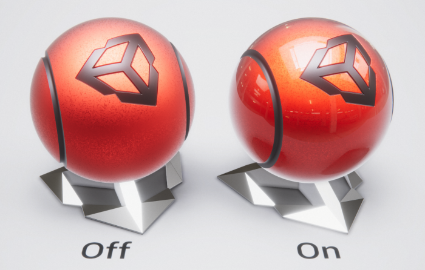
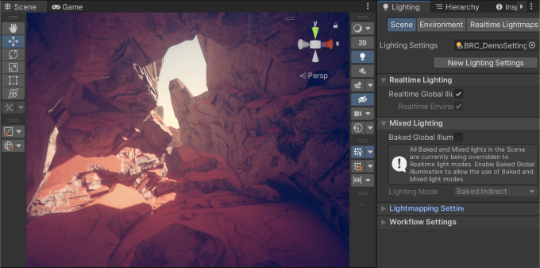
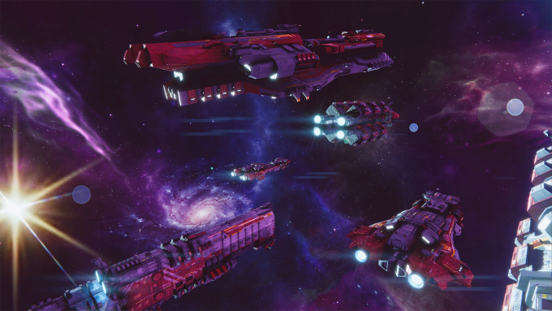

# URP features

This page contains an overview of the key features you can use in the Universal Render Pipeline (URP).

* [Material properties](#material-properties)
    * [Clear Coat](#clear-coat)
    * [Detail Map, Detail Normal Map](#detail-map-detail-normal-map)
    * [Parallax mapping and Height Map property](#parallax-mapping-and-height-map-property)
    * [Decals](#decals)
* [Shaders](#shaders)
    * [Lit shader](#lit-shader)
    * [Complex Lit shader](#complex-lit-shader)
    * [Simple Lit shader](#simple-lit-shader)
    * [Baked Lit shader](#baked-lit-shader)
    * [Unlit shader](#unlit-shader)
    * [Particles Lit shader](#particles-lit-shader)
    * [Particles Simple Lit shader](#particles-simple-lit-shader)
    * [Particles Unlit shader](#particles-unlit-shader)
* [Lighting](#lighting)
    * [Shadows](#shadows)
        * [Shadow distance fade](#shadow-distance-fade)
        * [Shadow cascades](#shadow-cascades)
        * [Shadowmask](#shadowmask)
        * [Point Light shadows](#point-light-shadows)
    * [Reflection probe blending](#reflection-probe-blending)
    * [Rendering Paths](#rendering-paths)
    * [Light Cookies](#light-cookies)
    * [Rendering Layers](#rendering-layers)
    * [Enlighten Realtime Global Illumination (GI)](#enlighten-realtime-global-illumination-gi)
    * [Lighting modes](#lighting-modes)
    * [Lens Flare](#lens-flare) 
* [Camera](#camera)
    * [Temporal anti-aliasing (TAA)](anti-aliasing.md#taa)
    * [High Dynamic Range (HDR) Output](#high-dynamic-range-hdr-output)
    * [Motion vectors](#motion-vectors)
* [Custom post-processing effects](#custom-post-processing-effects)    
* [Renderer Features](#renderer-features)
    * [Screen Space Shadows](#screen-space-shadows)
    * [Screen Space Ambient Occlusion (SSAO)](#screen-space-ambient-occlusion-ssao)
    * [Render Objects](#render-objects)
    * [Full Screen Pass](#full-screen-pass)
* [Tools](#tools)
    * [Rendering Debugger](#rendering-debugger)
    * [Render Pipeline Converter](#render-pipeline-converter)
    * [RTHandle system](https://docs.unity3d.com/Packages/com.unity.render-pipelines.core@latest/index.html?preview=1&subfolder=/manual/rthandle-system.html)
* [Optimization](#optimization)
    * [Depth priming](#depth-priming)
    * [Shader Stripping](#shader-stripping)
    * [LOD Cross-fade](#lod-cross-fade)
* [URP package samples](#urp-package-samples)

## Material properties

URP shaders let you use the following properties.

### Clear Coat

The Clear Coat feature adds an extra Material layer which simulates a transparent and thin coating on top of the base Material. The feature is available in the Complex Lit shader.

For more information on the feature, refer to section [Surface Inputs](shader-complex-lit.md#surface-inputs) on the [Complex Lit](shader-complex-lit.md) page.

 *Clear Coat effect (Left: Off, Right: On).*

### Detail Map, Detail Normal Map

A Detail map lets you overlay another texture on top of the Base Map. A Detail Normal Map is a special texture that lets you add surface detail such as bumps, grooves, and scratches which catch the light as if they exist in the mesh geometry.

For more information, refer to section [Detail Inputs](lit-shader.md#detail-inputs) on the [Lit shader](lit-shader.md) page.

 *Left: rendered object only with the Base Map. Right: rendered object with the Detail Map.*

### Parallax mapping and Height Map property

URP implements the parallax mapping technique which uses the height map to achieve surface-level occlusion effect. The **Height Map** property is available in the Lit shader.

For more information on how parallax mapping works, refer to the [Heightmap](https://docs.unity3d.com/Manual/StandardShaderMaterialParameterHeightMap.html) page.

### Decals

With the Decal Renderer Feature, Unity can project specific Materials (decals) onto other objects in the scene. The decals interact with the scene's lighting and wrap around Meshes.

For examples of how to use Decals, refer to the [Decals samples in URP Package Samples](package-sample-urp-package-samples.md#decals).

For more information, refer to [Decal Renderer Feature](renderer-feature-decal.md).

## Shaders

### Lit shader

The Lit Shader lets you render real-world surfaces like stone, wood, glass, plastic, and metals in photo-realistic quality. Your light levels and reflections look lifelike and react properly across various lighting conditions, for example bright sunlight, or a dark cave. This Shader uses the most computationally heavy [shading model](shading-model.md) in the Universal Render Pipeline (URP).

For examples of how to use the Lit Shader, refer to the [Shaders samples in URP Package Samples](package-sample-urp-package-samples.md#shaders).

For more information, refer to [Lit shader](lit-shader.md).

### Complex Lit shader

The Complex Lit Shader contains all the functionality of the Lit shader and adds advanced material features. Some features in this shader might be considerably more resource-intensive and require [Unity Shader Model 4.5](https://docs.unity3d.com/Manual/SL-ShaderCompileTargets.html) hardware.

In the Deferred Rendering Path, URP renders objects that have the Complex Lit shader using the Forward Rendering Path. If the hardware of the target platform does not support features in the Complex Lit shader, URP uses the Lit shader instead.

For more information, refer to [Complex Lit shader](shader-complex-lit.md).

### Simple Lit shader

Use this Shader when performance is more important than photorealism. This Shader uses a simple approximation for lighting. Because this Shader [does not calculate for physical correctness and energy conservation](shading-model.md#simple-shading), it renders quickly.

For more information, refer to [Simple Lit shader](simple-lit-shader.md).

### Baked Lit shader

Use this Shader for stylised games or apps that only require [baked lighting](https://docs.unity3d.com/Manual/LightMode-Baked.html)via [lightmaps](https://docs.unity3d.com/Manual/Lightmapping.html) and [Light Probes](https://docs.unity3d.com/Manual/LightProbes.html). This shader does not use [Physically Based Shading](shading-model.md#physically-based-shading) and has no real-time lighting, so all real-time relevant shader keywords and variants are [stripped](shader-stripping.md) from the Shader code, which makes it faster to calculate.

For more information, refer to [Baked Lit shader](baked-lit-shader.md).

### Unlit shader

Use this Shader for effects or unique objects in your visuals that don’t need lighting. Because there are no time-consuming lighting calculations or lookups, this Shader is optimal for lower-end hardware. The Unlit Shader uses the most simple [shading model](shading-model.md) in URP.

For more information, refer to [Unlit shader](unlit-shader.md).

### Particles Lit shader

Use this Shader to make particles appear almost photorealistic, for example for camp fire particles, rain drops or torch smoke. This Shader produces lifelike visuals but uses the most computationally heavy [shading model](shading-model.md) in URP, which can impact performance.

For more information, refer to [Particles Lit shader](particles-lit-shader.md).

### Particles Simple Lit shader

Use this Shader for particles where performance is more important than photorealism. This Shader uses a simple approximation for lighting. Because this Shader [does not calculate for physical correctness and energy conservation](shading-model.md#simple-shading), it renders quickly.

For more information, refer to [Particles Simple Lit shader](particles-simple-lit-shader.md).

### Particles Unlit shader

Use this Shader for Particles that don’t need lighting. Because there are no time-consuming lighting calculations or lookups, this Shader is optimal for lower-end hardware. The Unlit Shader uses the most simple [shading model](shading-model.md) in the Universal Render Pipeline (URP).

For more information, refer to [Particles Unlit shader](particles-unlit-shader.md).

## Lighting

### Shadows

URP has the following features that let you configure how the shadows are rendered.

#### Shadow distance fade

With Shadow Distance Fade, shadows fade smoothly when they reach the maximum shadow rendering distance.

To access the property, navigate to **URP Asset** > **Shadows** > **Max Distance**.

For more information, refer to the [Shadows](universalrp-asset.md#shadows) section in the URP Asset description.

#### Shadow cascades

With shadow cascades, you can avoid crude shadows close to the Camera and keep the Shadow Resolution reasonably low. For more information on how shadow cascades work, refer to the page [Shadow Cascades](https://docs.unity3d.com/Manual/shadow-cascades.html).

URP supports up to 4 shadow cascades.

To access the property, navigate to **URP Asset** > **Shadows** > **Cascade Count**.

For more information, refer to the [Shadows](universalrp-asset.md#shadows) section in the URP Asset description.

#### Shadowmask

URP supports the Shadowmask Lighting Mode. Shadowmask Lighting Mode combines real-time direct lighting with baked indirect lighting. For more information, refer to the page [Lighting Mode: Shadowmask](https://docs.unity3d.com/Manual/LightMode-Mixed-Shadowmask.html).

#### Point Light shadows

URP supports Point Light shadows. Point Light shadows help you to create more realistic simulation of local sources of light, such as lamps, torches, campfires, and so on.

For more information, refer to [Shadows in URP](Shadows-in-URP.md).

### Reflection probe blending

Reflection probe blending lets you avoid a situation where a reflection suddenly appears on an object when it enters the probe box volume. When reflection probe blending is enabled, Unity gradually fades probe cubemaps in and out as the reflective object passes from one volume to the other.

URP supports reflection probe blending in all Rendering Paths.

For more information, refer to [Reflection probe blending](lighting/reflection-probes.md#reflection-probe-blending).

### Rendering Paths

The URP Universal Renderer implements the following Rendering Paths:

* Forward Rendering Path.

* [Forward+ Rendering Path](rendering/forward-plus-rendering-path.md).

* [Deferred Rendering Path](rendering/deferred-rendering-path.md).

For more information, refer to [Universal Renderer](urp-universal-renderer.md).

You can also check: [Rendering Path comparison](urp-universal-renderer.md#rendering-path-comparison).

### Light Cookies

The **Light Cookies** feature enables a technique for masking or filtering outgoing light’s intensity to produce patterned illumination. This feature can be used to change the appearance, shape, and intensity of cast light for artistic effects or to simulate complex lighting scenarios with minimal runtime performance impact.

For more information, refer to [**Light component** > **Emission** > **Cookie**](light-component.md#Emission).

### Rendering Layers

The Rendering Layers feature lets you configure certain Lights to affect only specific GameObjects.

For example, in the following illustration, Light `A` affects Sphere `D`, but not Sphere `C`. Light `B` affects Sphere `C`, but not Sphere `D`.

For more information, refer to [Rendering Layers](features/rendering-layers.md).

### Enlighten Realtime Global Illumination (GI)

Enlighten Realtime GI lets you implement more dynamic lighting effects by, for example, having moving lights that affect global illumination in scenes.

 *A sample scene with Enlighten Realtime GI.*

Enlighten Realtime GI is supported in URP from version 12. For more information, refer to [Realtime Global Illumination using Enlighten](https://docs.unity3d.com/Manual/realtime-gi-using-enlighten.html).

### Lighting modes

URP supports the following lighting modes:

* [Baked Indirect](https://docs.unity3d.com/Manual/LightMode-Mixed-BakedIndirect.html)
    
    When you set a scene's Lighting Mode to **Baked Indirect**, Mixed Lights behave like Realtime Lights, with the additional benefit of baking indirect lighting into lightmaps. GameObjects lit by Mixed Lights cast real-time shadows up to the Shadow Distance you define in the Project.

* [Subtractive](https://docs.unity3d.com/Manual/LightMode-Mixed-Subtractive.html)

* [Shadowmask](https://docs.unity3d.com/Manual/LightMode-Mixed-Shadowmask.html) 

### Lens Flare

Lens Flares simulate the effect of lights refracting inside a camera lens. They are used to represent really bright lights, or, more subtly, they can add a bit more atmosphere to your scene. 

 *A sample URP scene using lens flares.*

For more information, refer to [Lens Flare (SRP) component](shared/lens-flare/lens-flare-component.md).

## Camera

### Anti-aliasing

URP has multiple methods of anti-aliasing, each with their own effectiveness and resource requirements.

The anti-aliasing methods available are:

* [Fast Approximate Anti-aliasing (FXAA)](anti-aliasing.md#fxaa)
 
* [Subpixel Morphological Anti-aliasing (SMAA)](anti-aliasing.md#smaa)

* [Temporal Anti-aliasing (TAA)](anti-aliasing.md#taa)

* [Multisample Anti-aliasing (MSAA)](anti-aliasing.md#msaa)

### High Dynamic Range (HDR) Output

[High Dynamic Range](https://en.wikipedia.org/wiki/High_dynamic_range) content has a wider color gamut and greater luminosity range than standard definition content.

URP can output HDR content for displays which support that functionality.

To activate HDR output, navigate to **Project Settings** > **Player** > **Other Settings** and enable **Use display in HDR mode**.

For more information, refer to [High Dynamic Range (HDR) Output](post-processing/hdr-output.md).

### Motion vectors

Motion vector support provides a velocity buffer that captures and stores the per-pixel and screen-space motion of objects from one frame to another.

## Custom post-processing effects

The [Full Screen Pass Renderer Feature](renderer-features/renderer-feature-full-screen-pass.md) lets you create custom post-processing effects with minimum coding effort. To read how to create a simple post-processing effect, refer to the page [How to create a custom post-processing effect](post-processing/post-processing-custom-effect-low-code.md).

The following image shows a fog effect implemented with a Full Screen Render Pass Renderer Feature.

## Renderer Features

### Screen Space Shadows

The Screen Space Shadows [Renderer Feature](urp-renderer-feature.md) calculates screen-space shadows for opaque objects affected by the main directional light and draws them in the scene. To render screen-space shadows, URP requires an additional render target. This increases the amount of memory your application requires, but if your project uses forward rendering, screen-space shadows can benefit the runtime resource intensity. This is because if you use screen-space shadows, URP doesn't need to access the cascade shadow maps multiple times.

For more information, refer to [Screen Space Shadows](renderer-feature-screen-space-shadows.md).

### Screen Space Ambient Occlusion (SSAO)

The Ambient Occlusion effect darkens creases, holes, intersections and surfaces that are close to each other in real-time. In the real world, such areas tend to block out or occlude ambient light, so they appear darker.

URP implements the Screen [Space Ambient Occlusion (SSAO)](post-processing-ssao.md) effect as a [Renderer Feature](urp-renderer-feature.md). It works with every shader that the Universal Render Pipeline (URP) provides as well as any custom opaque Shader Graphs you create.

### Render Objects

URP draws objects in the **DrawOpaqueObjects** and **DrawTransparentObjects** passes. You might need to draw objects at a different point in the frame rendering, or interpret and write rendering data (like depth and stencil) in alternate ways. The Render Objects Renderer Feature lets you do such customizations by letting you draw objects on a certain layer, at a certain time, with specific overrides.

For more information, refer to [Render Objects Renderer Feature](renderer-features/renderer-feature-render-objects.md).

### Full Screen Pass

The Full Screen Pass Renderer Feature lets you inject full screen render passes at pre-defined injection points to create full screen effects.

You can use this Renderer Feature to create [custom post-processing effects](post-processing/custom-post-processing.md).

For more information, refer to [Full Screen Pass Renderer Feature](renderer-features/renderer-feature-full-screen-pass.md).

## Tools

### Rendering Debugger

The **Rendering Debugger** window lets you visualize various lighting, rendering, and Material properties. The visualizations help you identify rendering issues and optimize scenes and rendering configurations.

For more information, refer to [Rendering Debugger](features/rendering-debugger.md).

### Render Pipeline Converter

The **Render Pipeline Converter** converts assets made for a Built-in Render Pipeline project to assets compatible with URP.

To open the Render Pipeline Converter window, select **Window** > **Rendering** > **Render Pipeline Converter**.

For more information, refer to [Render Pipeline Converter](features/rp-converter.md).

## Optimization

### Depth priming

Depth Priming can improve GPU frame timings by reducing the number of pixel shader executions. The performance improvement depends on the amount of overlapping pixels in the opaque pass and the complexity of the pixel shaders that Unity can skip by using depth priming.

The feature has an upfront memory and performance cost. The feature uses a depth prepass to determine which pixel shader invocations Unity can skip, and the feature adds the depth prepass if it's not available yet.

For more information, refer to [**Rendering** > **Depth Priming Mode**](urp-universal-renderer.md#rendering) in [Universal Renderer](urp-universal-renderer.md).

### Shader Stripping

The shaders in the Universal Render Pipeline (URP) use [shader keywords](https://docs.unity3d.com/Manual/shader-keywords) to support many different features, which can mean Unity compiles a lot of [shader variants](https://docs.unity3d.com/Manual/shader-variants).

URP implements the shader stripping functionality to speed up builds, reduce memory usage and file sizes. For more information, refer to the page [Shader Stripping](shader-stripping.md).

### LOD Cross-fade

The LOD cross-fade lets you achieve a smoother transition blending between the current mesh LOD and the next LOD based on the object's distance to the Camera.

As the Camera moves, Unity shows different LODs to provide a good balance between quality and processing cost. Cross-fading lets you avoid harsh LOD snapping and popping.

 *1: LOD cross-fade off. 2: LOD cross-fade on.*

For more information, refer to the [LOD Cross Fade](universalrp-asset.md#quality) property.

## URP package samples

URP package samples contain example shaders, C# scripts, and other assets you can build upon, use to learn how to use a feature, or use directly in your application.

For more information, refer to [URP package samples](package-sample-urp-package-samples.md).
