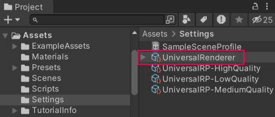
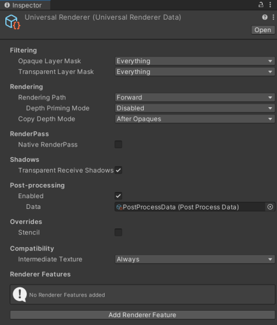
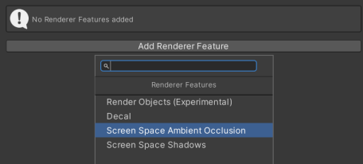
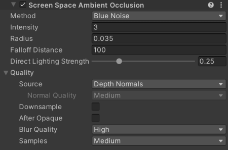
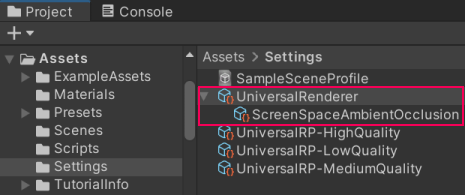

# How to add a Renderer Feature to a Renderer

To add a Renderer Feature to a Renderer:

1. In the __Project__ window, select a Renderer.

    

    The Inspector window shows the Renderer properties.

    

2. In the Inspector window, select __Add Renderer Feature__. In the list, select a Renderer Feature.

    

    Unity adds the selected Renderer Feature to the Renderer.

    

Unity shows Renderer Features as child items of the Renderer in the Project Window:

