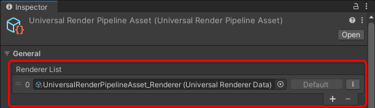
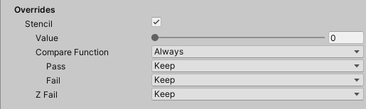

# Universal Renderer

This page describes the URP Universal Renderer settings.

For more information on rendering in URP, also check [Rendering in the Universal Render Pipeline](rendering-in-universalrp.md).

## Rendering Paths

The URP Universal Renderer implements the following Rendering Paths:

* Forward Rendering Path.

* [Forward+ Rendering Path](rendering/forward-plus-rendering-path.md).

* [Deferred Rendering Path](rendering/deferred-rendering-path.md).

### Rendering Path comparison

The following table shows the differences between the Forward and the Deferred Rendering Paths in URP.

| Feature | Forward | Forward+ | Deferred |
|---------|---------|----------|----------|
| Maximum number of real-time lights per object. | 9 (1 Main Light, and 8 Additional Lights) | Unlimited. [The per-Camera limit applies](#real-time-lights-limitations). | Unlimited. [The per-Camera limit applies](#real-time-lights-limitations). Transparent objects are rendered using the Forward pass, where the maximum number of real-time lights is 9 (1 Main Light, and 8 Additional Lights). |
| Per-pixel normal encoding | No encoding (accurate normal values). | No encoding (accurate normal values). | Two options:<ul><li>Quantization of normals in G-buffer (loss of accuracy, better performance).</li><li>Octahedron encoding (accurate normals, might have significant performance impact on mobile GPUs).</li></ul>For more information, refer to [Encoding of normals in G-buffer](rendering/deferred-rendering-path.md#accurate-g-buffer-normals). |
| MSAA | Yes | Yes | No |
| Vertex lighting | Yes | No | No |
| Camera stacking | Yes | Yes | Supported with a limitation: Unity renders only the base Camera using the Deferred Rendering Path. Unity renders all overlay Cameras using the Forward Rendering Path. |

#### Real-time lights limitations

There is a per-Camera limit which applies to the number of real-time lights in all rendering paths.

As for the Additional Lights, the limit applies only to the Lights visible to the Camera.

The per-Camera limits for different platforms are:

* Desktop and console platforms: 1 Main Light, and 256 Additional Lights.

* Mobile platforms: 1 Main Light, and 32 Additional Lights. OpenGL ES 3.0 and earlier: 1 Main Light, and 16 Additional Lights.

## How to find the Universal Renderer asset

To find the Universal Renderer asset that a URP asset is using:

1. Select a URP asset.

2. In the Renderer List section, click a renderer item or the vertical ellipsis icon (&vellip;) next to a renderer.

    

## Universal Renderer asset reference

This section describes the properties of the Universal Renderer asset.

### Filtering

This section contains properties that define which layers the renderer draws.

| Property | Description |
|:-|:-|
| **Opaque Layer Mask** | Select which opaque layers this Renderer draws |
| **Transparent Layer Mask** | Select which transparent layers this Renderer draws |

### Rendering

This section contains properties related to rendering.

| Property | Description |
|:-|:-|
| **Rendering&#160;Path** | Select the Rendering Path. Options:<ul><li>**Forward**: The Forward Rendering Path.</li><li>**Forward+**: The [Forward+ Rendering Path](rendering/forward-plus-rendering-path.md).</li><li>**Deferred**: The [Deferred Rendering Path](rendering/deferred-rendering-path.md).</li></ul> |
| &#160;&#160;**Depth&#160;Priming&#160;Mode** | This property determines when Unity performs depth priming. Depth Priming can improve GPU frame timings by reducing the number of pixel shader executions. The performance improvement depends on the amount of overlapping pixels in the opaque pass and the complexity of the pixel shaders that Unity can skip by using depth priming. The feature has an upfront memory and performance cost. The feature uses a depth prepass to determine which pixel shader invocations Unity can skip, and the feature adds the depth prepass if it's not available yet. The options are:<ul><li>**Disabled**: Unity does not perform depth priming.</li><li>**Auto**: If there is a Render Pass that requires a depth prepass, Unity performs the depth prepass and depth priming.</li><li>**Forced**: Unity always performs depth priming. To do this, Unity also performs a depth prepass for every render pass. **Note**: Depth priming is disabled at runtime on certain hardware (Tile Based Deferred Rendering) regardless of this setting.</li></ul>On Android, iOS, and Apple TV, Unity performs depth priming only in the Forced mode. On tiled GPUs, which are common to those platforms, depth priming might reduce performance when combined with MSAA.  This property is available only if **Rendering Path** is set to **Forward** |
| &#160;&#160;**Accurate G-buffer normals** | Indicates whether to use a more resource-intensive normal encoding/decoding method to improve visual quality.  This property is available only if **Rendering Path** is set to **Deferred**. |
| **Depth&#160;Texture&#160;Mode** | Specifies the stage in the render pipeline at which to copy the scene depth to a depth texture. The options are:<ul><li>**After Opaques**: URP copies the scene depth after the opaques render pass.</li><li>**After Transparents**: URP copies the scene depth after the transparents render pass.</li><li>**Force Prepass**: URP does a depth prepass to generate the scene depth texture.</li></ul>**Note**: On mobile devices, the **After Transparents** option can lead to a significant improvement in memory bandwidth. This is because the Copy Depth pass causes a switch in render target between the Opaque pass and the Transparents pass. When this occurs, Unity stores the contents of the Color Buffer in the main memory, and then loads it again once the Copy Depth pass is complete. The impact increases significantly when MSAA is enabled as Unity must also store and load the MSAA data alongside the Color Buffer. |

### Native RenderPass

This section contains properties related to URP's Native RenderPass API.

| Property | Description |
|:-|:-|
| **Native RenderPass** | Indicates whether to use URP's Native RenderPass API. When enabled, URP uses this API to structure render passes. As a result, you can use [programmable blending](https://docs.unity3d.com/Manual/SL-PlatformDifferences.html#using-shader-framebuffer-fetch) in custom URP shaders. For more information about the RenderPass API, refer to [ScriptableRenderContext.BeginRenderPass](https://docs.unity3d.com/ScriptReference/Rendering.ScriptableRenderContext.BeginRenderPass.html).  **Note**: Enabling this property has no effect on OpenGL ES. |

### Shadows

This section contains properties related to rendering shadows.

| Property | Description |
|:-|:-|
| **Transparent Receive Shadows** | When this option is on, Unity draws shadows on transparent objects. |

### Overrides

This section contains Render Pipeline properties that this Renderer overrides.

#### Stencil

With this check box selected, the Renderer processes the Stencil buffer values.

For more information on how Unity works with the Stencil buffer, refer to [ShaderLab: Stencil](https://docs.unity3d.com/Manual/SL-Stencil.html).

In URP, you can use bits 0 to 3 of the stencil buffer for custom rendering effects. This means you can use stencil indices 0 to 15.

### Compatibility

This section contains settings related to backwards compatibility.

| Property | Description |
|:-|:-|
| **Intermediate Texture** | This property lets you force URP to renders via an intermediate texture. Options: <ul><li>**Auto**: URP uses the information provided by the `ScriptableRenderPass.ConfigureInput` method to determine automatically whether rendering via an intermediate texture is necessary.</li><li>**Always**: forces rendering via an intermediate texture. Use this option only for compatibility with Renderer Features that do not declare their inputs with `ScriptableRenderPass.ConfigureInput`. Using this option might have a significant performance impact on some platforms.</li></ul> |

### Renderer Features

This section contains the list of Renderer Features assigned to the selected Renderer.

For information on how to add a Renderer Feature, check [How to add a Renderer Feature to a Renderer](urp-renderer-feature-how-to-add.md).

URP contains the pre-built Renderer Feature called [Render Objects](renderer-features/renderer-feature-render-objects.md).
