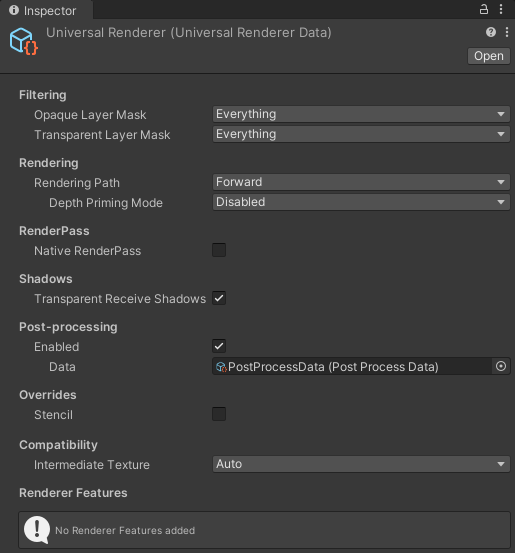

# Universal Renderer

This page describes the URP Universal Renderer settings.

For more information on rendering in URP, refer to [Rendering in the Universal Render Pipeline](rendering-in-universalrp.md).

## Rendering Paths

The URP Universal Renderer implements two Rendering Paths:

* Forward Rendering Path.

* [Deferred Rendering Path](rendering/deferred-rendering-path.md).

### Rendering Path comparison

The following table shows the differences between the Forward and the Deferred Rendering Paths in URP.

| Feature | Forward | Deferred |
|---------|---------|----------|
| Maximum number of real-time lights per object. | 9 Lights per object. | Unlimited number of real-time lights. |
| Per-pixel normal encoding | No encoding (accurate normal values). | Two options:<ul><li>Quantization of normals in G-buffer (loss of accuracy, better performance).</li><li>Octahedron encoding (accurate normals, might have significant performance impact on mobile GPUs).</li></ul>For more information, refer to [Encoding of normals in G-buffer](rendering/deferred-rendering-path.md#accurate-g-buffer-normals). |
| MSAA | Yes | No |
| Vertex lighting | Yes | No |
| Camera stacking | Yes | Supported with a limitation: Unity renders only the base Camera using the Deferred Rendering Path. Unity renders all overlay Cameras using the Forward Rendering Path. |

## How to find the Universal Renderer asset

To find the Universal Renderer asset that a URP asset is using:

1. Select a URP asset.

2. In the Renderer List section, click a renderer item or the vertical ellipsis icon (&vellip;) next to a renderer.

    

## Universal Renderer asset reference

This section describes the properties of the Forward Renderer asset.

### Filtering

This section contains properties that define which layers the renderer draws.

| Property | Description |
|:-|:-|
| **Opaque Layer Mask** | Select which opaque layers this Renderer draws |
| **Transparent Layer Mask** | Select which transparent layers this Renderer draws |

### Rendering

This section contains properties related to rendering.

| Property | Description |
|:-|:-|
| **Rendering&#160;Path** | Select the Rendering Path. Options:<ul><li>**Forward**: The Forward Rendering Path.</li><li>**Deferred**: The Deferred Rendering Path. For more information, refer to [Deferred Rendering Path](rendering/deferred-rendering-path.md).</li></ul> |
| **Depth Priming Mode** | Skips drawing overlapping pixels, to speed up rendering. Unity uses the depth texture to check which pixels overlap. The rendering improvement depends on the number of overlapping pixels and the complexity of the pixel shaders.  **Note**: If you use custom shaders, Unity renders opaque objects as invisible unless you add passes with `DepthOnly` and `DepthNormals` tags. For more information, refer to [Write depth only in a shader](writing-shaders-urp-depth-only.md).  The options are:<ul><li>**Disabled**: Doesn't perform depth priming.</li><li>**Auto**: Performs depth priming only if a depth prepass already exists in the render pipeline. This setting isn't supported on Android, iOS and Apple TV platforms.</li><li>**Forced**: Adds a depth prepass to the render pipeline if it doesn't already exist, and performs depth priming. Adding the depth prepass has an impact on memory and performance.</li></ul>**Note**: Depth priming isn't supported if you use a [deferred rendering path](rendering/deferred-rendering-path-landing.md) or [Multisample Anti-aliasing](anti-aliasing.md#multisample-anti-aliasing-msaa), or at runtime on mobile devices that use tile-based deferred rendering (TBDR).| 
| &#160;&#160;**Accurate G-buffer normals** | Indicates whether to use a more resource-intensive normal encoding/decoding method to improve visual quality.  This property is available only if **Rendering Path** is set to **Deferred**. |
| **Depth Texture Mode** | Specifies the stage in the render pipeline at which to copy the scene depth to a depth texture. The options are:<ul><li>**After Opaques**: URP copies the scene depth after the opaques render pass.</li><li>**Force Prepass**: URP does a depth prepass to generate the scene depth texture. |

### Native RenderPass

This section contains properties related to URP's Native RenderPass API.

| Property | Description |
|:-|:-|
| **Native RenderPass** | Indicates whether to use URP's Native RenderPass API. When enabled, URP uses this API to structure render passes. As a result, you can use [programmable blending](https://docs.unity3d.com/Manual/SL-PlatformDifferences.html#using-shader-framebuffer-fetch) in custom URP shaders. Enable Native RenderPass if you use Vulkan, Metal or DirectX 12 graphics APIs, so URP automatically reduces how often it copies render textures into and out of memory. For more information about the RenderPass API, refer to [ScriptableRenderContext.BeginRenderPass](https://docs.unity3d.com/ScriptReference/Rendering.ScriptableRenderContext.BeginRenderPass.html).  **Note**: Enabling this property has no effect on OpenGL ES. |

### Shadows

This section contains properties related to rendering shadows.

| Property | Description |
|:-|:-|
| **Transparent Receive Shadows** | When this option is on, Unity draws shadows on transparent objects. |

### Overrides

This section contains Render Pipeline properties that this Renderer overrides.

#### Stencil

With this check box selected, the Renderer processes the Stencil buffer values.

For more information on how Unity works with the Stencil buffer, refer to [ShaderLab: Stencil](https://docs.unity3d.com/Manual/SL-Stencil.html).

### Compatibility

This section contains settings related to backwards compatibility.

| Property | Description |
|:-|:-|
| **Intermediate Texture** | Controls when URP renders via an intermediate texture. Options: <ul><li>**Auto**: Uses information declared by active Renderer Features to automatically determine whether to render through an intermediate texture or not.</li><li>**Always**: Forces rendering via an intermediate texture, enabling compatibility with renderer features that do not declare their needed inputs, but can have a significant performance impact on some platforms.</li></ul> |

### Renderer Features

This section contains the list of Renderer Features assigned to the selected Renderer.

For information on how to add a Renderer Feature, refer to [How to add a Renderer Feature to a Renderer](urp-renderer-feature-how-to-add.md).

URP contains the pre-built Renderer Feature called [Render Objects](renderer-features/renderer-feature-render-objects.md).
