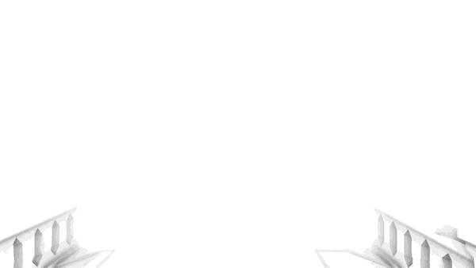

# What's new in URP 14 (Unity 2022.2)

This section contains information about new features, improvements, and issues fixed in URP 14.

For a complete list of changes made in URP 14, refer to the [Changelog](xref:changelog).

## Features

This section contains the overview of the new features in this release.

### Full Screen Pass Renderer Feature

This Renderer Feature lets you inject full screen render passes at pre-defined injection points to create full screen effects. To read more about the feature, refer to page [Full Screen Pass Renderer Feature](../renderer-features/renderer-feature-full-screen-pass.md).

 *Full Screen Pass with a custom Grayscale Material.*

### Custom post-processing effects

The Full Screen Pass Renderer Feature lets you create custom post-processing effects with minimum coding effort. To read how to create a simple post-processing effect, see the page [How to create a custom post-processing effect](../post-processing/post-processing-custom-effect-low-code.md).

The following images show a fog effect implemented with a Full Screen Render Pass Renderer Feature.

The scene without the fog effect: 

The scene with the custom fog effect implemented as a Full Screen Render Pass Renderer Feature: 

Implementing a custom effect lets you overcome the limitation of the default Unity fog effect that does not affect the skybox: 

### Rendering layers

The Rendering Layers feature lets you configure certain Lights to affect only specific GameObjects. With the [Custom Shadow Layers](../features/rendering-layers.md#shadow-layers) property, you can configure certain GameObjects to cast shadows only from specific Lights (even if those Lights do not affect the GameObjects).

In this URP version, Rendering Layers work not only with Lights, but also with Decals.

Refer to the following pages to learn more about the feature:

* [Rendering Layers](../features/rendering-layers.md)

* [How to use Rendering Layers with Decals](../features/rendering-layers.md#how-to-rendering-layers-decals)

### Forward+ Rendering Path

The Forward+ Rendering Path lets you avoid the per object limit of the Forward Rendering Path.

The Forward+ Rendering Path has the following advantages compared with the Forward Rendering Path:

* There is no per-object limit for the number of Lights that affect GameObjects, the per-Camera limit still applies. The per-Camera limits for different platforms are:<ul><li>Desktop and console platforms: 256 Lights</li><li>Mobile platforms: 32 Lights. OpenGL ES 3.0 and earlier: 16 Lights.</li></ul>This implementation lets you avoid splitting big meshes when more than 8 lights affect them.

* Blending of more than 2 reflection probes.

* Support for multiple Lights when using Unity Entity Component System (ECS).

* More flexibility with procedural draws.

For more information, see the page [Forward+ Rendering Path](../rendering/forward-plus-rendering-path.md).

### LOD Cross-fade

The LOD cross-fade lets you achieve a smoother transition blending between the current mesh LOD and the next LOD based on the object's distance to the Camera.

As the Camera moves, Unity shows different LODs to provide a good balance between quality and processing cost. Cross-fading lets you avoid harsh LOD snapping and popping.

 *1: LOD cross-fade off. 2: LOD cross-fade on.*

For more information, see the [LOD Cross Fade](../universalrp-asset.md#lod-cross-fade) property.

### Temporal anti-aliasing (TAA)

Temporal anti-aliasing (TAA) is a spatial multi-frame anti-aliasing technique that uses results from current and previous rendered frames to remove jaggies in the current frame and reduce temporal judder between frames.

TAA uses Motion Vectors to reduce or avoid shimmer and ghosting artifacts caused by moving objects that end up being in different pixel locations in different frames.

To enable TAA for a Camera:

* Select the Camera.

* In the Inspector, in the **Rendering** section, select **Temporal Anti-aliasing (TAA)** in the **Anti-aliasing** property.

The following image shows a frame with TAA off:

The following image shows a frame with TAA on:

## Improvements

This section contains the overview of the major improvements in this release.

### Screen space ambient occlusion (SSAO) Improvements

This release implements multiple performance and quality improvements to the SSAO feature.

 *The Falloff Distance property lets you improve performance for Scenes with a lot of distant objects*

Performance improvements:

* New **Blur Quality** property with three blur options: High, Medium, Low.

* The **Downsample** check box now not only affects the Ambient Occlusion pass but also the following blur passes.

* The **Falloff Distance** property lets you reduce computational work on objects far away from the Camera.

* The last Blur pass and the After Opaque pass are now merged into one when the **After Opaque** option is enabled.

* The **Samples** property now has three options with pre-defined sample counts that provide a good balance of visual quality and performance.

Quality improvements:

* The **Method** property lets you choose the algorithm that Unity uses to calculate the ambient occlusion values. The **Blue Noise** algorithm is added in this release.

* A new depth test was added to avoid adding SSAO to objects far away from one another. 

For more information, see the page [Screen Space Ambient Occlusion](../post-processing-ssao.md).

### 64 bit high precision HDR render target format

URP can now render into 64-bit high precision HDR render target format. Compared to the default 32-bit HDR render target, the 64-bit option provides the following benefits: 

* Better precision for all color channels which reduces banding.

* Even precision for color channels eliminates the subtle blue-yellow banding caused by the lower blue channel precision of the 32-bit target.

* Support for the alpha channel. The alpha channel enables the alpha output with some limitations.
 
The 64-bit format uses twice more memory compared to the 32-bit format. It can also have a significant performance impact on mobile platforms.

To select the 64-bit render target option: in URP Asset, navigate to **Quality** > **HDR** > **HDR Precision**.

This setting controls only the internal HDR rendering precision, not HDR output.

### New bloom quality settings

URP 14 adds two new properties to the Bloom post-processing effect:

* **Downscale**: set the bloom texture scale to either half size or quarter size.

* **Max Iterations**: set the maximum number of scale iterations (down and up) the bloom effect does. This property replaces the **Skip Iterations** property, which skipped a number of last iterations, but did not limit the maximum number.

For more information, see the page [Bloom](../post-processing-bloom.md).

### Improvements to the Render Pipeline Converter

This release contains multiple usability improvements of the Render Pipeline Converter:

* The Render Pipeline Converter window now has the **Initialize and Convert** button.

* Certain dialogs now show the number of selected elements and the total number of elements.

* You can click each converter to see more information about the elements it converter.

* Improvements to the visual appearance and usability of the Render Pipeline Converter dialogs.

Material converter section improvements:

* Items in the list are sorted alphabetically now.

* The converter handles Materials in packages better.

* The converter ignores Shader Graph shaders.

Performance improvement:

* Indexing is significantly faster in this release. This improves the performance of converters that use an `.index` file.

### Full screen draws in URP now use the SRP Core Bliter API

All the calls to `cmd.Blit` method are replaced with the [Blitter](https://docs.unity3d.com/Packages/com.unity.render-pipelines.core@14.0/api/UnityEngine.Rendering.Blitter.html) API. This ensures a correct and consistent way to perform full screen draws.

In the current URP version, using `cmd.Blit` might implicitly enable or disable XR shader keywords, which breaks XR SPI rendering.

Refer to the [Perform a full screen blit in URP](../renderer-features/how-to-fullscreen-blit.md) page to read how to use the Blitter API.

### More consistent lighting behavior on different platforms

Removed implicit mobile shader optimizations to keep the visual appearance of lighting consistent on all platforms. Changes are mostly related to light fade quality and shadow filtering. Light fade calculations on mobile platforms are now the same as on desktop platforms.

In this release, URP implements full quality spherical harmonics and always normalized normals for lighting.

`SHADER_QUALITY_LOW/MEDIUM/HIGH` and `SHADER_HINT_NICE_QUALITY` shader defines were removed. If you used those defines in custom shaders, consider using `SHADER_API_MOBILE` or `SHADER_API_GLES` defines to replace `SHADER_QUALITY_LOW/MEDIUM/HIGH`. 

URP uses the `SHADER_API_MOBILE` define only for platform-specific functions now, and not for implicit quality changes.

### XRSystem API

URP can now use the [XRSystem API](https://docs.unity3d.com/Packages/com.unity.render-pipelines.core@14.0/api/UnityEngine.Experimental.Rendering.XRBuiltinShaderConstants.html) override the Built-In Render Pipeline stereo matrices. This lets you inject modifications to the projection matrix and the view matrix in URP.

### Shader stripping improvement: Light cookie stripping

The URP Asset now has the option **Lighting** > **Light Cookies** that lets you enable or disable Light Cookies. When Light Cookies are disabled in all URP Assets in **Graphics** and **Quality** settings, Unity strips all shader variants with Light Cookies. This can reduce the shader variant count up to two times.

### CPU performance improvements for light-heavy scenes

This release contains optimizations to avoid unnecessary copies of Light and Camera data. The changes mostly affect scenes containing tens or hundreds of Lights with Light cookies, with shadows enabled, and when using the Deferred Rendering Path. In scenes with hundreds of Lights that use all the mentioned features, the rendering performance can be up to 25% faster in the Editor.

### Soft Shadows Quality property on Lights

Point Lights and Spot Lights now have the **Soft Shadows Quality** property. Options **Low**, **Medium**, and **High** let you specify the soft shadow quality value for the Light.

## Issues resolved

For a complete list of issues resolved in URP 14, see the [Changelog](xref:changelog).

## Known issues

For information on the known issues in URP 14, see the section [Known issues](../known-issues.md).
