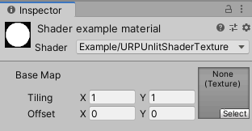
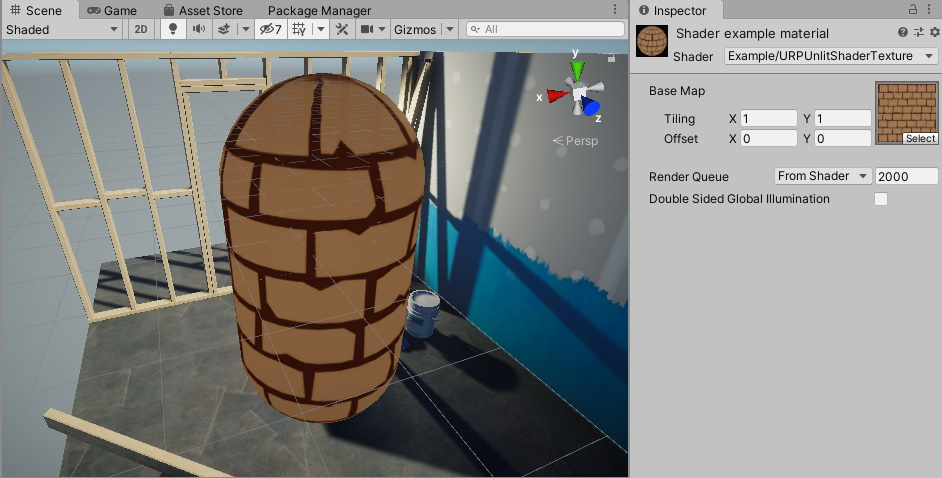

# Drawing a texture

The Unity shader in this example draws a texture on the mesh.

Use the Unity shader source file from section [URP unlit shader with color input](writing-shaders-urp-unlit-color.md) and make the following changes to the ShaderLab code:

1. In the Properties block, replace the existing code with the `_BaseMap` property definition.

    ```c++
    Properties
    {
        [MainTexture] _BaseMap("Base Map", 2D) = "white"
    }
    ```

    When you declare a texture property in the Properties block, Unity adds the `_BaseMap` property with the label **Base Map** to the Material, and adds the Tiling and the Offset controls.

    

    When you declare a property with the `[MainTexture]` attribute, Unity uses this property as the [main texture](https://docs.unity3d.com/ScriptReference/Material-mainTexture.html) of the Material.

    > **Note**: For compatibility reasons, the `_MainTex` property name is a reserved name. Unity uses a property with the name `_MainTex` as the [main texture](https://docs.unity3d.com/ScriptReference/Material-mainTexture.html) even it does not have the `[MainTexture]` attribute.

2. In `struct Attributes` and `struct Varyings`, add the `uv` variable for the UV coordinates on the texture:

    ```c++
    float2 uv           : TEXCOORD0;
    ```

3. Define the texture as a 2D texture and specify a sampler for it. Add the following lines before the CBUFFER block:

    ```c++
    TEXTURE2D(_BaseMap);
    SAMPLER(sampler_BaseMap);
    ```

    The TEXTURE2D and the SAMPLER macros are defined in one of the files referenced in `Core.hlsl`.

4. For tiling and offset to work, it's necessary to declare the texture property with the `_ST` suffix in the 'CBUFFER' block. The `_ST` suffix is necessary because some macros (for example, `TRANSFORM_TEX`) use it.

    > **Note**: To ensure that the Unity shader is SRP Batcher compatible, declare all Material properties inside a single `CBUFFER` block with the name `UnityPerMaterial`. For more information on the SRP Batcher, refer to the documentation on the [Scriptable Render Pipeline (SRP) Batcher](https://docs.unity3d.com/Manual/SRPBatcher.html).

    ```c++
    CBUFFER_START(UnityPerMaterial)
        float4 _BaseMap_ST;
    CBUFFER_END
    ```

5. To apply the tiling and offset transformation, add the following line in the vertex shader:

    ```c++
    OUT.uv = TRANSFORM_TEX(IN.uv, _BaseMap);
    ```

    The `TRANSFORM_TEX` macro is defined in the `Macros.hlsl` file. The `#include` declaration contains a reference to that file.

6. In the fragment shader, use the `SAMPLE_TEXTURE2D` macro to sample the texture:

    ```c++
    half4 frag(Varyings IN) : SV_Target
    {
        half4 color = SAMPLE_TEXTURE2D(_BaseMap, sampler_BaseMap, IN.uv);
        return color;
    }
    ```

Now you can select a texture in the **Base Map** field in the Inspector window. The shader draws that texture on the mesh.



Below is the complete ShaderLab code for this example.

```c++
// This shader draws a texture on the mesh.
Shader "Example/URPUnlitShaderTexture"
{
    // The _BaseMap variable is visible in the Material's Inspector, as a field
    // called Base Map.
    Properties
    {
        [MainTexture] _BaseMap("Base Map", 2D) = "white"
    }

    SubShader
    {
        Tags { "RenderType" = "Opaque" "RenderPipeline" = "UniversalPipeline" }

        Pass
        {
            HLSLPROGRAM
            #pragma vertex vert
            #pragma fragment frag

            #include "Packages/com.unity.render-pipelines.universal/ShaderLibrary/Core.hlsl"

            struct Attributes
            {
                float4 positionOS   : POSITION;
                // The uv variable contains the UV coordinate on the texture for the
                // given vertex.
                float2 uv           : TEXCOORD0;
            };

            struct Varyings
            {
                float4 positionHCS  : SV_POSITION;
                // The uv variable contains the UV coordinate on the texture for the
                // given vertex.
                float2 uv           : TEXCOORD0;
            };

            // This macro declares _BaseMap as a Texture2D object.
            TEXTURE2D(_BaseMap);
            // This macro declares the sampler for the _BaseMap texture.
            SAMPLER(sampler_BaseMap);

            CBUFFER_START(UnityPerMaterial)
                // The following line declares the _BaseMap_ST variable, so that you
                // can use the _BaseMap variable in the fragment shader. The _ST
                // suffix is necessary for the tiling and offset function to work.
                float4 _BaseMap_ST;
            CBUFFER_END

            Varyings vert(Attributes IN)
            {
                Varyings OUT;
                OUT.positionHCS = TransformObjectToHClip(IN.positionOS.xyz);
                // The TRANSFORM_TEX macro performs the tiling and offset
                // transformation.
                OUT.uv = TRANSFORM_TEX(IN.uv, _BaseMap);
                return OUT;
            }

            half4 frag(Varyings IN) : SV_Target
            {
                // The SAMPLE_TEXTURE2D marco samples the texture with the given
                // sampler.
                half4 color = SAMPLE_TEXTURE2D(_BaseMap, sampler_BaseMap, IN.uv);
                return color;
            }
            ENDHLSL
        }
    }
}
```

Section [Visualizing normal vectors](writing-shaders-urp-unlit-normals.md) shows how to visualize normal vectors on the mesh.
