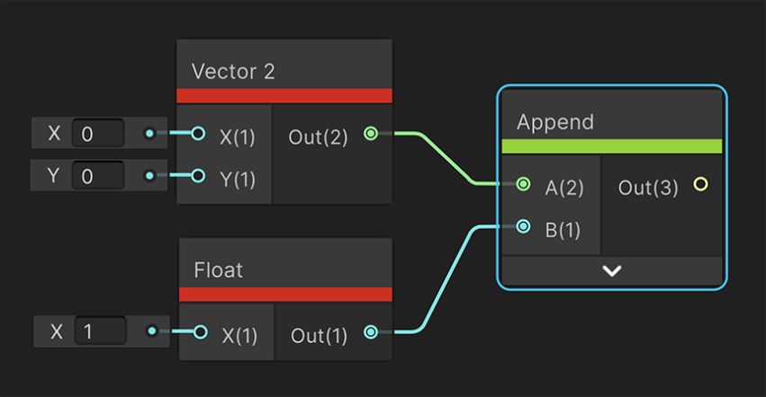

# Append Node

## Description

Creates a new vector **Out** by combining the channels of input **A** followed by the channels of input **B**.
Inputs **A** and **B** can have up to **three** channels.

**Out** can have **two** to **four** channels, depending on the combination of channels of the inputs.

Input **A** channels take priority over input **B** to combine up to a maximum of **four** in the output.

## Ports

| Name        | Direction           | Type  | Binding | Description |
|:------------ |:-------------|:-----|:---|:---|
| A     | Input     | Dynamic   | None | First input value |
| B     | Input     | Dynamic   | None | Second input value |
| Out   | Output    | Dynamic   | None | Combined vector from A and B |

## Example graph usage

In the following example, an **Append** node combines a **Vector 2** and a **Float**. The resulting output vector has 3 channels: the **X** and **Y** from the **Vector 2**, and the **X** from the **Float**.

Notice that with an Append node, you don't need to use a Split node to break up the Vector 2 into individual channels, then a Combine node to combine the 3 separate channels.



## Generated Code Example

The following example code represents one possible outcome of this node for different inputs combinations.

### Vector2 and Float
```
float3 Append_Out = float3( A.xy, B.x);
```
### Float and Vector3
```
float4 Append_Out = float4( A.x, B.xyz);
```
### Vector3 and Vector2
```
float4 Append_Out = float4( A.xyz, B.x);
```