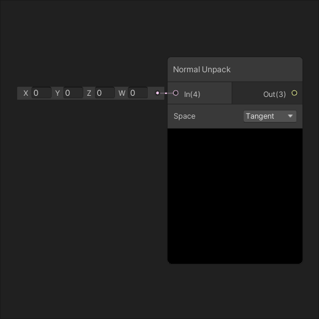
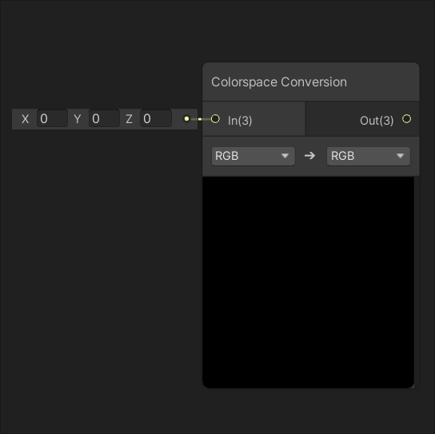

# Artistic Nodes

## Adjustment

|[Channel Mixer](Channel-Mixer-Node.md)| [Contrast](Contrast-Node.md) |
|:---------:|:---------:|
|||
|Controls the amount each of the channels of input In contribute to each of the output channels.|Adjusts the contrast of input In by the amount of input Contrast.|
|[**Hue**](Hue-Node.md)|[**Invert Colors**](Invert-Colors-Node.md)|
|||
|Offsets the hue of input In by the amount of input Offset.|Inverts the colors of input In on a per channel basis.|
|[**Replace Color**](Replace-Color-Node.md)|[**Saturation**](Saturation-Node.md)|
|||
|Replaces values in input In equal to input From to the value of input To.|Adjusts the saturation of input In by the amount of input Saturation.|
|[**White Balance**](White-Balance-Node.md)||
|||
|Adjusts the temperature and tint of input In by the amount of inputs Temperature and Tint respectively.||

## Blend

|[Blend](Blend-Node.md)|
|:---------:|
||
|Blends the value of input Blend onto input Base using the blending mode defined by parameter Mode.|

## Filter

|[Dither](Dither-Node.md)|
|:---------:|
||
|Dither is an intentional form of noise used to randomize quantization error. It is used to prevent large-scale patterns such as color banding in images..|

## Mask

|[Channel Mask](Channel-Mask-Node.md)| [Color Mask](Color-Mask-Node.md) |
|:---------:|:---------:|
|||
|Masks values of input In on channels selected in dropdown Channels.|Creates a mask from values in input In equal to input Mask Color.|

## Normal

|[Normal Blend](Normal-Blend-Node.md)| [Normal From Height](Normal-From-Height-Node.md) |
|:---------:|:---------:|
|||
|Blends two normal maps defined by inputs A and B together.|Creates a normal map from a height map defined by input Texture.|
|[**Normal Strength**](Normal-Strength-Node.md)|[**Normal Unpack**](Normal-Unpack-Node.md)|
|||
|Adjusts the strength of the normal map defined by input In by the amount of input Strength.|Unpacks a normal map defined by input In.|

## Utility

|    [Colorspace Conversion](Colorspace-Conversion-Node.md)    |
| :----------------------------------------------------------: |
|            |
| Returns the result of converting the value of input In from one colorspace space to another. |
