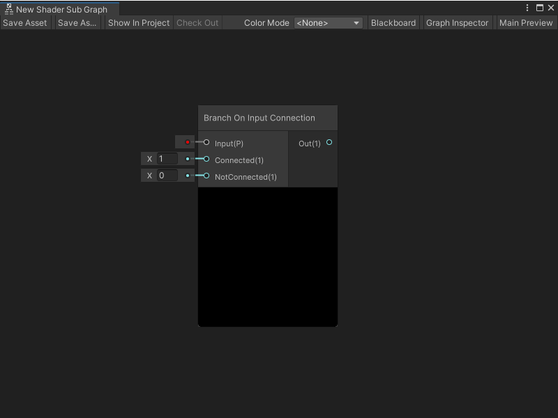

# Branch On Input Connection node

The Branch On Input Connection node allows you to change the behavior of a Subgraph based on the connected state of an input property in the parent Shader Graph. You should use the Branch On Input Connection node when you want to create a default input for a port

Shader Graph determines whether the property in the parent Shader Graph is connected, or not connected, and chooses a value to use as an output based on that connection state.

Shader Graph uses two ports when it determines the node's connection state:

- The Branch On Input Connection node's **Input** port.

- The Subgraph node's matching Property port in the parent Shader Graph. For more information on Subgraph nodes, see [Subgraph node](Sub-graph-Node).

The Branch On Input Connection node's functionality is based on the [Branch node](Branch-Node.md).

> [!NOTE]
> You can't use the Branch On Input Connection node with a Streaming Virtual Texture Property. For more information on Streaming Virtual Texturing, see [Using Streaming Virtual Texturing in Shader Graph](https://docs.unity3d.com/Documentation/Manual/svt-use-in-shader-graph.html).

The Branch On Input Connection node generates branching HLSL source code, but during compilation, the branch is optimized out of your shader.

## Create Node menu category

The Branch On Input Connection node is under the **Utility** &gt; **Logic** category in the Create Node menu. You can only use it in a Shader Subgraph.

To use the Branch On Input Connection node in a Subgraph:

1. Open the Subgraph where you want to add a Branch On Input Connection node.

2. In the Blackboard, do one of the following:

    - To add a new property, select **Add** (+), then select a property type from the menu. Enter a name for your new property and press Enter. Then, select your property in the Blackboard and drag it onto your graph to create a Property node.

    - Select an existing property in the Blackboard and drag it onto your graph to create a Property node.

3. With your Property node selected, in the Graph Inspector, enable **Use Custom Binding**.

    > [!NOTE]
    > If you disable **Use Custom Binding**, you can't connect your Property node to the Branch On Input Connection node. If you've already made a connection, the Unity Editor breaks the connection and displays a warning on the node.

4. In the **Label** field, enter the label for the default value that displays on your Subgraph node's port binding in its parent Shader Graph. For more information on port bindings, see [Port Bindings](Port-Bindings.md).

5. Press Spacebar or right-click and select **Create Node**. Find the **Branch On Input Connection** node in the Create Node Menu, then double-click or press Enter with the node selected to add it to your Subgraph.

6. On your Property node, select the output port and drag its new connection to the Branch On Connection node's **Input** port.

7. To specify the value Shader Graph uses when the **Input** port is connected on the Subgraph node in the parent Shader Graph, connect a node to the **Connected** port. To specify the value that Shader Graph uses when the **Input** port isn't connected, connect another node to the **NotConnected** port.

8. To specify how Shader Graph uses your **Connected** or **NotConnected** values in your shader, connect any valid node to the **Output** port on the Branch On Input Connection node.

## Compatibility

The Branch On Input Connection [!include[nodes-compatibility-all](./snippets/nodes-compatibility-all.md)]    <!-- ALL PIPELINES INCLUDE  -->

## Inputs

The Branch On Input Connection [!include[nodes-inputs](./snippets/nodes-inputs.md)] <!-- MULTIPLE INPUT PORTS INCLUDE -->

| **Name**         | **Type**          | **Description** |
| :---             | :------           | :----------     |
| **Input**        | Property          | The property that determines the branching logic in the node, based on its connection state in the parent Shader Graph.      |
| **Connected**    | Dynamic Vector    | The value to send to the **Out** port when **Input** is connected in the parent Shader Graph.     |
| **NotConnected** | Dynamic Vector    | The value to send to the **Out** port when **Input** isn't connected in the parent Shader Graph. |

## Outputs

The Branch On Input Connection [!include[nodes-single-output](./snippets/nodes-single-output.md)] <!-- SINGLE OUTPUT PORT INCLUDE -->

| **Name** | **Type** | **Description** |
| :------  | :------- | :-------------  |
| **Out**  | Dynamic Vector    | Outputs the value of either **Connected** or **NotConnected**, based on the **Input** property's connection state in the parent Shader Graph.        |

## Example Subgraph usage

In the following example, a Branch On Input Connection node specifies the default behavior for a UV Subgraph input property. When a value for the **UV** property is connected in the parent graph, then the value from that property is passed to the Checkerboard node to determine the UV coordinates for the checkerboard pattern. When the **UV** property isn't connected, then the Branch On Input Connection node uses the **UV0** channel from the UV node for the Checkerboard node's UV coordinates:

> [!NOTE]
> When you preview a Subgraph, the Branch On Input Connection node always uses its NotConnected value.

## Related nodes

<!-- OPTIONAL. Any nodes that may be related to this node in some way that's worth mentioning -->

[!include[nodes-related](./snippets/nodes-related.md)] Branch On Input Connection node:

- [Branch node](Branch-Node.md)
- [Subgraph node](Sub-graph-Node.md)
