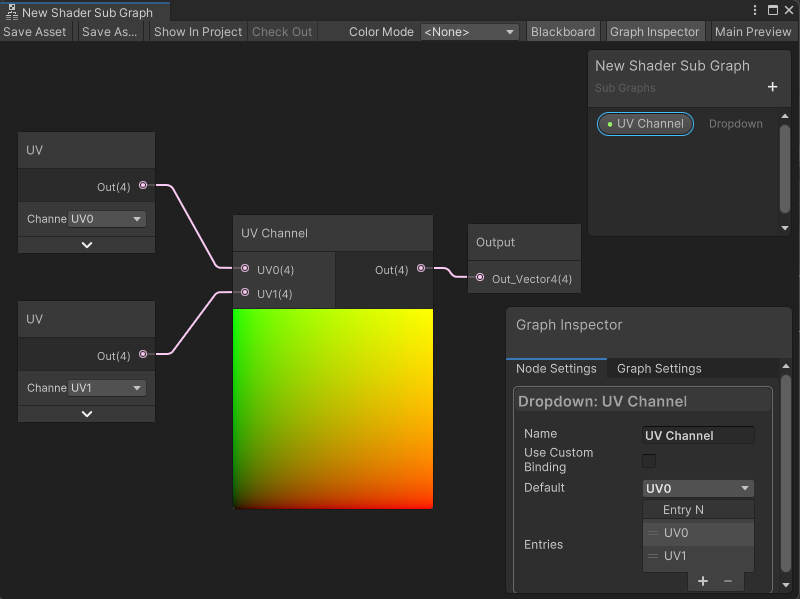

# Change the behavior of a Sub Graph with a dropdown

To set up a [Sub Graph](Sub-graph.md) so you can change its behavior using a dropdown menu in shader graphs, use a **Dropdown** node. You can specify the number of options that appear in the dropdown menu, and their names.

## Create a dropdown

Follow these steps:

1. From the **Project** window, open a Sub Graph asset.
2. In the Blackboard, select **Add** (+), then select **Dropdown**.

    **Note**: The **Dropdown** property appears only in the Blackboard for Sub Graphs, not regular shader graphs.

3. Drag the new **Dropdown** property from the Blackboard to the Sub Graph. Unity creates a **Dropdown** node.

When you add the Sub Graph to a shader graph, the **Sub Graph** node now has a dropdown menu with **A** and **B** options.

## Customize the dropdown options

To customize the options in the dropdown menu, follow these steps:

1. In the Sub Graph, select the **Dropdown** property in the Blackboard window.
2. In the **Graph Inspector** window, select the **Node Settings** tab.
3. Next to **Entries**, select the **Add** (**+**) button to add a new option, or the **Remove** (**-**) button to remove an option. The minimum number of options is two.

Each option you add adds a corresponding input port to the **Dropdown** node.

## Set up the output for each option

To set up the output for each option in the dropdown menu, follow these steps:

1. Connect a node or set of nodes to each input port on the **Dropdown** node. Each input becomes active when the corresponding option is selected in the dropdown menu.
2. Connect the **Out** port to the **Output** node.

Each input port has the Dynamic Vector type, which allows you to connect any Vector type. For more information, refer to [Dynamic Data Types](Data-Types.md#dynamic-data-types).

## Example

In the following example, a Subgraph Dropdown node changes the UV channel it sends to the Subgraph's Output node. The selection on the Subgraph node in the parent graph changes whether the Subgraph outputs **UV1** or **UV0**. If the Subgraph is used in multiple Shader Graphs, the Subgraph Dropdown node can change the UV channel output without changing the Subgraph:

## Additional resources

- [Sub Graphs](Sub-graph.md)
