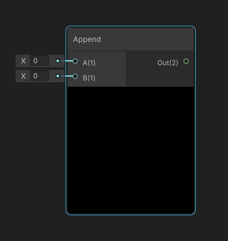
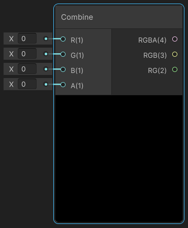
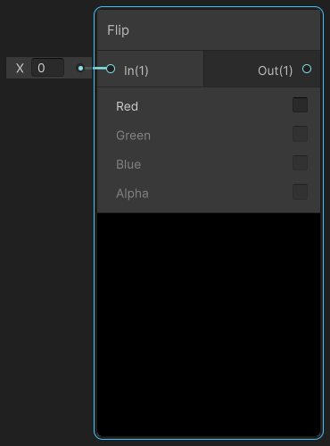
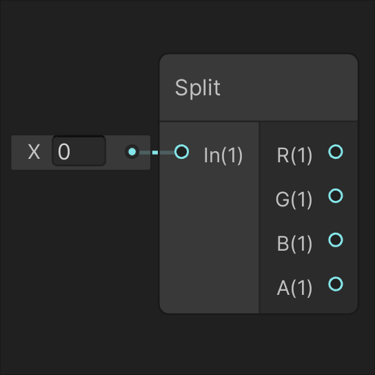
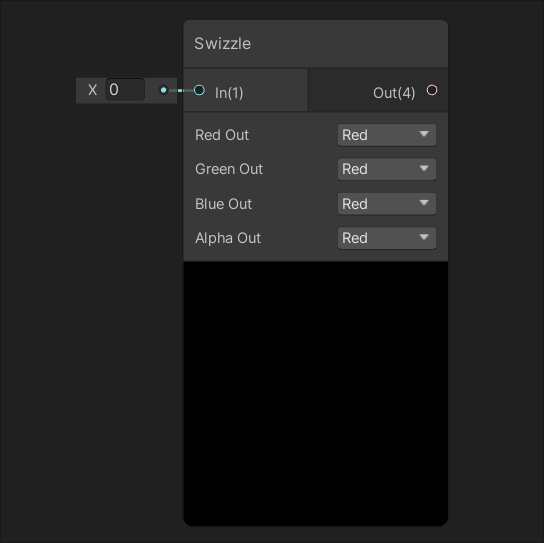

# Channel Nodes

|[Append](Append-Node.md)|[Combine](Combine-Node.md)|
|:---------:|:---------:|
|||
|Combine two float or vector inputs into a single new vector of variable dimensions.|Creates new vectors from the four inputs **R**, **G**, **B** and **A**.|
|[**Flip**](Flip-Node.md)|[**Split**](Split-Node.md)|
|||
|Flips the individual channels of input **In** selected by the [Node](Node.md)'s parameters.|Splits the input vector **In** into four **Float** outputs **R**, **G**, **B** and **A**.|
|[**Swizzle**](Swizzle-Node.md)||
|||
|Creates a new [vector](https://docs.unity3d.com/Manual/VectorCookbook.html) from the reordered elements of the input vector.||