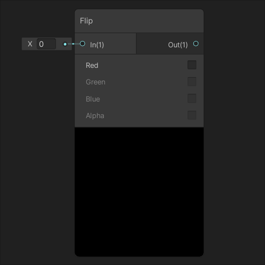

# Channel Nodes

|[Combine](Combine-Node.md)| [Flip](Flip-Node.md) |
|:---------:|:---------:|
|||
|Creates new vectors from the four inputs **R**, **G**, **B** and **A**.|Flips the individual channels of input **In** selected by the [Node](Node.md)'s parameters.|
|[**Split**](Split-Node.md)|[**Swizzle**](Swizzle-Node.md)|
|||
|Splits the input vector **In** into four **Float** outputs **R**, **G**, **B** and **A**.|Creates a new [vector](https://docs.unity3d.com/Manual/VectorCookbook.html) from the reordered elements of the input vector. |
