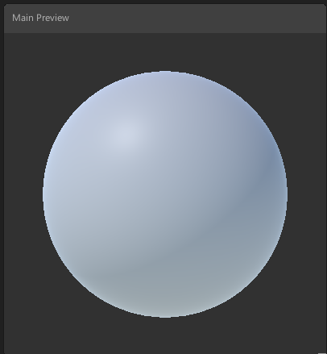
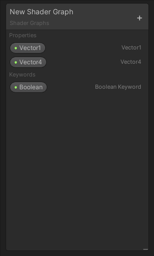
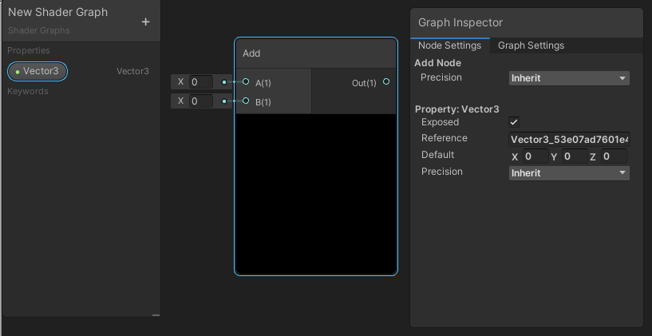

# Creating a new shader graph asset

After you configure an SRP, you can create a new shader graph asset.

To create a new shader graph asset, follow these steps:

1. In the **Project** window, right-click and select **Create** > **Shader Graph** > **From Template...**. 

1. In the context menu, select your desired type of Shader Graph.

	The type of Shader Graph available is dependent on the render pipelines present in your project.

	A submenu for each installed render pipeline may be present containing template stacks for standard shading models ( Lit, Unlit, etc ).

	For a full list of provided options, refer to the [Universal Render Pipeline](https://docs.unity3d.com/Manual/urp/urp-introduction.html) and [High Definition Render Pipeline](https://docs.unity3d.com/Packages/com.unity.render-pipelines.high-definition@latest) documentation.

	For this example, Universal is installed so a Universal Lit Shader Graph has been created.

1. Double-click your newly created shader graph asset to open it in the Shader Graph window.

## Shader Graph window

The Shader Graph window consists of the Master Stack, the Preview Window, the Blackboard, and the Graph Inspector.

### Master Stack

The final connection that determines your shader output. Refer to [Master Stack](Master-Stack.md) for more information.

### Preview window

An area to preview the current shader output. Here, you can rotate the object, and zoom in and out. You can also change the basic mesh on which the shader is previewed. Refer to [Main Preview](Main-Preview.md) for more information.

### Blackboard

An area that contains all of the shader's properties in a single, collected view. Use the Blackboard to add, remove, rename, and reorder properties. Refer to [Blackboard](Blackboard.md) for more information.

After you've set up a project, and become familiar with the Shader Graph window, refer to [My first Shader Graph](First-Shader-Graph.md) for more information on how to get started.

### Internal Inspector

An area that contains information contextual to whatever the user is currently clicking on. It's a window that automatically is hidden by default and only appears when something is selected that can be edited by the user. Use the Internal Inspector to display and modify properties, node options, and the graph settings. Refer to [Internal Inspector](Internal-Inspector.md) for more information.

