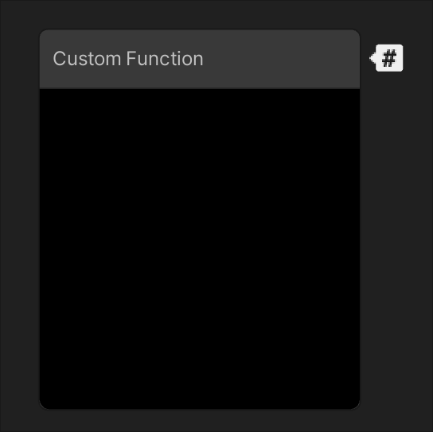
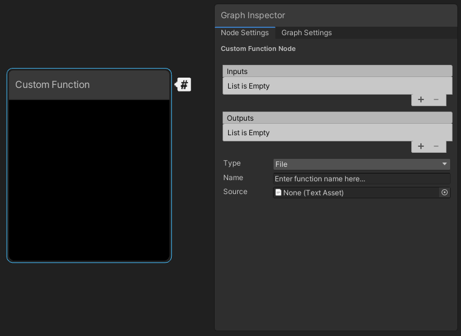
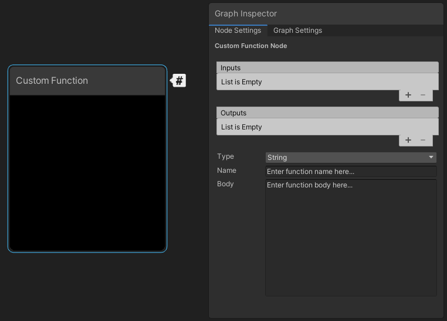
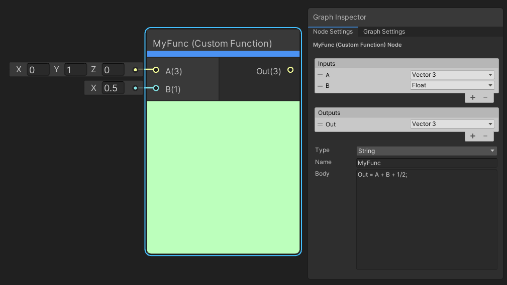
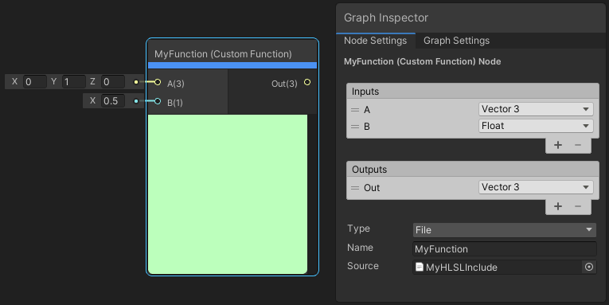
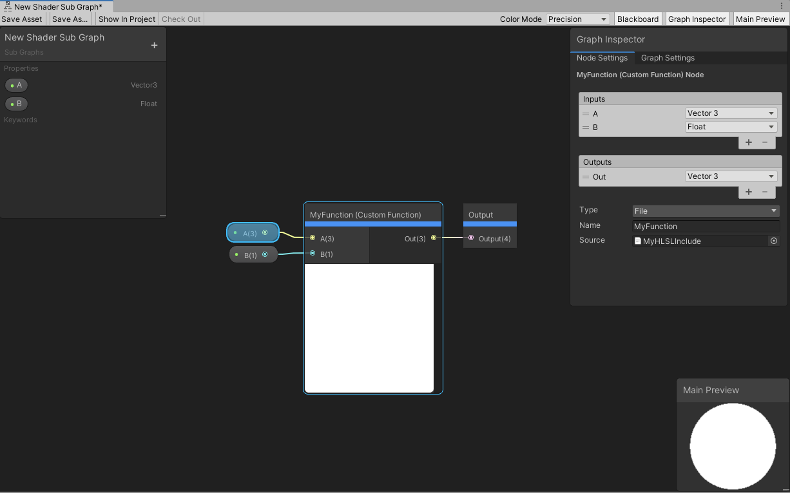

# Custom Function Node



## Description

The Custom Function Node enables you to inject your own custom HLSL code in Shader Graphs. This provides you with an extra level of control when you need it (for example, to do some fine-grained optimization). You can either write small functions directly into graphs by using the string mode, or reference external HLSL include files. Use the [Custom Port Menu](Custom-Port-Menu.md) to define your own input and output ports on the node itself.

## How to Use

Use the [Create Node Menu](Create-Node-Menu.md) to create Custom Function nodes. By default, new Custom Function nodes don't have any input or output ports.
In the [Graph Inspector](Internal-Inspector.md), open the **Node Settings** to access the Custom Function and [Custom Port Menu](Custom-Port-Menu.md) menus.

 

### Custom Function menu

| Menu Item | Description |
|:----------|:------------|
| Inputs | A [Custom Port Menu](Custom-Port-Menu.md) that defines the node's input ports. |
| Outputs | A [Custom Port Menu](Custom-Port-Menu.md) that defines the node's output ports. |
| Type | A function type selector. Choose File to reference an external file or string to directly input functions to the node. |
| Name | Part of the name this custom function has in the final generated code. Suffixed by the function type ` _half ` or ` _float `. |
| Source | An asset field to reference the external HLSL include file with the `.hlsl` extension. **Available only in `File` mode**. |
| Body | A text box where you enter HLSL code. **Available only in `String` mode**. |

### Defining the Function via string
If you select `String` mode, the graph generates the shader function. The `Name` field defines the name of the generated function, and the `Body` field defines the contents of the generated function. Unity handles the arguments, braces, and indent scope automatically. In `String` mode you may use the token `$precision` instead of `half` or `float` in the `Body` field. Unity replaces this with the correct type, based on that node's precision, when the node is processed.



The example in the image above generates the following function:

```
void MyFunction_float(float3 A, float B, out float3 Out)
{
    Out  =  A + B + 1/2;
}
```

### Defining the Function via file

If you select `File` mode, the graph does not automatically generate the shader function. This mode injects an include reference in the final generated shader, and uses a function from within the referenced file. The `Name` field must match the name of the function you wish to call. The `Source` field contains a reference to the HLSL file that includes the function.



When you use `File` mode for the Custom Function node, you must manually format the functions properly. One thing to note when creating custom functions for [Shader Graph](index.md) is the precision suffixes. The generated code appends a precision suffix to function names. Your include file function must also append your desired precision suffix (shown below with `_float`), or contain multiple functions with both `_float` and `_half` suffixes, but your `Name` field **must not include the precision suffix**.

```
//UNITY_SHADER_NO_UPGRADE
#ifndef MYHLSLINCLUDE_INCLUDED
#define MYHLSLINCLUDE_INCLUDED

void MyFunction_float(float3 A, float B, out float3 Out)
{
    Out = A + B;
}
#endif //MYHLSLINCLUDE_INCLUDED
```

`File` mode allows for more flexibility with custom functions in a graph. You can define uniform variables outside the function scope, as shown here with a matrix.

```
//UNITY_SHADER_NO_UPGRADE
#ifndef MYHLSLINCLUDE_INCLUDED
#define MYHLSLINCLUDE_INCLUDED
float4x4 _MyMatrix;
void MyFunction_float(float3 A, float B, out float3 Out)
{
    A = mul(float4(A, 0.0), _MyMatrix).rgb;
Out = A + B;
}
#endif //MYHLSLINCLUDE_INCLUDED
```

You can define multiple functions in the same file, and call them from your referenced function. Alternatively, you can reference the same file, but use different functions from different Custom Function nodes.

```
//UNITY_SHADER_NO_UPGRADE
#ifndef MYHLSLINCLUDE_INCLUDED
#define MYHLSLINCLUDE_INCLUDED
float3 MyOtherFunction_float(float3 In)
{
    return In * In;
}

void MyFunction_float(float3 A, float B, out float3 Out)
{
    A = MyOtherFunction_float(A);
    Out = A + B;
}
#endif //MYHLSLINCLUDE_INCLUDED
```

You can even include other files that contain other functions.

```
//UNITY_SHADER_NO_UPGRADE
#ifndef MYHLSLINCLUDE_INCLUDED
#define MYHLSLINCLUDE_INCLUDED
#include "Assets/MyOtherInclude.hlsl"
void MyFunction_float(float3 A, float B, out float3 Out)
{
    A = MyOtherFunction_float(A);
    Out = A + B;
}
#endif //MYHLSLINCLUDE_INCLUDED
```

### Reusing Custom Function Nodes

The Custom Function node, on its own, is a single node instance. If you wish to re-use the same custom functions without re-creating the inputs, outputs, and function referencing, use [Sub Graphs](Sub-graph.md). Sub Graphs appear in the [Create Node Menu](Create-Node-Menu.md), and they enable you to share or re-use your custom functions.



Create your custom function either directly in a Sub Graph, or right-click the existing Custom Function node and select `Convert to Sub Graph`. To add the appropriate input and output ports, use the [Graph Inspector](Internal-Inspector.md) and [Custom Port Menu](Custom-Port-Menu.md). After this, you can reuse your custom function as many times as needed, even within other Sub Graphs.

### Working with texture wires

From version 10.3, Shader Graph has five new data structures to ensure that Custom Function Nodes (CFNs) and SubGraphs input and output data from texture wires in a consistent way. The new structures also make it possible for SamplerState to compile on [GLES2](https://en.wikipedia.org/wiki/OpenGL_ES#OpenGL_ES_2.0) platforms and  access data associated with textures via `myInputTex.samplerstate` and `myInputTex.texelSize`.

Four structures are for the texture types, and one is for the sampler state:

* UnityTexture2D
* UnityTexture2DArray
* UnityTexture3D
* UnityTextureCube
* UnitySamplerState

CFNs you create with earlier versions of Shader Graph continue to work after this change. As part of the automatic update, Unity transitions them to the new **Bare** node type. This type replicates the old input and output behavior. All other types pass the new structs.

However, you should manually upgrade CFNs that produce texture or samplerstate types as output to ensure that they behave consistently—and to gain the benefits of the new design. Unity flags this type of outdated Custom Function Nodes with a warning when you open your Shader Graph in 10.3 or later.

#### How to upgrade

1. Change all of the input and output types from **Bare** to **non-Bare**.<br/>

* **String** type: Ensure that your HLSL string already uses Unity's texture access macros (such as `SAMPLE_TEXTURE2D`).

* **File** type: Replace Bare types (such as Texture2D) with the new struct types (such as UnityTexture2D) in your function parameters.

2. If your HLSL code is using platform-specific or non-standard texture operations, you'll need to convert the way you access textures to take that structure into account. For example, `myInputTex.GetDimensions(...)` would become `myInputTex.tex.GetDimensions(...)`


From version 10.3, you can access data associated with textures via `myInputTex.samplerstate` and `myInputTex.texelSize`.
