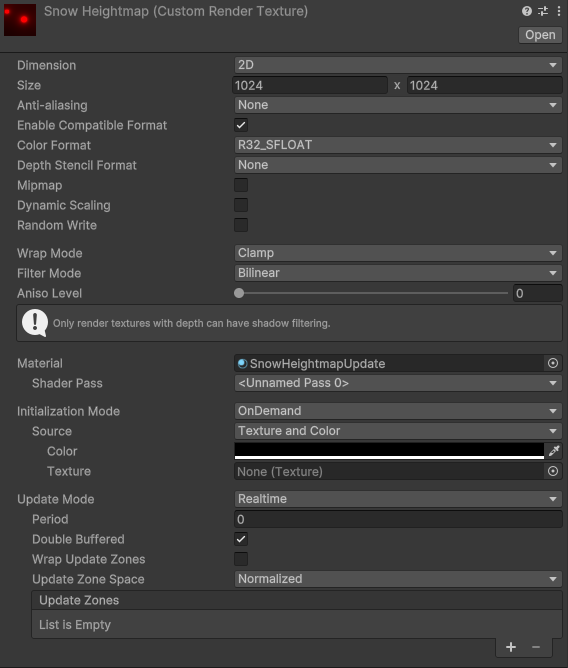
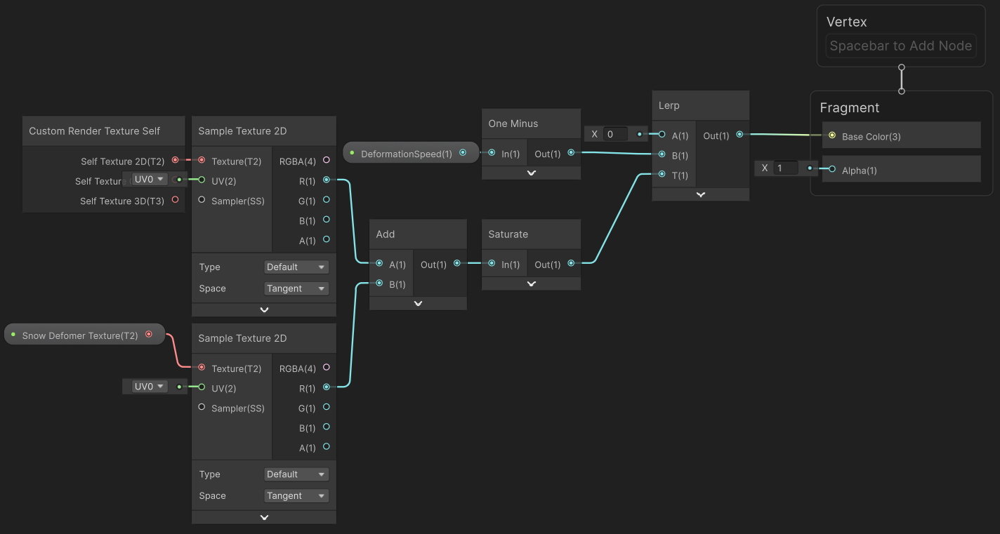

# Example Custom Render Texture with Shader Graph

This example demonstrates how to set up a Shader Graph for Custom Render Texture shaders to create a self-healing deformation effect that could be used for snow, sand, etc.

<video src="Images/CustomRenderTexture-Animation.mp4" title="A grid with various cells labeled with letter-number pairs (for example, A0, B1, G2, and so on), accompanied by arrows. Each cell is a different color. In the upper-left corner, there’s a black square with two red spots, one square and the other circular. The square remains stationary, while the circular spot traces a curve. In the upper-right corner, a black square contains the same glowing red spots, with the circular spot leaving a fading trail as it describes a curve. Above the grid, a cube corresponding to the square floats and leaves a hollow imprint behind, as if the grid were a mattress pressed by a heavy object. A red sphere traces the same curve as the circular spot, creating a furrow in the grid. The grid gradually recovers its original shape, and the furrow disappears." width="700" height="auto" autoplay="true" loop="true" controls></video>

For this effect, we need a Render Texture that contains the pixels we want to displace. This Render Texture is displayed at the top left corner of the preceding image. It was directly assigned to a camera that renders the objects in red above the UV plane.

1. Create a **Custom Render Texture** Shader Graph as follows:
   - Right-click in the Project window.
   - Select **Create** > **Shader Graph** > **Custom Render Texture** and name your shader.

2. Create a new **Custom Render Texture** as follows: 
    - Select **Create** > **Rendering** > **Custom Render Texture**. 
    - Configure the parameters to match the following settings:
      - **Dimension**: 2D
      - **Size**: 1024 x 1024
      - **Anti-aliasing**: None
      - **Enable Compatible Format**: selected
      - **Color Format**: R32_SFLOAT
      - **Depth Stencil Format**: None
      - **Mipmap**: not selected
      - **Dynamic Scaling**: not selected
      - **Random Write**: not selected
      - **Wrap Mode**: Clamp
      - **Filter Mode**: Bilinear
      - **Aniso Level**: 0
      - **Material**: SnowHeightmapUpdate
    **Note**: The material in the **Material** field was created.
      - **Shader Pass**: <Unnamed Pass 0>
      - **Initialization Mode**: OnDemand
      - **Source**: Texture and Color
      - **Color**: select a color
      - **Texture**: None (Texture)
      - **Update Mode**: Realtime
      - **Period**: 0
      - **Double Buffered**: selected
      - **Wrap Update Zones**: not selected
      - **Update Zone Space**: Normalized
      - **Update Zones**: list empty

The following Shader Graph reads the output of the Camera Render Texture, as well as the Self texture, then adds them and lerps the result so that it tends towards 0 over time. 

3. Finally you need to assign the **Custom Render Texture** to a material that can deform the geometry (tessellation or pixel displacement).

## New ShaderGraph Nodes for Custom Render Textures

Three new ShaderGraph nodes have been introduced to facilitate working with Custom Render Textures:

1. [Custom Render Texture Self](Custom-Texture-Self)
   - Outputs the double-buffered texture from the previous update.
   - It provides three outputs for different types of textures: 2D, 3D, and Cube textures.

2. [Custom Render Texture Size](Custom-Texture-Size)
   - Outputs the width, height, and volume depth of the current Custom Render Texture.
   - Use this node to determine the size of the texture being worked with.

3. [Custom Render Texture Slice](Custom-Texture-Slice)
   - Outputs the current slice for 2D Texture Arrays or the Cubemap face index being updated.

## Known Limitations

When working with Custom Render Texture shaders, be aware of the following limitations:

* Rendering Order
   - The Custom Render Texture update loop runs before any rendering operations. This means:
      - You cannot access any render pipeline-specific information in the shader, such as depth, normal, or scene color.
      - Despite this, you can rely on the content of the Custom Render Texture being ready for use in the scene when the camera renders.

## Additional resources
- [Custom Render Textures](https://docs.unity3d.com/Manual/class-CustomRenderTexture.html)
- [Custom Render Texture Nodes](Custom-Render-Texture-Nodes.md)
