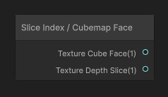
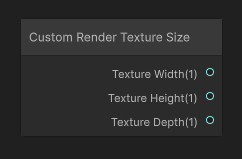
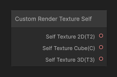

# Custom Render Texture Nodes

|[Custom Render Texture Slice](Custom-Texture-Slice.md) | [Custom Render Texture Size](Custom-Texture-Size.md) | [Custom Render Texture Self](Custom-Texture-Self.md) |
|:---------:|:---------:|:---------:|
|| | |
|Access the custom render texture slice index and cubemap face. | Access the custom render texture size. | Access the custom render texture from the previous update. |
