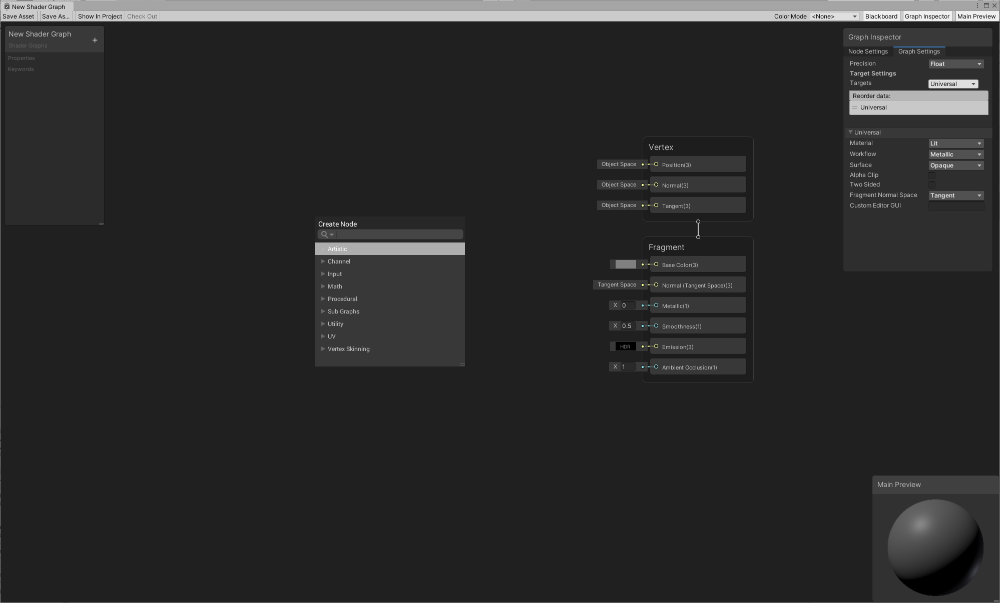
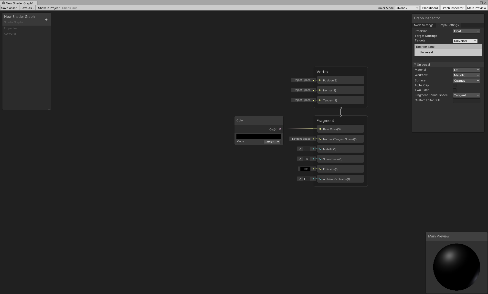
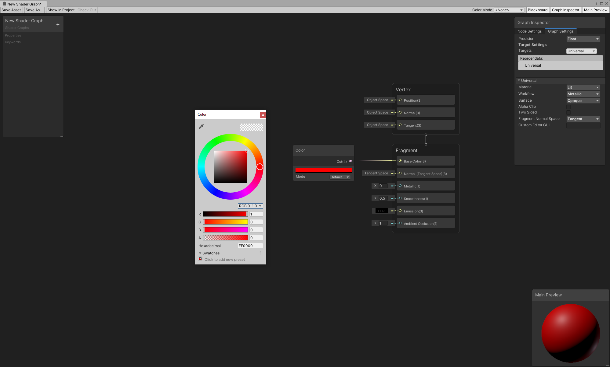
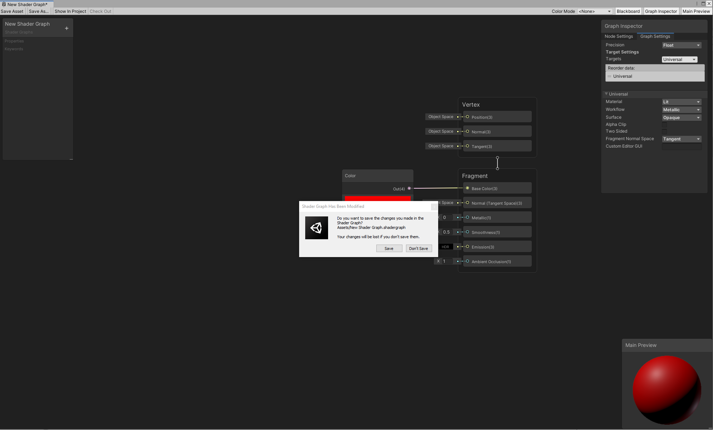
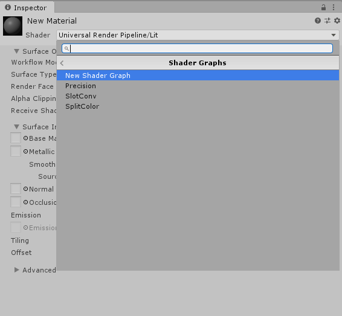
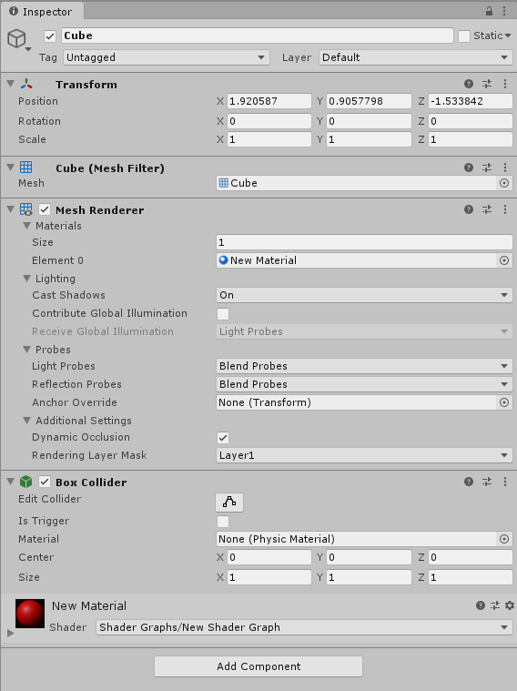
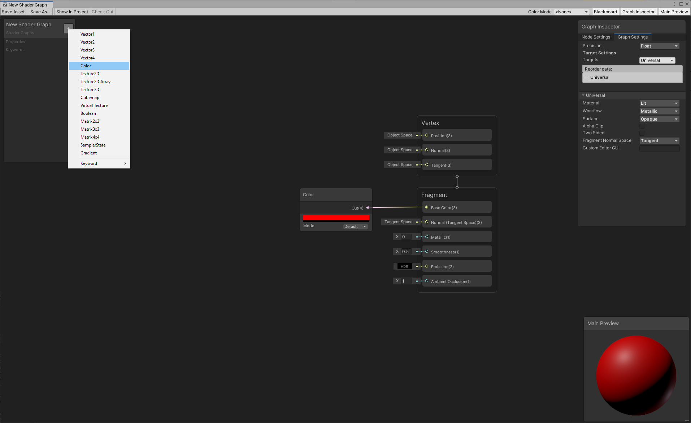
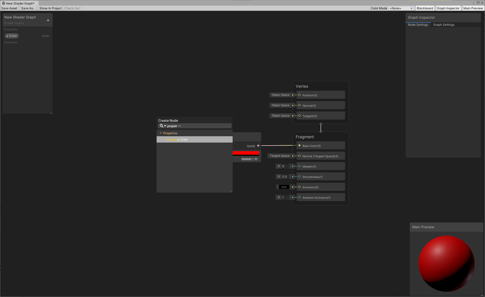
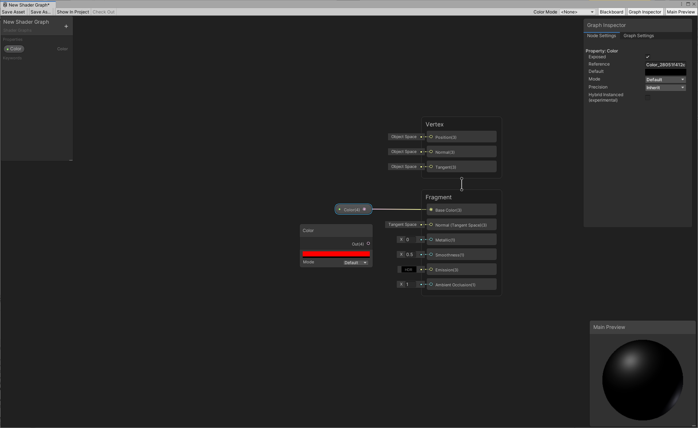
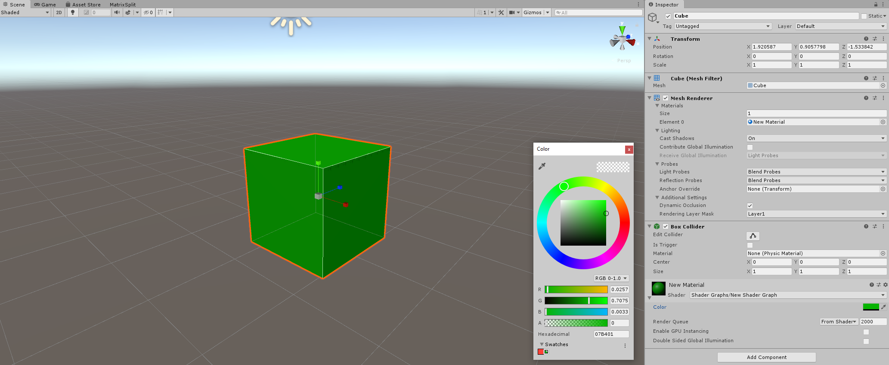

# My first Shader Graph

Before you begin, make sure that your project is set up properly, and the graphs are loading correctly. See [Getting started with Shader Graph](Getting-Started.md) for more information.

## Create a New Graph
Use the Project Browser to create a new [Shader Graph Asset](Shader-Graph-Asset.md) in your project. The **Create > Shader Graph** will display the various creation options.

A **Blank Shader Graph** will create a Shader Graph with no selected active targets or [block nodes](Block-Node.md). You will need to select a target via the [Graph Settings Menu](Graph-Settings-Tab.md) to continue.

Certain integrations, like Render Pipelines, can also provide pre-configured options for Shader Graphs. For this example, a **Universal > Lit** Shader Graph has been created and opened.

## Create a new node

Use the **Create Node** menu to create new nodes. There are two ways to open the menu:

1. Right click, and select **Create Node** from the context menu.
2. Press the spacebar.

In the menu, you can type in the search bar to look for specific nodes, or browse all nodes in the library. In this example, we'll create a Color node. First, type "color" in the **Create Node** menu's search bar. Then, click **Color**, or highlight **Color** and press Enter to create a Color node.

## Connect nodes

To build a graph, you need to connect nodes together. To do so, click the **Output Slot** of a node, and drag that connection into the **Input Slot** of another node.

Start by connecting the Color node to the **Base Color** block of our Fragment Stack.

## Change node output

Notice that the connection updated the main preview, and the 3D Object in the **Main Preview** is now black, which is the color specified in the Color node. You can click on the color bar in that node, and use the color picker to change the color. Any changes you make on the node updates the object in the **Main Preview** in real time.

For example, if you pick red, the 3D Object immediately reflects this change.

## Save the graph

Currently, Shader Graphs do not automatically save. There are two ways to save your changes:

1. Click the **Save Asset** button in the top left corner of the window.
3. Close the graph. If Unity detects any unsaved changes, a pop-up window appears, and asks if you want to save those changes.

## Create a Material

After saving your graph, use the shader to create a new Material. The process of [creating a new Material](https://docs.unity3d.com/Manual/Materials.html) and assigning it a Shader Graph shader is the same as that for regular shaders. In either the main menu or the Project View context menu, select **Assets > Create > Material**. Select the Material you just created. In its Inspector window, select the **Shader** drop-down menu, click **Shader Graphs**, and choose the Shader Graph shader you wish to apply to the Material.

You can also right-click the Shader Graph shader, and select **Create > Material**. This method automatically assigns that Shader Graph shader to the newly created Material.

A Material is also automatically generated as a subasset of the Shader Graph. You can assign it directly to an object in your scene. Modifying a property from the Blackboard on the Shader Graph will update this material in real time, which allows for quick visualization in the scene.

## Put the Material in the Scene

Now that you have assigned your shader to a Material, you can apply it to objects in the Scene. Drag and drop the Material onto an object in the Scene. Alternatively, in the object's Inspector window, locate **Mesh Renderer > Materials**, and apply the Material to the **Element**.

## Use properties to edit the graph

You can also use properties to alter your shader's appearance. Properties are options that are visible from the Material's Inspector, which lets others change settings in your shader without the need to open the Shader Graph.

To create a new property, use the **Add (+)** button on the top right corner of the Blackboard, and select the type of property to create. In this example, we'll select **Color**.

This adds a new property in the Blackboard with the following options in the **Node Settings** tab of the [Graph Inspector](Internal-Inspector.md) when the property is selected.

| **Option**          | **Description**                                              |
| ------------------- | ------------------------------------------------------------ |
| **Property button** | To change the name of the property, right-click the button in the Blackboard, select **Rename**, then enter a new property name. To delete the property, right-click the button, and select **Delete**. |
| **Exposed**         | Enable this checkbox to make the property visible from the Material's Inspector. |
| **Reference**       | The property's name that appears in C# scripts. To change the **Reference** name, enter a new string. |
| **Default**         | The default value of the property.                           |
| **Mode**            | The mode of the property. Each property has different modes. For **Color**, you can select either **Default** or **HDR**. |
| **Precision**       | The default [precision](Precision-Modes.md) of the property. |
| **Hybrid Instanced**| An experimental feature that enables this property to be instanced when using the Hybrid DOTS renderer. |

There are two ways to reference a property in your graph:

1. Drag the property from the Blackboard onto the graph.
2. Right-click and select **Create Node**. The property is listed in the **Properties** category.

Try connecting the property to the **Base Color** block. The object immediately changes to black.

Save your graph, and return to the Material's Inspector. The property now appears in the Inspector. Any changes you make to the property in the Inspector affects all objects that use this Material.

## More Tutorials

Older tutorials use an outdated format of Shader Graph with master nodes. When looking at older tutorials, reference the [Upgrade Guide](Upgrade-Guide-10-0-x.md) for tips on how to convert the master node to a [Master Stack](Master-Stack.md).

To keep exploring how to use Shader Graph to author shaders, check out these blog posts:

- [Art That Moves: Creating Animated Materials with Shader Graph](https://blogs.unity3d.com/2018/10/05/art-that-moves-creating-animated-materials-with-shader-graph/)
- [Shader Graph Updates and Sample Project ](https://blogs.unity3d.com/2018/08/07/shader-graph-updates-and-sample-project/)
- [Custom Lighting in Shader Graph: Expanding Your Graphs in 2019](https://blogs.unity3d.com/2019/07/31/custom-lighting-in-shader-graph-expanding-your-graphs-in-2019/)
- [Unity 2018.3 Shader Graph Update: Lit Master Node](https://blogs.unity3d.com/2018/12/19/unity-2018-3-shader-graph-update-lit-master-node/)
- [Creating an Interactive Vertex Effect using Shader Graph](https://blogs.unity3d.com/2019/02/12/creating-an-interactive-vertex-effect-using-shader-graph/)
- [Introduction to Shader Graph: Build your shaders with a visual editor](https://blogs.unity3d.com/2018/02/27/introduction-to-shader-graph-build-your-shaders-with-a-visual-editor/)

You can also visit the [Unity YouTube Channel](https://www.youtube.com/channel/UCG08EqOAXJk_YXPDsAvReSg) and look for [video tutorials on Shader Graph](https://www.youtube.com/user/Unity3D/search?query=shader+graph), or head to our [user forum](https://forum.unity.com/forums/shader-graph.346/) to find the latest information and conversations about Shader Graph.
