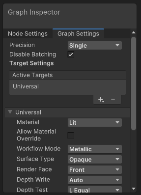

# Graph Settings Tab

## Description

The **Graph Settings** tab on the **[Graph Inspector](Internal-Inspector.md)** make it possible to change settings that affect the Shader Graph as a whole.

### Graph Settings options

| Menu Item | Description |
|:----------|:------------|
| Precision | A [Precision Mode](Precision-Modes.md) drop-down menu that lets you set the default precision for the entire graph. You can override the Precision setting here at the node level in your graph.|
| Preview Mode | (Subgraphs only) Your options are **Inherit**, **Preview 2D**, and **Preview 3D**. |
| Active Targets | A list that contains the Targets you've selected. You can add or remove entries using the Add (**+**) and Remove (**-**) buttons.  Shader Graph supports three targets: the [Universal Render Pipeline](https://docs.unity3d.com/Packages/com.unity.render-pipelines.universal@12.0/manual/index.html), the [High Definition Render Pipeline](https://docs.unity3d.com/Packages/com.unity.render-pipelines.high-definition@12.0/manual/index.html), and [Built-In Render Pipeline](https://docs.unity3d.com/2020.3/Documentation/Manual/render-pipelines.html). Target-specific settings appear below the standard setting options. The displayed Target-specific settings change according to which Targets you select. |
