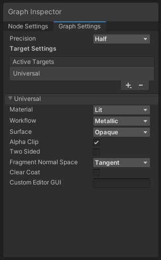

# Graph Target

A Target determines the end point compatibility of a shader you generate using Shader Graph. You can select Targets for each Shader Graph asset, and use the [Graph Settings Menu](Graph-Settings-Tab.md) to change the Targets.

Targets hold information such as the required generation format, and variables that allow compatibility with different render pipelines or integration features like [Visual Effect Graph](https://docs.unity3d.com/Packages/com.unity.visualeffectgraph@latest). You can select any number of Targets for each Shader Graph asset. If a Target you select isn't compatible with other Targets you've already selected, an error message that explains the problem appears.

Target Settings are specific to each Target, and can vary between assets depending on which Targets you've selected. Be aware that Universal Render Pipeline (URP) Target Settings and High Definition Render Pipeline (HDRP) Target Settings might change in future versions.

Typically, each Target you select generates a valid subshader from the graph. For example, a Shader Graph asset with both URP and HDRP Targets will generate two subshaders. When you use a graph that targets multiple render pipelines, you must reimport the Shader Graph asset if you change the active render pipeline. This updates the Material Inspector for any Materials that use your graph.

Shader Graph supports three targets: the [Universal Render Pipeline](https://docs.unity3d.com/Manual/urp/urp-introduction.html), the [High Definition Render Pipeline](https://docs.unity3d.com/Packages/com.unity.render-pipelines.high-definition@12.0/manual/index.html), and the [Built-In Render Pipeline](https://docs.unity3d.com/2020.3/Documentation/Manual/render-pipelines).

Not all blocks are compatible with all targets. If a block in your graph becomes inactive when you choose a target, that block is not compatible with that target.

The visual results of a graph are not the same in all render pipelines. This is because of the technical differences between URP, Built-In, and HDRP.

Shader Graphs that target the Built-In Render Pipeline replicate the results of shaders handwritten in ShaderLab, with the exception of normal maps. For mathematical correctness, normal maps created with Shader Graph behave as they do in URP even when your build targets the Built-In Render Pipeline.
