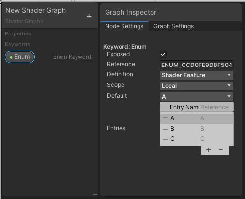

# Keywords

## Description
Use Keywords to create different variants for your Shader Graph.

Keywords enable you to create shaders:
* With features that you can turn on or off for each Material instance.
* With features that behave differently on certain platforms.
* That scale in complexity based on conditions you set.

There are three types of Keywords: Boolean, Enum, and Built-in. Unity defines a Keyword in the graph, shader, and optionally, the Material Inspector based on its type. See [Boolean Keyword](#BooleanKeywords), [Enum Keyword](#EnumKeywords), and [Built-in Keyword](#BuiltinKeywords) for more information about Keyword types. For more information about how these Keywords affect the final shader, see documentation on [Making multiple shader program variants](https://docs.unity3d.com/Manual/SL-MultipleProgramVariants.html).

In Shader Graph, you first define a Keyword on the [Blackboard](Blackboard.md), then use a [Keyword Node](Keyword-Node.md) to create a branch in the graph.

The Editor is able to compile variants on demand when it needs them to render content. If you declare many different variants, you can end up with millions or trillions of possibilities. However, the Player needs to determine at build time which variants are in use and include them when it pre-compiles your shaders. To manage memory effectively, the Player strips unused variants based on their keyword and Editor settings. See the next section, Common parameters, to learn more about how you can give the Player hints about what it needs to compile and what it can ignore. When the Player strips out a variant in the build process, it displays the pink error shader.

## Common parameters
Although some fields are specific to certain types of Keywords, all Keywords have the following parameters.

| **Name**           | **Type** | **Description**                                              |
| ------------------ | -------- | ------------------------------------------------------------ |
| **Display Name**   | String   | The display name of the Keyword. Unity shows this name in the title bar of nodes that reference the corresponding Keyword, and also in the Material Inspector if you expose that Keyword. |
| **Exposed**        | Boolean  | When you set this parameter to **true**, Unity displays this Keyword in the Material Inspector. If you set it to **false**, the Keyword does not appear in the Material Inspector.    If you intend to access a GLOBAL shader variable, be sure to add it as you would normally add an input variable, but deselect **Exposed**.|
| **Reference Name** | String   | The internal name for the Keyword in the shader.  If you overwrite the Reference Name parameter, take note of the following: &#8226; Keyword Reference Names are always in full capitals, so Unity converts all lowercase letters to uppercase. &#8226; If the Reference Name contains any characters that HLSL does not support, Unity replaces those characters with underscores. &#8226; Right-click on a Reference Name, and select **Reset Reference** to revert to the default Reference Name. |
| **Definition**     | Enum     | Sets how the Keyword is defined in the shader. Determines when to compile keyword variants.
  There are three available options. &#8226; **Shader Feature**: Unity only compiles keyword variants when a Material selects the relevant option. For this option to be available in the Player, a Material selecting it must exist at build-time. &#8226; **Multi Compile**:Pre-compiles all the variant possibilities. This is slower and uses more memory, but allows the option to be dynamically switched in the Player.
 &#8226; **Predefined**: The render pipeline defines this keyword and controls the settings for it. |
| **Scope**          | Enum     | Sets the scope at which to define the Keyword.  &#8226; **Global Keywords**: Defines Keyword for the entire project, and it counts towards the global keyword limit. &#8226; **Local Keywords**: Defines Keyword for only one shader, which has its own local keyword limit.  When you use Predefined Keywords, Unity disables this field. |
| **Stages** |  |  &#8226; **All** - Applies this keyword to all shader stages.
 &#8226;**Vertex** - Applies this keyword to the vertex stage.
 &#8226;**Fragment** - Applies this keyword to the fragment stage.
|

## Boolean Keywords
Boolean Keywords are either on or off. This results in two shader variants. Unity exposes Boolean Keywords in the Material Inspector if the Exposed parameter is set to is true. To enable the keyword from a script, use EnableKeyword on the keyword's Reference name. DisableKeyword disables the keyword. To learn more about Boolean Keywords, see [Shader variants and keywords](https://docs.unity3d.com/Manual/SL-MultipleProgramVariants.html).

### Type-specific parameters
Boolean Keywords have one Boolean-specific parameter in addition to the common parameters listed above.

| **Name**    | **Type** | **Description**                                              |
| ----------- | -------- | ------------------------------------------------------------ |
| **Default** | Boolean  |Enable this parameter to set the Keyword's default state to on, and disable it to set the Keyword's default state to off.
  
This parameter determines the value to use for the Keyword when Shader Graph generates previews. It also defines the Keyword's default value when you use this shader to create a new Material.
 |

## Enum Keywords
Enum Keywords can have two or more states, which you define in the **Entries** list. If you expose an Enum Keyword, the **Display Names** in its **Entries** list appear in a dropdown menu in the Material Inspector.

Special characters such as ( ) or ! @ are not valid in the **Entry Name** of an Enum Keyword. Shader Graph converts invalid characters to underscores ( _ ).

When you define an Enum Keyword, Shader Graph displays labels for each state consisting of  a sanitized version of the Enum's **Entry Name**  appended to the main **Reference** name.
When controlling a keyword via script with a, <code>Material.EnableKeyword</code> or <code>Shader.EnableKeyword function</code>, enter the state label in the format <code>{REFERENCE}_{REFERENCESUFFIX}</code>. For example, if your reference name is MYENUM and the desired entry is OPTION1, then you would call <code>Material.EnableKeyword("MYENUM_OPTION1")</code>. When you select an option, this disables the other options.

### Type-specific parameters
In addition to the common parameters listed above, Enum Keywords have the following additional parameters.

| **Name**    | **Type**         | **Description**                                              |
| ----------- | ---------------- | ------------------------------------------------------------ |
| **Default** | Enum             | Select an entry from the drop-down menu to determine which value to use for the Keyword when Shader Graph generates previews. This also defines the Keyword's default value when you use this shader to create a new Material. When you edit the Entries list, Shader Graph automatically updates the options in this control. |
| **Entries** | Reorderable List | This list defines all the states for the Keyword. Each state has a separate **Display Name** and **Reference Suffix**.  &#8226; **Display Name**: Appears in drop-down menus for the Keyword on the [Internal Inspector](Internal-Inspector.md) and the Material Inspector. Shader Graph also uses this name for port labels on nodes that reference the Keyword. &#8226; **Reference Suffix**: This is the final keyword, presented in the format <code>Reference_ReferenceSuffix</code>. |

## Built-in Keywords
Built-in Keywords are always of either the Boolean or Enum type, but they behave slightly differently from Boolean or Enum Keywords that you create. The Unity Editor or active Render Pipeline sets their values, and you cannot edit these.

All Built-in Keyword fields in the **Node Settings** tab of the [Graph Inspector](Internal-Inspector.md) are grayed out except for the **Default** field, which you can enable or disable to show the differences in Shader Graph previews. You also cannot expose Built-in Keywords in the Material Inspector.

