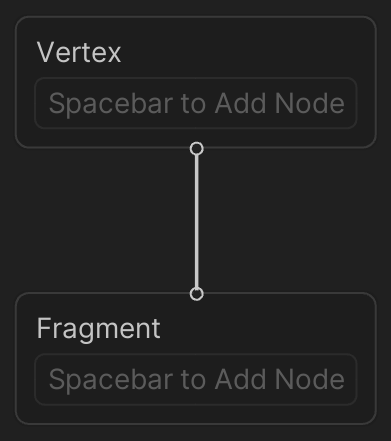

# Master Stack

## Description

The Master Stack is the end point of a Shader Graph that defines the final surface appearance of a shader. Your Shader Graph should always contain only one Master Stack.

The content of the Master Stack might change depending on the [Graph Settings](Graph-Settings-Tab.md) you select. The Master Stack is made up of Contexts, which contain [Block nodes](Block-Node.md).

## Contexts

The Master Stack contains two Contexts: Vertex and Fragment. These represent the two stages of a shader. Nodes that you connect to Blocks in the Vertex Context become part of the final shader's vertex function. Nodes that you connect to Blocks in the Fragment Context become part of the final shader's fragment (or pixel) function. If you connect any nodes to both Contexts, they are executed twice, once in the vertex function and then again in the fragment function. You can't cut, copy, or paste Contexts.
