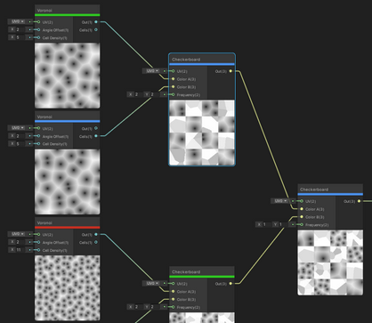
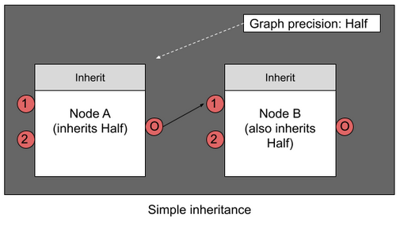

# Precision Modes

## Description

Shader Graph provides specific [data precision modes](https://en.wikipedia.org/wiki/Precision_(computer_science)) for nodes, graphs, and Sub Graphs to help you optimize your content for different platforms.

To set the precision of an entire graph, select the [**Graph Settings**](Graph-Settings-Tab.md) tab in the [Graph Inspector](Internal-Inspector.md) and adjust the **Precision** control. Select a node in your graph and select the **Node Settings** tab in the Graph Inspector to adjust the precision of individual nodes.

## Precision mode settings
| Name | Description |
|------:|------------|
| Single | This is a high-precision floating point value. The number of bits is platform-specific. For modern desktop computers, it is 32 bits. This mode is useful for world space positions, texture coordinates, and scalar computations that involve complex functions such as trigonometry, power, and exponentiation. |
| Half | This is a low-precision floating point value. The number of bits is platform-specific. For modern desktop computers, it is 16 bits. This mode is useful for short vectors, directions, object space positions, and many high dynamic range colors, but not very strong light sources, such as the sun.|
| Switchable | This mode is only for Sub Graphs. When you enable this mode for a Sub Graph, the default precision of the Sub Graph is decided by its Sub Graph node. See **Use Graph Precision** below. |
| Inherit | This mode determines a node's precision based on a set of inheritance rules. See [Precision inheritance](#precision-inheritance).|
| Use Graph Precision | This mode forces this node to use the same precision setting as the graph. If this is a node in a Sub Graph, and that Sub Graph’s **Precision** is set to **Switchable**, then the precision of this node is the precision of the Sub Graph node representing this Sub Graph. |

## Using Precision Modes
### Visualizing Precision in a graph
To visualize data precision in a graph, set the [**Color Mode**](Color-Modes.md) control to **Precision**. This applies color coding to your nodes:

* **Single** nodes are blue
* **Half** nodes are red
* **Switchable** nodes are Green.

### Setting graph Precision
To set the default precision for the entire graph to **Single** or **Half**, open the **Graph Settings** and set the Precision property. Newly-created nodes in a graph default to the **Inherit** precision mode, and inherit the graph's precision.

### Setting node Precision
Select a node to access its precision setting. The precision you set for a node determines the precision of the data types which that node uses for its calculations.

### Precision Inheritance
All nodes use the **Inherit** precision mode by default. In this mode, a node that has one or more edge connections takes on the precision mode of an incoming [edge](Edge.md). Nodes that do not have any edge connections take on **Graph Precision**. If you change the **Graph Precision** mode, the precision of those nodes also changes.

| **Inputs on the node**                 | **Final precision determined by inheritance**  |
|------------------------------------|--------------------------------------------|
| No inputs                          | **Graph Precision**                           |
| Only **Half** inputs                   | **Half**                                       |
| Only **Single** inputs                 | **Single**                                     |
| **Half** and **Single** inputs             | **Single**                                     |
| Only **Switchable** inputs             | **Switchable**                                 |
| **Switchable** and **Half** inputs         | **Switchable**                                 |
| **Switchable** and **Single** inputs       | **Single**                                     |
| **Switchable**, **Half** and **Single** inputs | **Single**                                     |

#### Simple inheritance

Simple inheritance refers to the inheritance behaviour of a node with only one precision type on its inputs.

In the figure below, Node A has the **Inherit** mode. Because it has no incoming edge, it takes the **Graph Precision**, which is **Half**. Node B also has the **Inherit** mode, so it inherits the **Half** precision mode from Node A.

#### Complex inheritance

Complex inheritance refers to the inheritance behaviour of a node with multiple precision types on its inputs.

A node reads precision settings from each input port. If you connect a node to several others with a variety of precision modes, the node with the highest resolution determines the precision mode for the group.

In the figure below, node D has the **Inherit** mode. It receives input from the adjacent edges via inputs 1 and 2. Node B passes the **Half** mode through input 1. Node C passes the **Single** mode through input 2. Because **Single** is 32-bit and **Half** only 16-bit, **Single** takes precedence, so Node D uses **Single** precision.

#### Mixed inheritance

Mixed inheritance refers to the inheritance behaviour on a node with both simple and complex inheritance types.

Nodes with no input ports, such as [Input nodes](Input-Nodes.md), inherit the **Graph Precision**. However, complex inheritance rules still affect other nodes in the same group, as illustrated in the figure below.

### Switchable precision

The **Switchable** mode overrides **Half** mode but not **Single**.

### Sub Graph precision

Precision behavior and user interface elements for [Sub Graphs](Sub-graph.md) and their nodes do not differ from other graphs and nodes. Sub Graphs represent a function, and you can affect that function's inputs, outputs, and operators by modifying the relevant set of precision settings.

* The Sub Graph properties correspond to the function's inputs.
* The internal node properties correspond to the function's operators.
* The output node corresponds to the function's outputs.

#### Outputs

To manually determine the precision of a Sub Graph's output, modify the **Output** node’s **Precision Mode** setting.

#### Inputs

To manually determine the precision of **Sub Graph Inputs**, open the [Graph Inspector](Internal-Inspector.md) and set precision modes for each individual [Property](Property-Types.md). Properties that use the Inherit option take on the **Graph Precision** you set for the Sub Graph.

#### Sub Graph Precision within other graphs

By default, a Sub Graph has a Precision Mode of `Switchable`. You can modify Precision Mode of any [Sub Graph node](Sub-graph-Node.md) for that Sub Graph, as long as you set the Precision Mode on the Sub Graph as `Switchable`.

Shader Graph won't allow you to change the Precision Mode for any Sub Graph node that doesn't have its Sub Graph set to `Switchable`. This is because the input and output precision you set in a Sub Graph define the precision of its associated Sub Graph Node.

For example, let's say that Sub Graph A is **Switchable**. You open Graph 1, which includes a Sub Graph Node referencing Sub Graph A. Like all other nodes, Sub Graph Node A defaults to **Inherit**. You change the precision of Sub Graph Node A to **Half**. The precision of Sub Graph A also becomes **Half**.
