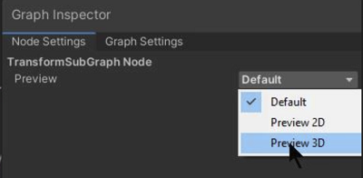

# Preview mode control

## Description
This control enables you to manually select your preferred preview mode for a node that has a preview.

When you select **Inherit** in the Preview Mode Control, the Editor automatically selects the preview mode to use.

That decision is determined by either the type of the node you are previewing, the Sub Graph setting (if this node is in a Sub Graph) or other upstream nodes.
To override the inheritance mode, select **Preview 2D** or **Preview 3D**.

This mode control functionality also applies to Sub Graph previews. See [Graph Settings menu](Graph-Settings-Tab.md).

## How to use

For nodes:
1. Add a node which includes a preview.
2. Select the node.
3. In the Graph Inspector or Node Settings, find the Preview control.
4. Select an option.

For SubGraphs:
* Select a mode in the [Sub Graph](Sub-graph.md) [Graph Settings](Graph-Settings-Tab.md) menu.

Related
[Preview node](Preview-Node.md)
